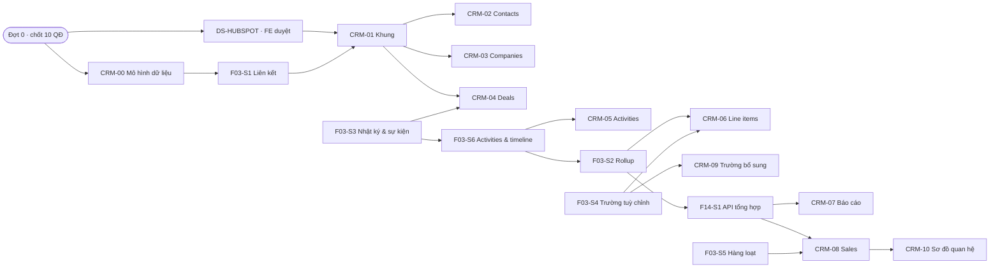

# Kế hoạch viết spec — CRM theo UX HubSpot (giai đoạn 2)

> **Trạng thái:** 💡 Proposed · v2.0 · 02/10/2026 — **đây là PLAN, chưa phải spec**
> **Nguồn phạm vi:** Google Sheet *[Erp-crm] - Feature breakdown*, tab **CRM** (122 tính năng) · `DOI-CHIEU-CHUC-NANG.md` §10–17 · Claude Doc *Kế hoạch triển khai giai đoạn 2 — CRM theo UX HubSpot* · `DESIGN-SYSTEM-HUBSPOT.md` · `../../spec_ttb_sales_pipeline.md` §6 (giới hạn engine)
> **Đã chốt với người dùng (30/09):** spec viết **Markdown trong repo** · chia **2 tầng** (nền tảng ERP + màn CRM) · độ sâu **vừa đủ để code** (collection + trường, API, hành vi màn, AC Given–When–Then gắn mã tính năng, test case; bỏ phần ≥5 use case theo ngành và Prisma của chuẩn `features/features/README.md`).

---

## 0. Kết luận ngắn

- **18 spec mới + 1 file đã có.** Tầng A gồm **7 spec nền** ERP đặt ở `features/features/` (6 spec mở rộng F03 + 1 spec F14). Tầng B gồm **11 spec màn CRM** đặt ở `specs/` trong repo này. Theme và shell đã được đặc tả trong `DESIGN-SYSTEM-HUBSPOT.md`, không viết lại.
- **Viết theo 5 đợt, trước đó có một đợt 0 để chốt quyết định.** Đợt 1 là nền dữ liệu: `CRM-00` mô hình dữ liệu, `F03-S1` liên kết bản ghi và `CRM-01` khung danh sách/trang chi tiết. Mọi màn còn lại đều dựa trên ba file này.
- **Điểm chặn lớn nhất không nằm ở kỹ thuật mà ở 3 quyết định mô hình:**
  - Owner lưu bằng *tài khoản người dùng* hay *bản ghi Sale*. Sheet S-03 hiện đang nối theo tên, còn doc giai đoạn 2 ghi "dùng loại Người dùng", hai nguồn mâu thuẫn nhau.
  - Leads có gộp vào Contacts không.
  - Contact thuộc 1 công ty hay nhiều công ty.

  Chưa chốt 3 điểm này thì `CRM-00` không viết được, kéo theo cả chuỗi phía sau. Chi tiết ở §5.
- **Theo dõi tiến độ:** cột **Specs** trong sheet chỉ tick TRUE khi spec đã qua review của cả FE lẫn BE (định nghĩa Done ở §4.3).

---

## 1. Vì sao chia hai tầng

Trong 122 tính năng có **40 cái cần cả FE lẫn BE**, và phần BE lặp lại qua nhiều màn:

| Năng lực nền | Số tính năng dùng tới | Rải ở các phân hệ |
|---|---|---|
| Activities & timeline | 18 | Activities, Contacts, Companies, Deals, trường tính |
| Liên kết bản ghi (1:N hai chiều, N:N có nhãn) | 7 | Chung, Contacts, Companies, Deals, Sơ đồ quan hệ |
| API tổng hợp báo cáo | 7 | Báo cáo, Sales |
| Nhật ký thay đổi & sự kiện | 7 | Chung, Contacts, Deals, Activities, Sales |
| Trường tuỳ chỉnh & cấu hình hiển thị | 6 | Contacts, Line items, Trường bổ sung |
| Trường tính / rollup | 5 | Chung, Contacts, Deals, Line items |
| Thao tác hàng loạt & chuyển giao | 4 | Contacts, Sales |

Nếu viết spec theo từng màn thì hợp đồng API của mỗi năng lực sẽ bị viết lại 3–4 lần và lệch nhau ngay từ bản đầu. Tách chúng thành **spec nền (tầng A)** thì mỗi hợp đồng chỉ có một nguồn. Các năng lực này cũng không riêng gì CRM:

- Rollup chính là gap G3 của `Hiring/`.
- Module báo cáo là gap của TTB (`spec_ttb_sales_pipeline.md` §6).
- Truy vấn liên kết ngược thì mọi Collection có trường Liên kết đều cần.

Vì vậy tầng A đặt ở `features/features/` theo đúng số F của lớp dữ liệu (F03) và báo cáo (F14, nối tiếp `F14-S0`). **Tầng B** là màn cụ thể của khách, gắn với prototype, nên để trong repo `erp-customize-hubspots/specs/`.

---

## 2. Danh sách spec

### 2.1 Tầng A — Năng lực nền ERP (`features/features/`)

| Mã | File | Nội dung chính | Tính năng phủ | Đợt |
|---|---|---|---|---|
| DS | `DESIGN-SYSTEM-HUBSPOT.md` ✅ **đã có** | Theme `data-brand="crm"`, shell, 17 component, 4 template. Spec màn chỉ **tham chiếu §**, không định nghĩa lại style | G-01, G-02 | 0 — chờ FE duyệt |
| F03-S1 | `F03-S1-lien-ket-ban-ghi.md` | Liên kết 1:N **hai chiều** (API "bản ghi nào trỏ tới tôi"); N:N qua **bảng nối có nhãn + cờ Primary**; API lấy bản ghi liên kết theo từng dòng (mở rộng dòng); ghi liên kết ngay khi tạo bản ghi; đếm liên kết theo collection; hành vi khi xoá hai phía | G-03 · phục vụ 6 | 1 |
| F03-S3 | `F03-S3-nhat-ky-thay-doi-su-kien.md` | Nhật ký thay đổi thuộc tính & liên kết theo bản ghi; **sự kiện hệ thống** (tạo, đổi stage / lifecycle / owner, thêm/gỡ liên kết, cập nhật line item) phát sang timeline; truy vấn lịch sử một thuộc tính | G-05 · phục vụ 6 | 2 |
| F03-S6 | `F03-S6-activities-timeline.md` | Collection Activities (Ghi chú · Task · Cuộc gọi · Cuộc họp); bảng nối activity ↔ N bản ghi; nội dung HTML đã lọc; ghim; task theo dõi; **job nhắc hạn & lặp task**; API timeline **hợp nhất** activity + sự kiện F03-S3, phân trang theo tháng, lọc theo nhóm / người / khoảng thời gian | phục vụ 18 | 3 |
| F03-S2 | `F03-S2-truong-tinh-rollup.md` | Trường tính từ bản ghi liên kết: ngày hoạt động gần nhất, liên hệ gần nhất, hoạt động tiếp theo, tổng line item → Amount. Tính lại khi nào (theo sự kiện hay định kỳ), có lọc/sắp xếp được không | G-04 · phục vụ 4 | 3 |
| F03-S4 | `F03-S4-truong-tuy-chinh-cau-hinh-hien-thi.md` | Tạo trường từ trang chi tiết (quyền, cờ `custom` + ngày tạo); cấu hình **trường ghim** theo đối tượng; lưu cấu hình view (cột, thứ tự, mật độ, bộ lọc nhanh) theo user | phục vụ 6 | 3 |
| F14-S1 | `F14-S1-api-tong-hop-bao-cao.md` | Group-by theo trường/mốc thời gian; so sánh kỳ; lọc owner + khoảng ngày; thời gian chốt trung bình (thay cho "thời gian giữa 2 stage", xem §3); tỷ lệ thắng; drill-down trả danh sách id; lưu cấu hình dashboard theo user | phục vụ 7 | 4 |
| F03-S5 | `F03-S5-thao-tac-hang-loat.md` | Đổi owner hàng loạt, xoá hàng loạt, **gộp 2 bản ghi**, **chuyển giao** toàn bộ bản ghi của một sale; mọi thao tác ghi nhật ký F03-S3 | phục vụ 4 | 4 |

### 2.2 Tầng B — Màn CRM (`specs/` trong repo này)

| Mã | File | Nội dung chính | Tính năng sở hữu | Đợt |
|---|---|---|---|---|
| CRM-00 | `CRM-00-mo-hinh-du-lieu-chuyen-doi.md` | **Toàn bộ collection & trường** (Contacts, Companies, Deals_Pipeline sửa, bảng nối, Products, Line_Items, Activities, Sale/NhanVien), **key ASCII có nghĩa**, danh mục (Lifecycle, Lead status, nhãn liên kết), chuyển Leads → Contacts, `lead_id` văn bản → Liên kết, "Sale phụ trách" văn bản → owner, **rà 10 workflow đang đọc các collection này**, (tuỳ QĐ) nhập dữ liệu từ HubSpot | — · phục vụ 9 | 1 |
| CRM-01 | `CRM-01-khung-danh-sach-trang-chi-tiet.md` | Khung **dùng chung** cho 3 đối tượng. Phần danh sách: tìm/lọc/sắp xếp, bộ lọc nhanh dạng popover, bộ lọc nâng cao, mở rộng dòng, xem trước, cài đặt view, thao tác hàng loạt, footer. Phần trang chi tiết 3 cột: 6 nút nhanh, menu Thao tác, card Tệp. Ánh xạ template T1/T2 của DS | 11 · phục vụ 17 | 1 |
| CRM-02 | `CRM-02-contacts.md` | Cấu hình riêng của Contacts: header, tab view, cột, board Lifecycle, panel tạo, thẻ định danh, Thông tin chính, Catch-up, card Companies/Deals | 11 | 2 |
| CRM-03 | `CRM-03-companies.md` | Cột/bộ lọc riêng, 2 trường mới, mở rộng dòng + board, record, Tổng quan 2 mục, card Contacts/Deals | 10 | 2 |
| CRM-04 | `CRM-04-deals.md` | Pipeline, bộ lọc, cột mặc định, cột Hoạt động tiếp theo, board (thẻ, chân cột, kéo thả), tạo deal kèm liên kết, record, sự kiện "Hoạt động Deal". **5 mục "ERP có sẵn" chỉ cần AC hồi quy** | 15 | 2 |
| CRM-05 | `CRM-05-activities.md` | Cửa sổ soạn (Ghi chú / Task / Ghi lại cuộc gọi / Ghi lại hoặc lên lịch cuộc họp, liên kết N bản ghi, task theo dõi); timeline (tab, bộ lọc nhóm, thẻ, ghim/sửa/xoá, hoàn thành task) | 16 | 3 |
| CRM-06 | `CRM-06-line-items-san-pham.md` | Card + trình sửa toàn màn hình, thư viện sản phẩm, dòng tuỳ chỉnh, cột giá (tần suất, kỳ hạn, chiết khấu), trường tuỳ chỉnh tự điền, điều chỉnh cấp Deal, ARR/MRR, tổng → Amount | 11 | 3 |
| CRM-09 | `CRM-09-truong-bo-sung.md` | Card "Trường bổ sung" trên 3 loại record, sửa tại chỗ, tạo trường mới, nhãn "Mới", ⚙ chọn trường ghim, dùng ở danh sách | 7 | 3 |
| CRM-07 | `CRM-07-bao-cao.md` | Bộ chọn dashboard, header, bộ lọc nhanh/nâng cao, thẻ báo cáo, bố cục kéo/đổi cỡ, drill-down; **định nghĩa phép tính của từng thẻ** trong CRM Data Overview (7 thẻ) và Pipeline Overview (6 thẻ) | 10 | 4 |
| CRM-08 | `CRM-08-sales.md` | Collection Sale, liên kết owner, danh sách + KPI + bảng xếp hạng (**công thức dự báo, chỉ tiêu kỳ**), trang chi tiết sale, chuyển giao, đánh dấu đã nghỉ | 19 | 4 |
| CRM-10 | `CRM-10-so-do-quan-he.md` | Trang Sơ đồ quan hệ (SVG, làm nổi, 2 panel chi tiết, luồng 4 bước, tải SVG). Chủ yếu FE + một API đếm | 7 | 5 |

Bảng đầy đủ **ID → spec chính → spec nền phụ thuộc** cho cả 122 tính năng nằm ở **Phụ lục A**. Đã kiểm bằng script: 122/122 ID có đúng một spec chính, không sót ID nào và không ID nào bị gán hai lần.

---

## 3. Thứ tự viết



| Đợt | Spec | Lý do đứng ở vị trí này |
|---|---|---|
| **0** | Chốt 10 quyết định ở §5 (QĐ-01/02/03 đã chốt 30/09) · FE duyệt DS-HUBSPOT | Ba quyết định mô hình (QĐ-01/02/03) đổi hình dạng bảng dữ liệu; viết spec trước khi chốt là viết lại |
| **1** | CRM-00 → F03-S1 → CRM-01 | Mọi spec màn đều trích **key trường**. Bài học token unresolved (13/08, 26/08) cho thấy key tự sinh kiểu `giai_o_n_pipeline` phải chốt trước khi ai viết biểu thức hay API. CRM-01 là khung của 3 đối tượng nên phải có trước 3 spec đối tượng |
| **2** | F03-S3 → CRM-02 · CRM-03 · CRM-04 | Kéo thả đổi stage (D-08, P0) và đổi lifecycle (C-09) phải ghi sự kiện ⇒ hợp đồng sự kiện cần có trước. 3 spec đối tượng lúc này chỉ còn là cấu hình trên khung CRM-01 nên viết được song song |
| **3** | F03-S6 → CRM-05 · F03-S2 → CRM-06 · F03-S4 → CRM-09 | Rollup "ngày hoạt động gần nhất / hoạt động tiếp theo" **tính từ Activities** ⇒ F03-S6 trước F03-S2. Line items cần rollup (tổng → Amount) và trường tuỳ chỉnh (L-06) |
| **4** | F14-S1 → CRM-07 · CRM-08 · F03-S5 | Báo cáo và KPI sale đọc mọi dữ liệu phía trên. R-08/R-09 là P0, nên nếu BE còn năng lực thì **kéo F14-S1 lên song song với đợt 3** |
| **5** | CRM-10 | Toàn P1/P2, phần lớn là trang tài liệu FE |

**Chạy song song được:** FE bắt tay vào khung list/record ngay khi CRM-01 xong (đợt 1), không cần đợi các spec đối tượng. BE làm F03-S1/F03-S3 trong lúc BA viết spec đợt 2.

**Tiến độ (01/10/2026):**

| Đợt | Trạng thái | Ghi chú |
|---|---|---|
| 1 | Đã viết, đã soát chéo | CRM-00, F03-S1, CRM-01 |
| 2 | Đã viết, đã soát chéo, chờ review | F03-S3, CRM-02, CRM-03, CRM-04. Kéo theo bản vá v1.1 cho CRM-00, CRM-01, F03-S1 |
| 3 | Đã viết, đã soát chéo, chờ review | F03-S6, CRM-05, F03-S2, CRM-06, F03-S4, CRM-09. Kéo theo CRM-00 v1.2, CRM-01 v1.2, F03-S1 v1.2, CRM-02 v1.1, CRM-04 v1.1, DS-HUBSPOT 1.2. QĐ-04, QĐ-05, QĐ-06, QĐ-08, QĐ-10 viết theo đề xuất mặc định, ghi câu hỏi ở từng spec |
| 4 | Đã viết, đã soát chéo, chờ review | F14-S1, CRM-07, CRM-08, F03-S5. Kéo theo CRM-00 v1.3 (`is_sales`, `lead_created_at`, `closed_at` cho deal cũ, `mergeConfig`), CRM-01 v1.3, F03-S3 v1.1, F03-S4 v1.1, F03-S6 v1.1. F14-S1 bỏ phép đo "thời gian giữa 2 stage" của plan: thẻ duy nhất cần nó là "Thời gian chốt trung bình", tính bằng `closed_at` − Ngày tạo; giới hạn và bộ nhớ đệm ở F14-S1 §7 |
| 5 | Đã viết, đã soát chéo, chờ review | CRM-10. Kéo theo F03-S1 v1.3 (§4.8 API thống kê liên kết viết đầy đủ), CRM-03 v1.1, CRM-07 v1.2, `DESIGN-SYSTEM-HUBSPOT.md` 1.3 (component `RelationDiagram`, màu đối tượng `--obj-*`). **Đủ 18 spec của plan** |

---

## 4. Khung mẫu một spec

Từ 02/10/2026 mọi spec viết theo **mẫu PRD** người dùng cung cấp (Google Doc *FBVONE - PRD - Authentication*). Quy tắc đầy đủ ở `00-HUONG-DAN-VIET-SPEC.md`; bản mẫu để bắt chước là `CRM-08-sales.md`. Khung cũ (11 mục đánh số, AC dạng Given–When–Then, bảng test case) không dùng nữa; các bản 1.x còn lưu ở `specs/_ban-cu-v1/`.

### 4.1 Cấu trúc

```
# <Mã> — <Tên>
# Product Requirement Document
Bảng thông tin: Project Owner · Created by · Version · Update at · Project · Features
CONTENT · VERSION HISTORY

# USER STORIES          — US-<MÃ>-nn: Là …, tôi muốn … để … (mã tính năng)
# OVERVIEW FLOW         — bảng Bước · Tác nhân · Mô tả
# USE CASE DESCRIPTION  — mỗi UC một bảng: Actor · Trigger · Pre-condition · Main Flow · Post-condition · Exception Flow
# BUSINESS RULE         — bảng BR · Mô tả
# ACCEPTANCE CRITERIA   — AC-n: tiêu đề (mã tính năng) + các gạch đầu dòng kiểm được
# PHỤ LỤC               — A. Màn hình và dữ liệu hiển thị · B. Dữ liệu · C. API · D. Lệch so với sheet / prototype · E. Câu hỏi còn mở · F. Tài liệu liên quan
```

### 4.2 Quy ước bắt buộc

- **Mỗi mã tính năng của sheet thuộc spec phải có mặt ở ít nhất một UC và một AC.**
- Phần chính (User stories → Acceptance criteria) viết cho người đọc lần đầu: câu ngắn, rõ ai làm gì. Bảng trường, cấu hình, API, mã lỗi, công thức đầy đủ để ở Phụ lục.
- Tham chiếu spec khác bằng mã file và tên chủ đề, không dùng số mục.
- **Key trường là `snake_case` ASCII có nghĩa**, đặt tay. Ngoại lệ là collection đã có (Deals_Pipeline), theo QĐ-09.
- Chỗ prototype làm giả (owner nối theo tên, Amount do FE ghi, "Sắp có"…) phải ghi ở Phụ lục D để dev không chép logic giả.
- Style không định nghĩa lại trong spec màn; phát sinh component hoặc token mới thì báo và cập nhật design system theo RULE 2b.

### 4.3 Định nghĩa Done của một spec (điều kiện tick cột *Specs* = TRUE)

1. Mọi mã tính năng thuộc spec có UC và AC.
2. Mọi trường có key và kiểu. Mọi API có mã lỗi.
3. Phụ lục D đã liệt kê hết chỗ lệch sheet và phần giả lập của prototype.
4. **FE và BE đã đọc và không còn câu hỏi chặn** (câu hỏi không chặn để ở Phụ lục E).
5. Mọi thay đổi đã cập nhật vào `AGENTS.md`/`CLAUDE.md` và bảng đối chiếu `DOI-CHIEU-CHUC-NANG.md`.

---

## 5. Mười quyết định cần chốt ở đợt 0

| # | Câu hỏi | Chặn spec | Đề xuất mặc định |
|---|---|---|---|
| **QĐ-01** | **Owner lưu gì?** Có 2 lựa chọn: (a) trường Người dùng (tài khoản đăng nhập) như HubSpot, còn collection Sale chỉ giữ team/chỉ tiêu và liên kết 1:1 với user; (b) Liên kết tới bản ghi Sale. Hiện sheet S-03 nối theo **tên**, doc giai đoạn 2 lại ghi "dùng loại Người dùng" | CRM-00, CRM-08, F03-S5 | **(a)** — view "Của tôi", thông báo, quyền đều cần biết *ai đang đăng nhập*. Nối theo tên thì đổi tên là vỡ (S-12 đã phải thêm cập nhật hàng loạt chỉ vì lý do này) |
| **QĐ-02** | Collection **Leads** gộp vào Contacts (Lifecycle = Lead) hay giữ riêng? | CRM-00, CRM-02 | Gộp. HubSpot không có Leads riêng, giữ hai bảng thì một người tồn tại hai nơi. Đổi lại phải rà các workflow đang trigger trên Leads |
| **QĐ-03** | Contact thuộc **1 công ty** (1:N) hay **nhiều công ty có nhãn + Primary** (N:N)? Prototype C-20 đã có *Primary · Thêm nhãn liên kết · Xem tất cả Companies* ⇒ đang ngầm N:N | CRM-00, F03-S1 | N:N có cờ Primary. Dùng chung cơ chế bảng nối với Deal_Contacts nên F03-S1 không tốn thêm |
| **QĐ-04** | Task CRM (Activities) có hiện trong **"Việc của tôi"** (hệ task F07) không? | F03-S6, CRM-05 | Hiện, nhưng **đọc chung một danh sách**, không nhân đôi bản ghi. Nếu không chốt, sản phẩm sẽ có **hai hệ quản lý việc song song** |
| **QĐ-05** | Deal Amount **luôn** bằng tổng line item, hay có ô "dùng tổng line item làm Amount" (L-11, mặc định bật) và vẫn cho nhập tay? | F03-S2, CRM-06 | Theo L-11: có tuỳ chọn, mặc định bật; nhập tay khi deal chưa có line item |
| **QĐ-06** | Rollup làm **thật ở BE** (F03-S2) hay tạm để **FE ghi lại** khi lưu (doc giai đoạn 2 ghi "tạm")? | F03-S2, CRM-04, CRM-06 | Làm thật cho "tổng line item" và "ngày hoạt động gần nhất" (dùng để lọc/sắp xếp nên phải nằm ở server). Chọn tạm thì phải có bài đối soát |
| **QĐ-07** | **Nhập dữ liệu cũ từ HubSpot** (Contacts / Companies / Deals / liên kết) có trong phạm vi không? | CRM-00 | Hỏi khách. Nếu có thì CRM-00 thêm mục ánh xạ cột CSV HubSpot → key ERP và thứ tự nhập (Companies → Contacts → Deals → liên kết) |
| **QĐ-08** | Cấu hình view, bộ lọc nhanh, trường ghim, bố cục dashboard lưu **theo user** hay **dùng chung**? | F03-S4, F14-S1 | View mặc định dùng chung, người dùng tự lưu view riêng (như HubSpot). Trường ghim (TB-05) dùng chung theo đối tượng |
| **QĐ-09** | Đổi key trường **Deals_Pipeline** sang ASCII có nghĩa (phải sửa workflow đang dùng) hay giữ key cũ? | CRM-00, CRM-04 | Giữ key cũ để không làm vỡ workflow đang chạy, chỉ đặt chuẩn cho collection mới; ghi bảng ánh xạ trong CRM-00 |
| **QĐ-10** | Mục chưa có prototype (G-05 giao diện lịch sử, D-15 nhiều pipeline, A-16 bình luận) viết spec ngay hay để đợt sau? | F03-S3, CRM-04, CRM-05 | Viết phần **BE** của G-05 ngay (audit log là nền của timeline), còn D-15 và A-16 để đợt sau |

Các câu hỏi còn treo từ doc giai đoạn 2 cũng phải đóng ở đợt 0: danh sách sản phẩm ban đầu, trường tuỳ chỉnh của line item, Quotes/Tickets/Payments ngoài phạm vi. Chúng được ghi vào §11 của CRM-06.

---

### 5.1 Kết quả chốt (30/09/2026)

| QĐ | Kết quả |
|---|---|
| QĐ-01 | **(b) Liên kết tới bản ghi `NhanVien`** (khác đề xuất mặc định). Hệ quả ghi ở CRM-00 §2, §6.3: thêm `NhanVien.tai_khoan` và toán tử lọc `linked_to_me` (F03-S1 §4.10) để làm view "của tôi" |
| QĐ-02 | Gộp Leads vào Contacts |
| QĐ-03 | Nhiều công ty, một Primary |
| QĐ-09 | Chưa có xác nhận riêng; spec đợt 1 viết theo đề xuất mặc định (giữ key cũ) |
| Còn lại | Chưa chốt; ghi là câu hỏi mở trong từng spec |

## 6. Theo dõi trong sheet

- **Cột Specs** chỉ tick TRUE khi đạt §4.3. Đang ở trạng thái draft thì để FALSE.
- Đề xuất **thêm một cột "File spec"** chứa mã spec (CRM-02, F03-S1…) để lọc theo spec. Tôi chưa sửa sheet, đợi bạn đồng ý.
- Hai điểm nên sửa trong sheet:
  - Tên phân hệ *"dynamic fieds"* bị gõ sai, và không thống nhất với tên "Trường bổ sung" trong tài liệu.
  - Tab **Marketing** là sản phẩm khác, nên ghi chú rõ để không ai đếm chung với tiến độ CRM.

---

## 7. Rủi ro đã thấy trước

| Rủi ro | Ảnh hưởng | Cách xử lý trong spec |
|---|---|---|
| Prototype giả lập nhiều hành vi BE | Dev chép logic giả (nối theo tên, FE ghi Amount) | Mục §9 bắt buộc ở mọi spec |
| **"Contacts của tôi" chỉ là bộ lọc, không phải quyền** — F01/F03 chưa có quy tắc thu hẹp quyền theo owner (đã ghi ở TTB §7) | Khách tưởng sale không xem được khách của nhau | CRM-01 §6 ghi rõ; hỏi khách có cần chặn thật không |
| Hai hệ task (Activities ↔ F07) | Việc nằm hai nơi, nhắc hạn hai lần | Chốt QĐ-04 trước F03-S6 |
| DS-HUBSPOT chưa được FE duyệt | Các § spec màn tham chiếu có thể đổi | Tham chiếu theo **tên component**, không theo số § |
| Portal HubSpot của khách là gói Free | Line items/Products không có trên portal để đối chiếu | CRM-06 ghi nguồn là tài liệu HubSpot + ảnh chụp khách gửi |
| Báo cáo tính trên bảng lớn | Dashboard chậm | F14-S1 §10 đặt giới hạn khoảng ngày, cache, và nói rõ số liệu "tính lúc …" |
| Nhiều mục P0 cần trường tính của F03-S2 (đợt 3): C-06, C-16, CO-03, CO-07, D-02, D-11 | Màn đợt 2 ra mắt thiếu cột, bộ lọc "Ngày hoạt động gần nhất", dòng "Liên hệ gần nhất" | Spec đợt 2 ghi rõ phần nào ẩn khi F03-S2 chưa xong. Nếu PO cần đủ ngay thì kéo phần tính `last_activity_at`, `last_contacted_at` của F03-S2 lên trước (CRM-01 Q7) |
| Sheet ghi nhiều mục là "ERP có sẵn" hoặc "Chỉ FE" nhưng cần BE: D-03, D-07, D-08 (CRM-04 §1); A-04, A-05, A-06, A-08, A-09, A-11 → A-14 (CRM-05 §1); L-01, L-02, L-04, L-11 (CRM-06 §1); R-01, R-05, R-06, R-07 (CRM-07 §1); S-09, S-10, S-19 (CRM-08 §1). Ngoài ra QH-06 ghi 11 quan hệ theo thiết kế cũ; CRM-10 vẽ 12 theo CRM-00 | Ước lượng thiếu việc BE | Mỗi spec liệt kê việc thêm; đề nghị sửa cột Phạm vi thành FE + BE |

---

## 8. Việc tiếp theo

1. Review đợt 2 → 5 cùng các bản vá của CRM-00, CRM-01, CRM-02, CRM-03, CRM-04, CRM-07, F03-S1, F03-S3, F03-S4, F03-S6 và DS-HUBSPOT 1.3. Nên có một vòng review **xuyên suốt cả 18 spec** (không theo đợt) để bắt chỗ lệch giữa các đợt.
2. Chốt QĐ-04 (task CRM trong Việc của tôi), QĐ-05 (Amount theo tổng line item), QĐ-06 (trường tính làm ở máy chủ), QĐ-08 (cấu hình dùng chung / theo người dùng), QĐ-10 (bình luận làm ngay hay để sau). Spec đang viết theo đề xuất mặc định.
3. Trả lời các câu hỏi mở chặn việc làm: CRM-04 Q2 (bộ đếm Mã Deal), Q4 (API Kanban đếm theo cột), CRM-00 Q1 (API cho chỉ định key trường), Q8 (đồng bộ chủ sở hữu hệ thống), CRM-02 Q1 (nhãn Contact – Company), F03-S6 Q5 (API chuông thông báo), F03-S2 Q4 (hạ tầng hàng đợi).
4. Trả lời câu hỏi chặn việc của đợt 4: CRM-07 Q3 (ngày đóng của deal cũ), Q8 (ngày tạo lead gốc khi chuyển Leads), CRM-08 Q1 (ai xem trang Sales, vai trò Sales có đọc được dữ liệu của người khác không), F03-S5 Q1 (ngưỡng chạy ngay 200 bản ghi).
5. Trả lời câu hỏi của đợt 5: CRM-10 Q1 (lối tắt ở Trang chủ ERP), Q2 (ai được mở Sơ đồ quan hệ).
6. Cập nhật cột Specs/File spec trên Google Sheet cho 122 tính năng, cột Phạm vi cho các mục "Chỉ FE" cần BE, và `DOI-CHIEU-CHUC-NANG.md`.
7. Sau khi chốt: tách việc thành ticket BE/FE theo thứ tự đợt (BE làm F03-S1, F03-S3 trước).

---

## Phụ lục A — 122 tính năng → spec

| ID | Tính năng | Ưu tiên | Phạm vi | Spec chính | Spec nền phụ thuộc |
|---|---|---|---|---|---|
| G-01 | Theme HubSpot | P0 | Chỉ FE | DS | — |
| G-02 | Sidebar và topbar kiểu HubSpot | P0 | Chỉ FE | DS | CRM-01 |
| G-03 | Liên kết Contact · Company · Deal | P0 | FE + BE | F03-S1 | CRM-00 |
| G-04 | Trường tính tự động | P1 | FE + BE | F03-S2 | F03-S6 |
| G-05 | Lịch sử thay đổi | P2 | FE + BE | F03-S3 | — |
| C-01 | Header danh sách | P0 | Chỉ FE | CRM-02 | — |
| C-02 | Tab view | P0 | Chỉ FE | CRM-02 | — |
| C-03 | Tìm kiếm, bộ lọc, sắp xếp | P0 | Chỉ FE | CRM-01 | — |
| C-04 | Bộ lọc nhanh dạng popover | P0 | Chỉ FE | CRM-01 | F03-S2 |
| C-05 | Bộ lọc nâng cao | P1 | Chỉ FE | CRM-01 | — |
| C-06 | Cột bảng | P0 | Chỉ FE | CRM-02 | — |
| C-07 | Mở rộng dòng | P1 | FE + BE | CRM-01 | F03-S1 |
| C-08 | Xem trước | P1 | Chỉ FE | CRM-01 | — |
| C-09 | Board theo Lifecycle | P1 | Chỉ FE | CRM-02 | F03-S3 |
| C-10 | Cài đặt view | P1 | Chỉ FE | CRM-01 | F03-S4 |
| C-11 | Thao tác hàng loạt | P1 | Chỉ FE | CRM-01 | F03-S5 |
| C-12 | Footer danh sách | P2 | Chỉ FE | CRM-01 | — |
| C-13 | Panel Tạo contact | P0 | Chỉ FE | CRM-02 | — |
| C-14 | Thẻ định danh | P0 | Chỉ FE | CRM-02 | — |
| C-15 | Nút hành động nhanh | P0 | Chỉ FE | CRM-01 | — |
| C-16 | Thông tin chính | P0 | Chỉ FE | CRM-02 | F03-S2 |
| C-17 | Menu Thao tác | P1 | FE + BE | CRM-01 | F03-S3, F03-S5 |
| C-18 | Tab Tổng quan (Catch-up) | P2 | FE + BE | CRM-02 | F03-S6 |
| C-19 | Mục Sức khoẻ (AI) | P2 | Ngoài phạm vi | CRM-02 | — |
| C-20 | Card Companies | P0 | FE + BE | CRM-02 | F03-S1 |
| C-21 | Card Deals | P0 | Chỉ FE | CRM-02 | — |
| C-22 | Card Tệp đính kèm | P2 | FE + BE | CRM-01 | — |
| CO-01 | Danh sách Companies | P0 | Chỉ FE | CRM-03 | CRM-01 |
| CO-02 | Bộ lọc nhanh | P0 | Chỉ FE | CRM-03 | CRM-01 |
| CO-03 | Cột bảng | P0 | Chỉ FE | CRM-03 | CRM-01 |
| CO-04 | Trường mới cho Company | P0 | FE + BE | CRM-03 | CRM-00 |
| CO-05 | Mở rộng dòng và Board | P1 | Chỉ FE | CRM-03 | F03-S1 |
| CO-06 | Thẻ định danh | P0 | Chỉ FE | CRM-03 | CRM-01 |
| CO-07 | Thông tin chính | P0 | Chỉ FE | CRM-03 | CRM-01 |
| CO-08 | Tab Tổng quan | P2 | FE + BE | CRM-03 | F03-S6 |
| CO-09 | Card Contacts | P0 | Chỉ FE | CRM-03 | CRM-01 |
| CO-10 | Card Deals và Tệp đính kèm | P1 | Chỉ FE | CRM-03 | CRM-01 |
| D-01 | Header và pipeline | P0 | Chỉ FE | CRM-04 | CRM-01 |
| D-02 | Bộ lọc nhanh | P0 | Chỉ FE | CRM-04 | CRM-01 |
| D-03 | Cột mặc định | P0 | ERP có sẵn | CRM-04 | CRM-01 |
| D-04 | Cột Hoạt động tiếp theo | P1 | FE + BE | CRM-04 | F03-S2, F03-S6 |
| D-05 | Mở rộng dòng | P1 | Chỉ FE | CRM-04 | F03-S1 |
| D-06 | Thẻ board | P0 | Chỉ FE | CRM-04 | CRM-01 |
| D-07 | Chân cột board | P1 | ERP có sẵn | CRM-04 | CRM-01 |
| D-08 | Kéo thả đổi giai đoạn | P0 | ERP có sẵn | CRM-04 | F03-S3 |
| D-09 | Tạo deal | P0 | FE + BE | CRM-04 | F03-S1 |
| D-10 | Thẻ định danh | P0 | Chỉ FE | CRM-04 | CRM-01 |
| D-11 | Về Deal này | P0 | ERP có sẵn | CRM-04 | CRM-01 |
| D-12 | Sự kiện Hoạt động Deal | P1 | FE + BE | CRM-04 | F03-S3 |
| D-13 | Card bên phải | P0 | Chỉ FE | CRM-04 | CRM-01 |
| D-14 | Workflow và Quản lý trường | P1 | ERP có sẵn | CRM-04 | CRM-01 |
| D-15 | Nhiều pipeline | P2 | FE + BE | CRM-04 | CRM-00 |
| A-01 | Khung cửa sổ soạn | P0 | Chỉ FE | CRM-05 | F03-S6 |
| A-02 | Soạn thảo có định dạng | P1 | FE + BE | CRM-05 | F03-S6 |
| A-03 | Liên kết với N bản ghi | P0 | FE + BE | CRM-05 | F03-S6 |
| A-04 | Task theo dõi | P1 | Chỉ FE | CRM-05 | F03-S6 |
| A-05 | Ghi chú | P0 | Chỉ FE | CRM-05 | F03-S6 |
| A-06 | Task | P0 | Chỉ FE | CRM-05 | F03-S6 |
| A-07 | Nhắc nhở và lặp lại task | P2 | FE + BE | CRM-05 | F03-S6 |
| A-08 | Ghi lại cuộc gọi | P0 | Chỉ FE | CRM-05 | F03-S6 |
| A-09 | Ghi lại cuộc họp | P0 | Chỉ FE | CRM-05 | F03-S6 |
| A-10 | Lên lịch cuộc họp | P1 | FE + BE | CRM-05 | F03-S6 |
| A-11 | Tab và nút theo tab | P0 | Chỉ FE | CRM-05 | F03-S6 |
| A-12 | Bộ lọc timeline | P1 | Chỉ FE | CRM-05 | F03-S3 |
| A-13 | Thẻ hoạt động | P1 | Chỉ FE | CRM-05 | F03-S6 |
| A-14 | Hoàn thành task | P0 | Chỉ FE | CRM-05 | F03-S6 |
| A-15 | Email, SMS, gọi trực tiếp | P2 | Ngoài phạm vi | CRM-05 | — |
| A-16 | Bình luận trên hoạt động | P2 | FE + BE | CRM-05 | F03-S6 |
| L-01 | Card Line items | P0 | Chỉ FE | CRM-06 | — |
| L-02 | Trình sửa toàn màn hình | P0 | Chỉ FE | CRM-06 | — |
| L-03 | Thư viện sản phẩm | P0 | FE + BE | CRM-06 | CRM-00 |
| L-04 | Line item tuỳ chỉnh | P0 | Chỉ FE | CRM-06 | — |
| L-05 | Cột giá | P0 | FE + BE | CRM-06 | CRM-00 |
| L-06 | Trường tuỳ chỉnh | P0 | FE + BE | CRM-06 | F03-S4 |
| L-07 | Tự điền từ sản phẩm | P0 | FE + BE | CRM-06 | CRM-00 |
| L-08 | Thao tác dòng | P1 | Chỉ FE | CRM-06 | — |
| L-09 | Chiết khấu, phí, thuế cấp Deal | P1 | FE + BE | CRM-06 | CRM-00 |
| L-10 | Doanh thu định kỳ | P2 | Chỉ FE | CRM-06 | — |
| L-11 | Tổng làm Amount | P0 | Chỉ FE | CRM-06 | F03-S2 |
| R-01 | Bộ chọn dashboard | P1 | Chỉ FE | CRM-07 | — |
| R-02 | Header dashboard | P2 | FE + BE | CRM-07 | F14-S1 |
| R-03 | Bộ lọc nhanh | P0 | FE + BE | CRM-07 | F14-S1 |
| R-04 | Bộ lọc nâng cao | P2 | Chỉ FE | CRM-07 | — |
| R-05 | Thẻ báo cáo | P1 | Chỉ FE | CRM-07 | — |
| R-06 | Bố cục dashboard | P2 | Chỉ FE | CRM-07 | — |
| R-07 | Drill-down | P1 | Chỉ FE | CRM-07 | — |
| R-08 | CRM Data Overview | P0 | FE + BE | CRM-07 | F14-S1 |
| R-09 | Pipeline Overview | P0 | FE + BE | CRM-07 | F14-S1 |
| R-10 | Báo cáo Tickets | P2 | Ngoài phạm vi | CRM-07 | — |
| S-01 | Menu Sales trên sidebar | P0 | Chỉ FE | CRM-08 | — |
| S-02 | Collection Sale (nhân viên kinh doanh) | P0 | FE + BE | CRM-08 | CRM-00 |
| S-03 | Liên kết Sale với owner | P0 | FE + BE | CRM-08 | CRM-00 |
| S-04 | Header + nút Thêm sale | P0 | Chỉ FE | CRM-08 | — |
| S-05 | Tab view theo team | P1 | Chỉ FE | CRM-08 | — |
| S-06 | Tìm kiếm và chọn kỳ | P0 | Chỉ FE | CRM-08 | — |
| S-07 | Dải KPI tổng | P0 | FE + BE | CRM-08 | F14-S1 |
| S-08 | Bảng xếp hạng sale | P0 | FE + BE | CRM-08 | F14-S1 |
| S-09 | Export CSV | P2 | Chỉ FE | CRM-08 | — |
| S-10 | Panel Thêm sale | P0 | Chỉ FE | CRM-08 | — |
| S-11 | Thẻ định danh sale | P0 | Chỉ FE | CRM-08 | — |
| S-12 | Thông tin sale sửa tại chỗ | P0 | FE + BE | CRM-08 | F03-S5 |
| S-13 | KPI hiệu suất theo kỳ | P0 | FE + BE | CRM-08 | F14-S1 |
| S-14 | Pipeline theo giai đoạn | P1 | Chỉ FE | CRM-08 | — |
| S-15 | Việc cần làm | P1 | Chỉ FE | CRM-08 | — |
| S-16 | Hoạt động gần đây | P2 | Chỉ FE | CRM-08 | — |
| S-17 | Card bản ghi sở hữu | P1 | Chỉ FE | CRM-08 | — |
| S-18 | Chuyển giao bản ghi | P1 | FE + BE | CRM-08 | F03-S5, F03-S3 |
| S-19 | Đánh dấu đã nghỉ / đang làm | P2 | Chỉ FE | CRM-08 | — |
| QH-01 | Menu Sơ đồ quan hệ | P1 | Chỉ FE | CRM-10 | — |
| QH-02 | Lưu đồ đối tượng CRM | P1 | FE + BE | CRM-10 | F03-S1 |
| QH-03 | Làm nổi liên kết | P2 | Chỉ FE | CRM-10 | — |
| QH-04 | Panel chi tiết đối tượng | P2 | Chỉ FE | CRM-10 | — |
| QH-05 | Panel chi tiết quan hệ | P2 | Chỉ FE | CRM-10 | — |
| QH-06 | Luồng bán hàng 4 bước + bảng quan hệ | P2 | Chỉ FE | CRM-10 | — |
| QH-07 | Tải sơ đồ SVG | P2 | Chỉ FE | CRM-10 | — |
| TB-01 | Card “Trường bổ sung” | P0 | Chỉ FE | CRM-09 | — |
| TB-02 | Sửa giá trị tại chỗ | P0 | Chỉ FE | CRM-09 | — |
| TB-03 | Tạo trường mới | P0 | FE + BE | CRM-09 | F03-S4 |
| TB-04 | Nhãn “Mới” cho trường tự tạo | P2 | FE + BE | CRM-09 | F03-S4 |
| TB-05 | Chọn trường hiển thị (⚙) | P1 | FE + BE | CRM-09 | F03-S4 |
| TB-06 | Trường mới dùng ở danh sách | P1 | Chỉ FE | CRM-09 | — |
| TB-07 | Trường bổ sung cho Deal | P0 | FE + BE | CRM-09 | F03-S4 |

---

## Liên kết

- Prototype và bảng đối chiếu: `../index.html`, `../DOI-CHIEU-CHUC-NANG.md` §10–17
- Design system theme: `../DESIGN-SYSTEM-HUBSPOT.md`; gốc `ERPMini/systemdesign/systemdesign/DESIGN-SYSTEM.md`
- Chuẩn spec nền: `ERPMini/features/features/README.md`; lớp dữ liệu `F03-collections-data-layer.md`; báo cáo `F14-S0-benchmark-lark-base-dashboard.md`
- Giới hạn engine đã biết: `ERPMini/TTB/spec_ttb_sales_pipeline.md` §6
- Tiền lệ file plan: `ERPMini/features/features/F08-S5-PLAN-mau-tai-lieu.md`

## Version history

| Ngày | Nội dung | Tác giả |
|---|---|---|
| 2026-10-02 | v2.0 — cả 18 spec viết lại theo mẫu PRD của người dùng (user story, overview flow, use case, business rule, acceptance criteria, phụ lục); §4 đổi khung mẫu; thêm `00-HUONG-DAN-VIET-SPEC.md`; bản 1.x lưu ở `specs/_ban-cu-v1/` | TTS (qua Claude) |
| 2026-10-01 | v1.5 — đợt 5 đã viết: CRM-10; đủ 18 spec; thêm QH-06 vào rủi ro "sheet ghi sai phạm vi"; việc tiếp theo chuyển sang review xuyên suốt, chốt QĐ và cập nhật sheet | TTS (qua Claude) |
| 2026-10-01 | v1.4 — đợt 4 đã viết: F14-S1, CRM-07, CRM-08, F03-S5; ghi việc F14-S1 thay "thời gian giữa 2 stage" bằng thời gian chốt trung bình; thêm R-01/05/06/07, S-09/10/19 vào rủi ro "sheet ghi sai phạm vi"; việc tiếp theo chuyển sang đợt 5 | TTS (qua Claude) |
| 2026-09-30 | v1.3 — đợt 3 đã viết: F03-S6, CRM-05, F03-S2, CRM-06, F03-S4, CRM-09; bảng tiến độ; mở rộng rủi ro "sheet ghi sai phạm vi"; việc tiếp theo chuyển sang đợt 4 | TTS (qua Claude) |
| 2026-09-30 | v1.2 — đợt 2 đã viết: F03-S3, CRM-02, CRM-03, CRM-04; bảng tiến độ (§3); thêm hai rủi ro (phụ thuộc F03-S2 của mục P0, sheet ghi sai phạm vi D-03/D-07/D-08); cập nhật việc tiếp theo (§8) | TTS (qua Claude) |
| 2026-09-30 | v1.1 — ghi kết quả chốt QĐ-01/02/03 (§5.1); đợt 1 đã viết: CRM-00, F03-S1, CRM-01 | TTS (qua Claude) |
| 2026-09-30 | v1.0 — plan 18 spec mới (7 tầng nền + 11 tầng màn) + DS đã có, 5 đợt viết, khung mẫu, 10 QĐ, phụ lục 122 ID | TTS (qua Claude) |
