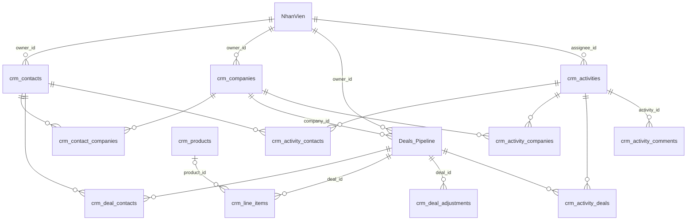

# CRM-00 — Mô hình dữ liệu CRM và chuyển đổi dữ liệu hiện có

# Product Requirement Document

| | | | |
|---|---|---|---|
| **Project Owner** | TTS | **Update at** | 02-10-2026 |
| **Created by** | TTS (qua Claude) | **Project** | CRM theo UX HubSpot — HarnexAI ERP |
| **Version** | 2.0 | **Features** | Spec nền — phục vụ G-03, CO-04, D-15, L-03, L-05, L-07, L-09, S-02, S-03 |

**CONTENT**

- USER STORIES
- OVERVIEW FLOW
- USE CASE DESCRIPTION
  - UC-1: Khởi tạo collection, trường và danh mục
  - UC-2: Chọn owner cho Contact, Company, Deal
  - UC-3: Chuyển Leads sang Contacts
  - UC-4: Chuyển `sale_ph_tr_ch` sang `owner_id`
  - UC-5: Chuyển `lead_id` sang liên kết Deal – Contact
  - UC-6: Điền `company_id` cho Deal cũ
  - UC-7: Kiểm Mã Deal trước khi bật Duy nhất
  - UC-8: Điền `closed_at` cho Deal đã đóng
  - UC-9: Rà workflow, view và báo cáo đang chạy
  - UC-10: Nhập dữ liệu từ HubSpot
- BUSINESS RULE
- ACCEPTANCE CRITERIA
- PHỤ LỤC

**VERSION HISTORY**

| **Ver** | **Author** | **Description** | **Updated at** |
|---|---|---|---|
| 2.0 | TTS (qua Claude) | Viết lại theo mẫu PRD: user story, use case, business rule, acceptance criteria. Nội dung giữ như bản 1.x | 02-10-2026 |
| 1.x | TTS (qua Claude) | Các bản trước 02-10-2026 (1.0 đến 1.3) | 30-09-2026 → 01-10-2026 |

---

# USER STORIES

US-DATA-01: Là sale, tôi muốn mỗi người liên hệ chỉ nằm ở một nơi (Contacts), kể cả khi họ mới là lead, để hoạt động và deal của họ không bị chia đôi. (QĐ-02)

US-DATA-02: Là sale, tôi muốn một contact gắn được với nhiều công ty và một deal gắn được với một công ty, nhiều contact, để nhìn đúng quan hệ khách hàng. (G-03, QĐ-03)

US-DATA-03: Là sale, tôi muốn deal có line item lấy từ thư viện sản phẩm, có tần suất thanh toán, trường tuỳ chỉnh và chiết khấu, phí, thuế cấp deal, để báo giá đúng cho khách. (L-03, L-05, L-07, L-09)

US-DATA-04: Là quản lý kinh doanh, tôi muốn owner của contact, công ty, deal là một nhân viên thật chứ không phải dòng chữ, để đổi tên hay chuyển giao không làm sai dữ liệu. (S-02, S-03, QĐ-01)

US-DATA-05: Là quản lý kinh doanh, tôi muốn công ty có thêm Quốc gia/Khu vực và Lead status để lọc và báo cáo như trên HubSpot. (CO-04)

US-DATA-06: Là quản lý kinh doanh, tôi muốn dữ liệu Leads và Deals đang có được chuyển sang mô hình mới mà không mất bản ghi nào và workflow đang chạy không bị lỗi.

US-DATA-07: Là lập trình viên BE, tôi muốn một nơi duy nhất ghi collection, key, kiểu trường, danh mục và quan hệ để mọi spec khác trích từ đó. (G-03, D-15)

US-DATA-08: Là người chạy script, tôi muốn script khởi tạo và script chuyển đổi có chế độ chạy thử và chạy lại được, để kiểm trước và không tạo dữ liệu trùng.

US-DATA-09: Là người chạy script, tôi muốn một quy trình rà workflow, view và báo cáo trước khi tắt các trường cũ, để biết chắc không còn nơi nào đọc chúng.

# OVERVIEW FLOW

| **Bước** | **Tác nhân** | **Mô tả** |
|---|---|---|
| 1 | Người chạy script | Khảo sát collection Leads, trường của `NhanVien` và các workflow đang chạy. |
| 2 | Người chạy script | Chạy script khởi tạo qua API. |
| 3 | Máy chủ | Tạo 12 collection mới, thêm trường cho `Deals_Pipeline` và `NhanVien`, tạo danh mục, cấu hình metadata và sản phẩm mẫu. |
| 4 | Người chạy script | Xuất JSON từng workflow, rà cả view đã lưu và báo cáo, lập bảng việc phải sửa. |
| 5 | Người chạy script | Chạy thử script chuyển Leads, đọc báo cáo CSV. |
| 6 | Người chạy script | Chạy thật: tạo Companies, rồi Contacts, rồi dòng nối Contact – Company. |
| 7 | Người chạy script | Chuyển `sale_ph_tr_ch` sang `owner_id` và `lead_id` sang dòng nối Deal – Contact. |
| 8 | Người duyệt dữ liệu | Duyệt gợi ý `company_id`, xử lý Mã Deal trùng hoặc rỗng, xem danh sách deal đã đóng thiếu ngày đóng. |
| 9 | Người chạy script | Khi bảng rà đủ dấu "Đã sửa": tắt quyền ghi Leads, tắt đồng bộ tên sale, ẩn `lead_id` và `sale_ph_tr_ch`. |
| 10 | Sale | Chọn owner là nhân viên đang làm việc, mở view "của tôi" thấy đúng bản ghi của mình. |

# USE CASE DESCRIPTION

## UC-1: Khởi tạo collection, trường và danh mục (G-03, CO-04, D-15, L-03, L-05, L-07, L-09, S-02)

| | |
|---|---|
| **Actor** | Người chạy script (BE) |
| **Trigger** | Chạy script khởi tạo trên workspace |
| **Pre-condition** | BE đã trả lời câu hỏi Q1 (API cho chỉ định key). Đã khảo sát trường hiện có của `NhanVien` (Q5). |
| **Main Flow** | 1. Script gọi API tạo 12 collection mới với slug có tiền tố `crm_` (danh sách ở Phụ lục B, phần danh sách collection).<br>2. Script tạo trường cho từng collection, đúng key, kiểu, cờ Bắt buộc và Duy nhất theo Phụ lục B.<br>3. Script thêm 12 trường mới vào `Deals_Pipeline`, giữ nguyên 17 key đang có.<br>4. Script thêm các trường "Mới" vào `NhanVien`. Trường nào `NhanVien` đã có với ý nghĩa tương đương thì dùng trường đó.<br>5. Script tạo danh mục giá trị cho các trường lựa chọn (Phụ lục B, phần danh mục giá trị).<br>6. Script ghi cấu hình metadata collection (Phụ lục B, phần cấu hình metadata).<br>7. Script sắp lại vị trí trường của `Deals_Pipeline` theo CRM-04, phần thứ tự cột của bảng Deals.<br>8. Script tạo 7 sản phẩm mẫu (Phụ lục B, phần dữ liệu khởi tạo). |
| **Post-condition** | Workspace có đủ cấu trúc dữ liệu CRM. Company có `country` và `lead_status` (CO-04). Deal có `company_id` (G-03). Có Products, Line items, Điều chỉnh Deal (L-03, L-05, L-07, L-09). `NhanVien` đủ trường cho Sales (S-02). Key `pipeline` được giữ chỗ cho nhiều pipeline (D-15), chưa tạo. |
| **Exception Flow** | 1a. Collection, trường hoặc sản phẩm đã tồn tại → script không tạo trùng, báo "đã tồn tại" cho từng mục.<br>2a. API không cho chỉ định key → dừng, phải bổ sung API trước khi chạy script (Q1).<br>6a. `history_config` của `Deals_Pipeline` chưa ghi ở bước này; ghi cùng đợt với UC-4, sau khi `owner_id` đã có dữ liệu. |

## UC-2: Chọn owner cho Contact, Company, Deal (S-03)

| | |
|---|---|
| **Actor** | Sale, quản lý kinh doanh |
| **Trigger** | Mở ô chọn Contact owner, Company owner hoặc Sale phụ trách |
| **Pre-condition** | `NhanVien` đã có các trường `work_status`, `is_sales` |
| **Main Flow** | 1. Hệ thống đọc trực tiếp từ `NhanVien` và liệt kê nhân viên có `work_status = Đang làm việc` và `is_sales = true`.<br>2. Người dùng chọn một nhân viên.<br>3. Máy chủ lưu `owner_id` là id bản ghi `NhanVien`, không lưu chuỗi tên.<br>4. Với Deal, trong thời gian chuyển tiếp, máy chủ ghi Họ và tên của nhân viên vào `sale_ph_tr_ch` trong cùng lần lưu. |
| **Post-condition** | Bản ghi có owner là liên kết tới nhân viên. Đổi tên nhân viên thì mọi bản ghi tự hiện tên mới. Người đó thấy bản ghi trong view "của tôi" nếu nhân viên có `tai_khoan` là tài khoản của họ. |
| **Exception Flow** | 1a. Nhân viên mới tạo → hiện ngay trong ô chọn owner.<br>1b. Bản ghi đang thuộc nhân viên "Tạm nghỉ" hoặc "Đã nghỉ" → vẫn hiện tên đó, kèm nhãn trạng thái.<br>1c. Ô Người thực hiện của task → liệt kê mọi nhân viên đang làm việc, không cần `is_sales`.<br>3a. Người dùng không có bản ghi `NhanVien` nào nối với tài khoản → view "của tôi" rỗng, giao diện hiện câu giải thích (CRM-01). |

## UC-3: Chuyển Leads sang Contacts (QĐ-02)

| | |
|---|---|
| **Actor** | Người chạy script |
| **Trigger** | Chạy script chuyển Leads |
| **Pre-condition** | UC-1 đã xong. Workflow đang trigger trên Leads đã được sửa (UC-9). |
| **Main Flow** | 1. Người chạy script khảo sát Leads và ghi kết quả vào một file khảo sát đính kèm spec:<br>1.1. Gọi `GET /collections/:id` của Leads để lấy danh sách trường (key, tên, kiểu, danh mục).<br>1.2. Đếm số bản ghi, số bản ghi có email, số email trùng nhau trong chính Leads.<br>1.3. Liệt kê workflow đang có trigger hoặc node đọc, ghi Leads.<br>1.4. Liệt kê các giá trị thực tế của trường trạng thái lead (nếu có).<br>2. Người chạy script điền bảng ánh xạ trường Leads sang Contacts (Phụ lục B).<br>3. Người chạy script chạy chế độ chạy thử. Script chỉ đọc và xuất báo cáo CSV gồm: sẽ tạo mới, sẽ ghép, lỗi.<br>4. Người chạy script chạy thật.<br>5. Script tìm hoặc tạo Company từ tên công ty của từng Lead (BR-13).<br>6. Script tạo Contact, hoặc điền vào Contact đã có cùng email (BR-12).<br>7. Script tạo dòng nối Contact – Company với `is_primary = true`.<br>8. Script xuất file ánh xạ mọi Lead sang Contact (`lead_id → contact_id`), lưu cùng báo cáo chuyển đổi.<br>9. Người chạy script tắt quyền ghi trên Leads cho mọi vai trò. |
| **Post-condition** | Mỗi Lead có một Contact tương ứng với `lifecycle_stage = Lead` (mặc định), `legacy_lead_id` và `lead_created_at`. Leads thành chỉ đọc và không bị xoá trong ít nhất 60 ngày. |
| **Exception Flow** | 4a. Chạy thật lần hai → không tạo bản ghi trùng (so theo `legacy_lead_id`).<br>5a. Tên công ty khớp nhiều hơn một Company → không tự chọn, không tạo dòng nối, ghi báo cáo "khớp nhiều".<br>6a. Email sai định dạng → để trống `email`, ghi báo cáo lỗi.<br>6b. Nguồn không khớp danh mục D-SOURCE → để trống, ghi báo cáo.<br>6c. Leads không có ngày tạo → để trống `lead_created_at`, ghi báo cáo.<br>9a. Còn workflow trigger trên Leads chưa sửa → chưa được tắt quyền ghi, nếu không form hoặc workflow đang tạo Lead sẽ báo lỗi. |

## UC-4: Chuyển `sale_ph_tr_ch` sang `owner_id` (S-03, QĐ-01)

| | |
|---|---|
| **Actor** | Người chạy script |
| **Trigger** | Chạy script chuyển trường trên `Deals_Pipeline` |
| **Pre-condition** | `Deals_Pipeline` đã có trường `owner_id`. `NhanVien` đã có bản ghi của các sale. |
| **Main Flow** | 1. Với mỗi Deal có `sale_ph_tr_ch` khác rỗng, script tìm `NhanVien` có Họ và tên trùng khớp (cách so ở BR-14).<br>2. Khớp đúng một nhân viên: script ghi `owner_id`.<br>3. Script đặt `is_sales = true` cho nhân viên khớp `sale_ph_tr_ch` và nhân viên có Team hoặc Vai trò.<br>4. Người chạy script ghi `history_config` cho `Deals_Pipeline` sau khi `owner_id` đã có dữ liệu.<br>5. BE bật đồng bộ một chiều: mỗi khi `owner_id` đổi, ghi Họ và tên nhân viên vào `sale_ph_tr_ch`. |
| **Post-condition** | Deal cũ có `owner_id`. Workflow cũ đọc `sale_ph_tr_ch` vẫn đúng trong thời gian chuyển tiếp. |
| **Exception Flow** | 2a. Không khớp hoặc khớp nhiều → để trống `owner_id`, ghi báo cáo kèm giá trị gốc để xử lý tay.<br>4a. Ghi `history_config` trước khi `owner_id` có dữ liệu → không ai được tự thêm vào người theo dõi.<br>5a. UC-9 xác nhận không còn workflow nào đọc trường cũ → tắt đồng bộ và ẩn `sale_ph_tr_ch`. |

## UC-5: Chuyển `lead_id` sang liên kết Deal – Contact (G-03)

| | |
|---|---|
| **Actor** | Người chạy script |
| **Trigger** | Chạy script chuyển trường trên `Deals_Pipeline`, sau UC-3 |
| **Pre-condition** | Có file ánh xạ `lead_id → contact_id` của UC-3. Khảo sát Leads đã trả lời `lead_id` đang chứa gì: id bản ghi Leads, mã lead do người nhập, hay số điện thoại. |
| **Main Flow** | 1. Nếu `lead_id` là id bản ghi Leads: script tra file ánh xạ để lấy Contact.<br>2. Script tạo dòng `crm_deal_contacts` nối Deal với Contact đó, `label` trống.<br>3. `lead_id` chuyển sang chỉ đọc. |
| **Post-condition** | Deal cũ có Contact qua bảng nối. `lead_id` giữ chỉ đọc cho tới khi UC-9 xác nhận không còn workflow đọc. |
| **Exception Flow** | 1a. `lead_id` là mã khác → lập bảng ánh xạ riêng sau khảo sát.<br>1b. Không tìm được Contact → ghi báo cáo. |

## UC-6: Điền `company_id` cho Deal cũ (G-03)

| | |
|---|---|
| **Actor** | Người chạy script, người duyệt dữ liệu |
| **Trigger** | Sau UC-5 |
| **Pre-condition** | Deal đã có ít nhất một Contact và Contact đó có Company Primary |
| **Main Flow** | 1. Script gợi ý Company Primary của Contact làm công ty của Deal.<br>2. Script xuất các gợi ý ra báo cáo.<br>3. Người duyệt xem và duyệt từng gợi ý.<br>4. Script ghi `company_id` cho các gợi ý đã duyệt. |
| **Post-condition** | Deal cũ có `company_id` đã được người duyệt xác nhận. |
| **Exception Flow** | 1a. Deal không có Contact, hoặc Contact không có Company Primary → không có gợi ý, điền tay.<br>2a. Script không ghi tự động. Không suy công ty từ "Tên Deal" như prototype vì không đủ tin cậy cho dữ liệu thật. |

## UC-7: Kiểm Mã Deal trước khi bật Duy nhất

| | |
|---|---|
| **Actor** | Người chạy script, người phụ trách dữ liệu |
| **Trigger** | Trước khi bật cờ Duy nhất cho `m_deal` |
| **Pre-condition** | Không có |
| **Main Flow** | 1. Script liệt kê deal có `m_deal` rỗng và các nhóm deal trùng `m_deal`. Khi so, script bỏ khoảng trắng hai đầu và không phân biệt hoa thường.<br>2. Script gửi báo cáo cho người phụ trách dữ liệu.<br>3. Người phụ trách dữ liệu quyết định mã mới cho từng deal.<br>4. Khi báo cáo rỗng, người chạy script bật cờ Duy nhất cho `m_deal`.<br>5. Script khởi tạo bộ đếm Mã Deal bằng số lớn nhất đang có + 1 (cách sinh mã ở CRM-04, phần sinh Mã Deal). |
| **Post-condition** | `m_deal` là duy nhất. Deal mới do BE sinh mã `DEAL-{n}` từ bộ đếm. |
| **Exception Flow** | 1a. Script không tự sửa mã.<br>4a. Báo cáo chưa rỗng → chưa bật cờ Duy nhất.<br>5a. Mã cũ không theo dạng `DEAL-{n}` (ví dụ `HX-2025-07`) → giữ nguyên và không tính vào số lớn nhất. |

## UC-8: Điền `closed_at` cho Deal đã đóng

| | |
|---|---|
| **Actor** | Người chạy script |
| **Trigger** | Chạy script chuyển trường trên `Deals_Pipeline` |
| **Pre-condition** | `Deals_Pipeline` đã có trường `closed_at` |
| **Main Flow** | 1. Script tìm deal đang ở `5. Closed Won` hoặc `6. Closed Lost` lúc chạy.<br>2. Script điền `closed_at` bằng `ng_y_c_p_nh_t_g_n_nh_t` nếu trường này có giá trị. |
| **Post-condition** | Deal đã đóng có ngày đóng để tính trong báo cáo và chỉ số của sale. `stage_changed_at` của deal cũ để trống, chỉ ghi từ lần đổi giai đoạn đầu tiên sau khi triển khai. |
| **Exception Flow** | 2a. `ng_y_c_p_nh_t_g_n_nh_t` trống → để trống `closed_at`, ghi báo cáo.<br>2b. Deal có `closed_at` trống → không được tính trong các thẻ báo cáo và chỉ số dựa trên ngày đóng (CRM-07, báo cáo thời gian chốt; CRM-08, công thức chỉ số). Cách điền này cần khách xác nhận (Phụ lục E, Q11). |

## UC-9: Rà workflow, view và báo cáo đang chạy

| | |
|---|---|
| **Actor** | Người chạy script, người sửa workflow |
| **Trigger** | Trước khi chạy UC-3 đến UC-8; và mỗi khi cần đổi tên một giá trị danh mục sau go-live |
| **Pre-condition** | ERP đang có 10 workflow có thể kích hoạt từ trang chi tiết Deal (khảo sát 23/09). Workflow trigger trên Leads chưa đếm. |
| **Main Flow** | 1. Người chạy script xuất JSON từng workflow (ERP có "Xuất JSON").<br>2. Người chạy script tìm trong JSON các chuỗi: id của collection Leads, `sale_ph_tr_ch`, `lead_id`, `test`, id collection `Deals_Pipeline`.<br>3. Người chạy script điền bảng rà (Phụ lục B, phần bảng rà workflow).<br>4. Workflow ghi vào Leads: người sửa đổi đích sang `crm_contacts` và bổ sung `lifecycle_stage = Lead`.<br>5. Workflow đọc `sale_ph_tr_ch`: người sửa đổi sang đọc `owner_id`; nếu cần tên thì đọc qua liên kết.<br>6. Người chạy script rà cả view đã lưu và báo cáo của `Deals_Pipeline` và Leads:<br>6.1. View lọc, sắp xếp hay hiện cột `sale_ph_tr_ch` → đổi điều kiện sang `owner_id` (điều kiện "Bằng Minh Trần" đổi thành owner là bản ghi nhân viên Minh Trần).<br>6.2. View dùng `lead_id` → bỏ điều kiện và ghi vào bảng để báo người tạo view.<br>6.3. View trên Leads → không chuyển sang Contacts tự động; ghi danh sách để người dùng tạo lại.<br>6.4. Ghi các dòng này vào cùng bảng rà, cột Workflow đổi thành "View {tên}" hoặc "Báo cáo {tên}".<br>7. Khi bảng đủ dấu "Đã sửa", người chạy script tắt quyền ghi Leads, tắt đồng bộ ở UC-4 và ẩn `lead_id`, `sale_ph_tr_ch`. |
| **Post-condition** | Không còn workflow, view hay báo cáo nào đọc trường cũ. Trường `test` được đề xuất xoá sau khi xác nhận không workflow nào dùng. |
| **Exception Flow** | 7a. Bảng chưa đủ dấu "Đã sửa" → không được tắt quyền ghi Leads, không tắt đồng bộ, không ẩn trường cũ.<br>Đổi tên giá trị danh mục sau go-live: dùng lại đúng bảng này. Tìm chuỗi cũ trong JSON workflow, bộ lọc đã lưu và cấu hình báo cáo, sửa hết rồi mới đổi. |

## UC-10: Nhập dữ liệu từ HubSpot (QĐ-07)

| | |
|---|---|
| **Actor** | Người chạy script |
| **Trigger** | QĐ-07 được chốt là "có" |
| **Pre-condition** | UC-1 đã xong. Khách xuất được dữ liệu từ HubSpot. |
| **Main Flow** | 1. Khách xuất từ HubSpot ba file CSV: Companies, Contacts, Deals, kèm cột associations.<br>2. Script thêm trường `hubspot_id` (Văn bản, Duy nhất) cho `crm_companies`, `crm_contacts`, `Deals_Pipeline`.<br>3. Script nhập theo thứ tự: Companies → Contacts → dòng nối Contact – Company → Deals → dòng nối Deal – Contact và `company_id`.<br>4. Script ghép HubSpot owner với `NhanVien` theo email.<br>5. Script ánh xạ lifecycle stage một–một, vì giá trị của HubSpot trùng tên danh mục D-LIFECYCLE.<br>6. Script ánh xạ deal stage của HubSpot sang 6 giai đoạn của `Deals_Pipeline` theo bảng ánh xạ lập khi có file thật. |
| **Post-condition** | Dữ liệu HubSpot có trong CRM. Nhập lại không tạo trùng nhờ `hubspot_id`. |
| **Exception Flow** | QĐ-07 chưa chốt hoặc chốt "không" → không làm use case này.<br>Hoạt động (notes, tasks, calls, meetings) của HubSpot không nhập trong giai đoạn này, trừ khi khách yêu cầu riêng. |

# BUSINESS RULE

| **BR** | **Mô tả** |
|---|---|
| BR-01 | **Phạm vi của spec này**<br>- File này là nơi duy nhất định nghĩa collection, trường, key và liên kết của CRM. Mọi spec khác (CRM-01 đến CRM-10, F03-S1 đến F03-S6, F14-S1) trích key từ đây. Spec khác cần thêm hay đổi trường thì sửa ở đây trước.<br>- Trong phạm vi: 12 collection mới và phần sửa trên 2 collection có sẵn (`Deals_Pipeline`, `NhanVien`); danh mục giá trị; quan hệ và hành vi khi xoá; chuyển Leads sang Contacts; chuyển hai trường văn bản trên `Deals_Pipeline` sang trường liên kết; quy trình rà workflow; dữ liệu khởi tạo.<br>- Ngoài phạm vi: cách engine lưu, truy vấn và kiểm tra bảng nối (F03-S1); cách tính các trường tính (F03-S2); nhật ký thay đổi và sự kiện hệ thống trên timeline (F03-S3); hành vi nghiệp vụ của Activities như nhắc hạn, lặp lại, ghim (F03-S6); giao diện từng màn (CRM-01 trở đi).<br>- Nhập dữ liệu từ HubSpot chỉ làm nếu QĐ-07 được chốt là "có".<br>- Nhiều pipeline (D-15, P2) chưa làm trong giai đoạn này. Khi làm sẽ thêm trường `pipeline` và danh mục giai đoạn theo pipeline. Không ai được dùng key `pipeline` cho việc khác. |
| BR-02 | **Hai loại chủ sở hữu**<br>- Mọi bản ghi của ERP đã có chủ sở hữu hệ thống là tài khoản người dùng (`ownerUserId` theo F03). Tài khoản này quyết định quyền: chủ sở hữu luôn đọc, sửa, xoá được bản ghi của mình.<br>- `owner_id` là chủ sở hữu nghiệp vụ (sale phụ trách). Trường này trỏ tới bản ghi nhân viên, không phải tài khoản.<br>- Đề xuất: khi `owner_id` được đặt hoặc đổi và nhân viên đó có `tai_khoan`, BE đặt chủ sở hữu hệ thống của bản ghi bằng tài khoản đó. Như vậy sale phụ trách luôn sửa được bản ghi của mình kể cả khi collection không cấp quyền ghi chung. Đề xuất này cần BE và khách xác nhận (Q8) vì nó thay đổi ai được sửa bản ghi. |
| BR-03 | **Ô chọn owner (S-03)**<br>- Ô chọn Contact owner, Company owner, Sale phụ trách chỉ liệt kê nhân viên có `work_status = Đang làm việc` và `is_sales = true`.<br>- Ô Người thực hiện của task liệt kê mọi nhân viên đang làm việc, không cần `is_sales` (CRM-08, phần ô chọn owner).<br>- Bản ghi đang thuộc nhân viên "Tạm nghỉ" hoặc "Đã nghỉ" vẫn hiển thị tên đó, kèm nhãn trạng thái (CRM-08, S-19).<br>- Nhân viên mới tạo xuất hiện ngay trong mọi ô chọn owner, vì ô chọn đọc trực tiếp từ `NhanVien`. |
| BR-04 | **View "của tôi"**<br>- "Contacts của tôi", "Deals của tôi" và các view tương tự lọc theo điều kiện: nhân viên trong `owner_id` có `tai_khoan` là người đang đăng nhập.<br>- Bộ lọc dùng toán tử `linked_to_me` của F03-S1 (Phụ lục C). Metadata của `NhanVien` đặt `identityUserField = "tai_khoan"` để toán tử biết so với trường nào.<br>- View đã lưu giữ toán tử, không giữ id người. Mỗi người mở view thấy bản ghi của mình.<br>- Người dùng không có bản ghi `NhanVien` nào nối với tài khoản sẽ thấy view rỗng. Giao diện hiện câu giải thích thay vì một bảng trống (CRM-01).<br>- View "của tôi" là bộ lọc, không phải chặn quyền. ERP chưa có quy tắc "chỉ xem bản ghi của mình" ở tầng quyền (ghi nhận ở `TTB/spec_ttb_sales_pipeline.md`, phần quyền). Nếu khách cần sale không xem được khách của nhau thì đó là việc riêng, không nằm trong spec này. |
| BR-05 | **Key, slug và cách tạo**<br>- Mọi collection và trường trong file này được tạo bằng script khởi tạo gọi API, không tạo tay trên giao diện, để đặt được key (Q1).<br>- Key là `snake_case` ASCII, có nghĩa, đặt tay. Không dùng key do ERP tự sinh từ tên tiếng Việt.<br>- Các key đang có trên `Deals_Pipeline` được giữ nguyên (QĐ-09). Trường mới đặt key chuẩn.<br>- Slug collection có tiền tố `crm_`, không đổi được sau khi có bản ghi. Deals giữ collection `Deals_Pipeline` đang chạy, không tạo mới.<br>- Script khởi tạo chạy lại không tạo collection, trường hay sản phẩm trùng.<br>- Quy ước đầy đủ ở Phụ lục B, phần quy ước chung. |
| BR-06 | **Giá trị lựa chọn cố định sau go-live**<br>- Theo hiện trạng ERP, trường Lựa chọn đơn lưu chính chuỗi hiển thị (ví dụ `"5. Closed Won"`). BE cần xác nhận (Q2).<br>- Hệ quả: đổi tên một lựa chọn là đổi dữ liệu. Workflow, bộ lọc đã lưu và báo cáo so sánh theo chuỗi sẽ sai nếu đổi tên mà không rà.<br>- Mọi danh mục trong file này coi là cố định sau khi go-live. Muốn đổi phải qua quy trình ở UC-9.<br>- Bốn chuỗi mà logic hệ thống dựa vào không được đổi tên: `5. Closed Won`, `6. Closed Lost`, `Lead`, `Customer` (Phụ lục B, phần chuỗi giá trị hệ thống dựa vào). Nếu buộc phải đổi, sửa đồng thời mọi nơi liệt kê.<br>- "Deal đang mở" trên mọi màn nghĩa là `giai_o_n_pipeline` khác `5. Closed Won` và `6. Closed Lost`. |
| BR-07 | **Không lưu mảng**<br>- Mọi quan hệ nhiều–nhiều dùng bảng nối: một collection riêng, mỗi dòng là một cặp.<br>- Không dùng trường Liên kết nhiều giá trị. Không dùng Lựa chọn nhiều để chứa danh sách thực thể.<br>- Danh sách người tham dự cuộc họp, người đã liên hệ trong cuộc gọi cũng đi qua bảng nối.<br>- Ngoại lệ duy nhất: trường Tệp đính kèm lưu danh sách id tệp, đúng như kiểu trường có sẵn của ERP. |
| BR-08 | **Contact và Company**<br>- Lead là Contact có `lifecycle_stage = Lead`. Contact mới tạo mặc định `lifecycle_stage = Lead`.<br>- Một Contact phải có ít nhất một trong ba: `email`, `first_name`, `last_name`. Kiểm ở form tạo (CRM-02) và trong script nhập. Q4 hỏi BE có chặn được ở API không.<br>- `email` lưu chữ thường, bỏ khoảng trắng hai đầu, duy nhất khi có giá trị.<br>- `full_name` do BE ghi mỗi khi họ hoặc tên đổi, không sửa tay.<br>- ERP không có loại trường Email hay Số điện thoại riêng. Email và SĐT dùng Văn bản; kiểm định dạng ở FE (CRM-02, CRM-03) và trong script nhập.<br>- `domain` của Company lưu dạng `ten-mien.vn`, duy nhất khi có giá trị, dùng để tránh tạo trùng công ty.<br>- `country` mặc định "Việt Nam" khi tạo Company từ giao diện (CO-04).<br>- Công ty của Contact không phải trường trên Contact mà nằm trong bảng nối. |
| BR-09 | **Công ty chính (Primary) của Contact (QĐ-03)**<br>- Một Contact thuộc nhiều Company, trong đó tối đa một Primary.<br>- Khi một Contact được gắn Company đầu tiên, dòng đó tự là Primary.<br>- Đặt dòng mới là Primary thì dòng cũ tự bỏ Primary.<br>- Khi gỡ dòng Primary mà Contact còn công ty khác, hệ thống không tự chọn Primary mới. Cột "Công ty chính" để trống cho tới khi người dùng chọn, vì hệ thống không có cơ sở để đoán công ty nào đúng.<br>- Cột "Công ty chính" trên danh sách lấy từ dòng nối có `is_primary = true`. |
| BR-10 | **Deal**<br>- Một Deal thuộc tối đa một Company (`company_id`, G-03) và có nhiều Contact qua bảng nối có nhãn vai trò.<br>- `m_deal` là khoá nghiệp vụ, không đổi sau khi tạo (D-10). Deal mới do BE sinh mã `DEAL-{n}`.<br>- `t_ng_cash_in_d_ki_n` là "Amount" trên mọi màn và báo cáo. Có thể được ghi từ tổng line item (CRM-06, L-11).<br>- BE ghi `stage_changed_at` khi `giai_o_n_pipeline` đổi.<br>- BE ghi `closed_at` khi giai đoạn chuyển vào Won hoặc Lost, và xoá khi chuyển ra.<br>- Báo cáo thời gian chốt dùng `closed_at`, không dùng `stage_changed_at`.<br>- Giao diện mới không cho sửa `sale_ph_tr_ch`. Đồng bộ chỉ một chiều, từ `owner_id` sang `sale_ph_tr_ch`. |
| BR-11 | **Sản phẩm, line item và điều chỉnh cấp Deal (L-03, L-05, L-07, L-09)**<br>- Line item có thể lấy từ thư viện Products hoặc là dòng tuỳ chỉnh (`product_id` trống, L-04).<br>- Tên, đơn giá, SKU, giá vốn được sao chép từ sản phẩm lúc thêm. Đổi giá sản phẩm sau này không làm thay đổi báo giá đã gửi cho khách.<br>- Đơn giá của hàng định kỳ là giá một kỳ. `term` bắt buộc khi tần suất khác "Một lần".<br>- Chiết khấu kiểu `%` không được lớn hơn 100.<br>- Sản phẩm ngừng bán (`is_active = false`) không hiện trong thư viện nhưng line item cũ vẫn giữ.<br>- Giá trị mặc định cho trường tuỳ chỉnh của line item (L-07) lưu trên Products dưới dạng trường cùng key. Cách tạo cặp trường ở F03-S4 và CRM-06.<br>- Chiết khấu, phí, thuế cấp Deal (L-09) là các dòng riêng trong `crm_deal_adjustments`, vì một Deal có thể có nhiều dòng. Thứ tự áp dụng (chiết khấu → phí → thuế) ở CRM-06.<br>- `line_total` do BE tính khi lưu, không sửa tay. |
| BR-12 | **Activities**<br>- `crm_activities` chứa hoạt động do người tạo: Ghi chú, Task, Cuộc gọi, Cuộc họp. `activity_type` không đổi được sau khi tạo.<br>- Sự kiện hệ thống (tạo bản ghi, đổi giai đoạn…) không lưu ở đây mà lấy từ nhật ký F03-S3. Timeline gộp hai nguồn (F03-S6).<br>- Email, SMS, WhatsApp, LinkedIn nằm ngoài phạm vi (A-15).<br>- Một hoạt động gắn được cùng lúc vào nhiều Contact, Company và Deal, nên hiện trên timeline của tất cả.<br>- Ghim là theo từng bản ghi: cờ `is_pinned` nằm trên dòng bảng nối, không có trường "ghim" trên hoạt động.<br>- "Đã liên hệ" của cuộc gọi và "Người tham dự" của cuộc họp là dòng `crm_activity_contacts` có `role` tương ứng.<br>- `body_html` được lọc ở BE trên mọi đường ghi, chỉ giữ thẻ `b strong i em u br p div ul ol li` (A-02).<br>- Gợi ý liên kết khi tạo hoạt động (A-03): tạo từ Contact thì gắn Contact đó, Company Primary của nó và các Deal đang mở của nó; tạo từ Deal thì gắn Deal đó, mọi Contact của Deal và Company của Deal; tạo từ Company thì gắn Company đó.<br>- Máy chủ chỉ gợi ý. Người dùng bỏ chọn được từng bản ghi trước khi lưu. Máy chủ không tự gắn thêm lúc lưu (F03-S6, phần gợi ý liên kết; CRM-05, phần chọn bản ghi liên kết). |
| BR-13 | **Xoá**<br>- Xoá trong ERP mặc định là xoá mềm: bản ghi vào thùng rác 30 ngày, khôi phục được (F03).<br>- Không xoá được nhân viên còn bản ghi trỏ tới (owner của Contact, Company, Deal kể cả Deal đã đóng; người thực hiện của hoạt động). Thông báo: "Không thể xoá: nhân viên còn sở hữu 1 bản ghi. Hãy chuyển giao, hoặc đánh dấu Đã nghỉ."<br>- Nhân viên nghỉ việc thì đánh dấu `work_status = Đã nghỉ` (S-19), không xoá. Xoá chỉ dành cho bản ghi nhân viên tạo nhầm.<br>- Xoá Deal thì line item, điều chỉnh bị xoá mềm theo; khôi phục Deal thì khôi phục theo. Xoá hoạt động thì bình luận xoá theo.<br>- Xoá Company thì Deal giữ nguyên, trường công ty hiện "(Đã xoá) Tên công ty".<br>- Xoá sản phẩm thì line item giữ nguyên; nên tắt `is_active` thay vì xoá.<br>- Bảng đầy đủ R1–R14 ở Phụ lục B, phần quan hệ và hành vi khi xoá. |
| BR-14 | **Chống trùng và ghép khi chuyển Leads**<br>- `email` đã tồn tại trên Contacts: không tạo mới. Chỉ điền các trường đang trống của Contact có sẵn; ghi `legacy_lead_id` nếu đang trống.<br>- Hai bản ghi Leads cùng email: bản tạo sớm hơn là gốc, bản sau điền vào trường trống. Ghi cả hai id vào báo cáo.<br>- Lead không có email: luôn tạo mới, vì không có khoá tin cậy để ghép.<br>- Script luôn xuất file ánh xạ mọi Lead sang Contact, kể cả Lead bị ghép vào Contact có sẵn. `legacy_lead_id` chỉ giữ được một id nên không đủ cho UC-5.<br>- Họ tên một trường được tách tại khoảng trắng cuối cùng: "Nguyễn Văn An" → `last_name` "Nguyễn Văn", `first_name` "An".<br>- Không ghi đè ngày tạo hệ thống. Ngày tạo của Lead ghi vào `lead_created_at`.<br>- Ghép Sale phụ trách và Người phụ trách theo tên: so Họ và tên sau khi bỏ khoảng trắng thừa và chuẩn Unicode NFC, giữ nguyên dấu, không phân biệt chữ hoa, chữ thường. |
| BR-15 | **Tìm hoặc tạo Company từ tên công ty**<br>Theo thứ tự, dừng ở bước đầu tiên khớp:<br>- Bước 1: nếu Leads có trường website/domain, chuẩn hoá như `crm_companies.domain` và tìm Company cùng domain.<br>- Bước 2: so tên đã chuẩn hoá (bỏ khoảng trắng thừa, chữ thường, chuẩn Unicode NFC, bỏ các tiền tố "công ty", "cty", "tnhh", "cổ phần", "cp"). Khớp đúng một Company thì dùng.<br>- Bước 3: khớp nhiều hơn một thì không tự chọn; ghi vào báo cáo để người xử lý.<br>- Bước 4: không khớp thì tạo Company mới với `name` là tên gốc (chưa chuẩn hoá).<br>- Không dùng domain của email để suy ra công ty. Email Gmail, Yahoo… sẽ gom nhầm mọi người vào một "công ty". |
| BR-16 | **Cách chạy script chuyển đổi**<br>- Script có hai chế độ: chạy thử (chỉ đọc, xuất báo cáo CSV) và chạy thật.<br>- Chạy thật idempotent theo `legacy_lead_id`: chạy lại không tạo bản ghi trùng.<br>- Thứ tự: Companies trước, rồi Contacts, rồi dòng nối Contact – Company.<br>- Sau khi chạy thật: tắt quyền ghi trên Leads cho mọi vai trò. Không xoá Leads trong ít nhất 60 ngày.<br>- Workflow đang trigger trên Leads phải được sửa trước khi tắt quyền ghi.<br>- Chỉ khi bảng rà ở UC-9 đủ dấu "Đã sửa" mới được tắt quyền ghi Leads, tắt đồng bộ `sale_ph_tr_ch` và ẩn `lead_id`, `sale_ph_tr_ch`. |

# ACCEPTANCE CRITERIA

Spec này không sở hữu tính năng nào trong sheet. Các tiêu chí dưới kiểm phần dữ liệu mà các tính năng khác dựa vào.

AC-1: Khởi tạo đủ cấu trúc (G-03, L-03, L-05, L-07, L-09)

- Workspace chưa có collection `crm_*`, chạy script khởi tạo → có đủ 12 collection mới và các trường đúng key, kiểu, cờ Bắt buộc, Duy nhất như Phụ lục B.
- `Deals_Pipeline` có thêm 12 trường mới.
- `NhanVien` có thêm các trường "Mới".
- Đọc metadata `NhanVien` thấy `identityUserField = "tai_khoan"`.

AC-2: Script khởi tạo chạy lại không trùng

- Script đã chạy một lần, chạy lại → không có collection, trường hay sản phẩm nào bị tạo trùng.
- Script báo "đã tồn tại" cho từng mục.

AC-3: Company có Quốc gia và Lead status (CO-04)

- Tạo một Company từ API chỉ với `name` → bản ghi có hai trường `country` và `lead_status` (rỗng).
- Hai trường đọc được qua API và lọc được.

AC-4: NhanVien đủ trường cho Sales (S-02)

- Mở một nhân viên → có đủ các trường "Mới": Tài khoản đăng nhập, Team, Vai trò, Chỉ tiêu tháng, Trạng thái, Thuộc đội kinh doanh (`is_sales`).
- Các trường hiện có tương ứng (Họ tên, Email, SĐT, Ngày vào làm) đã được xác nhận qua khảo sát Q5.

AC-5: Owner là liên kết tới nhân viên (S-03)

- "Lan Lê" có `work_status = Đang làm việc` và `is_sales = true`; "Hà Phạm" (kế toán) có `is_sales = false`.
- Đặt Lan Lê làm owner của một Contact, một Company và một Deal → cả ba bản ghi lưu `owner_id` là id bản ghi `NhanVien` của Lan Lê, không phải chuỗi tên.
- Ô chọn owner không có Hà Phạm.

AC-6: Đổi tên nhân viên không làm vỡ owner (S-03)

- Lan Lê đang là owner của 5 bản ghi. Đổi Họ và tên thành "Lê Thị Lan" → cả 5 bản ghi hiển thị owner là "Lê Thị Lan" mà không cần cập nhật hàng loạt.

AC-7: Email, chống trùng và họ tên của Contact

- Tạo Contact với email `  An@Cty.VN ` → lưu `an@cty.vn`.
- Tạo 2 Contact cùng email → lần hai trả 409 CONFLICT.
- Tạo 2 Contact cùng để trống email → cả hai tạo được (Duy nhất không áp cho rỗng; xem Q3).
- Tạo Contact không email, không họ, không tên → bị từ chối nếu BE chặn được ở API (Q4); nếu không, chỉ form chặn.
- Đổi `first_name` → `full_name` cập nhật theo.

AC-8: Primary duy nhất cho mỗi Contact

- Contact A đã có Company X là Primary. Thêm dòng nối A – Y với `is_primary = true` → dòng A – X tự chuyển `is_primary = false`; A chỉ còn một dòng Primary.
- Gỡ dòng Primary khi Contact còn 1 công ty khác → không dòng nào là Primary.

AC-9: Line item và sản phẩm (L-03, L-05)

- Tạo line item `discount_type = %`, `discount_value = 120` → 422, "Chiết khấu phần trăm không được lớn hơn 100".
- Tạo line item tần suất "Hằng tháng", không có `term` → 422.
- Đổi giá sản phẩm sau khi đã có line item → `unit_price` của line item giữ giá cũ.

AC-10: Hành vi khi xoá (G-03, L-09)

- Nhân viên B còn là owner của 1 Deal đã đóng. Xoá B → ERP từ chối với thông báo "Không thể xoá: nhân viên còn sở hữu 1 bản ghi. Hãy chuyển giao, hoặc đánh dấu Đã nghỉ."
- Xoá mềm Deal có 3 line item, 2 điều chỉnh → 5 dòng con xoá mềm theo; khôi phục Deal thì khôi phục cả 5.
- Xoá mềm Company là `company_id` của 2 Deal → 2 Deal còn nguyên, trường công ty hiện "(Đã xoá) …".

AC-11: Ngày đóng và ngày đổi giai đoạn

- Đổi `giai_o_n_pipeline` sang `5. Closed Won` → `closed_at` và `stage_changed_at` được ghi.
- Đổi từ Closed Won về `4. Proposal Sent` → `closed_at` bị xoá, `stage_changed_at` cập nhật.

AC-12: Chuyển Leads chạy thử không ghi dữ liệu

- Leads có 200 bản ghi, chạy script ở chế độ chạy thử → không có bản ghi nào được tạo hay sửa.
- Có file CSV liệt kê số sẽ tạo mới, sẽ ghép, lỗi.

AC-13: Chuyển Leads chạy thật

- Script đã chạy thật một lần, chạy thật lần hai → số Contact không đổi; không có hai Contact cùng `legacy_lead_id`.
- Leads có 2 bản ghi trùng email → 1 Contact; báo cáo ghi cả 2 id.
- Lead có tên công ty khớp 2 Company → không tạo dòng nối; báo cáo ghi "khớp nhiều".
- Lead email `abc@gmail.com`, không có tên công ty → không tạo Company "gmail.com".

AC-14: Chuyển và đồng bộ Sale phụ trách (S-03)

- `sale_ph_tr_ch = "Minh  Trần"` (2 khoảng trắng) → khớp "Minh Trần".
- `sale_ph_tr_ch = "Minh Tran"` (không dấu) → không khớp "Minh Trần"; ghi báo cáo.
- `sale_ph_tr_ch = "minh trần"` (chữ thường) → khớp "Minh Trần".
- Khi đồng bộ đang bật, đổi `owner_id` của một Deal sang Minh Trần → `sale_ph_tr_ch` của Deal đó bằng "Minh Trần" trong cùng lần lưu.

AC-15: Kiểm Mã Deal

- `Deals_Pipeline` có 2 deal cùng Mã Deal "DEAL-0005" và 1 deal Mã Deal rỗng → báo cáo ghi đủ 3 deal; cờ Duy nhất chưa bật.
- Mã Deal hiện có: DEAL-0120, HX-2025-07 → bộ đếm khởi tạo ở 121.

AC-16: Lọc nội dung hoạt động

- Tạo hoạt động với `body_html` chứa `<script>` và `` → lưu chỉ còn phần chữ và thẻ cho phép.

# PHỤ LỤC

## B. Dữ liệu

### B.1 Quyết định đầu vào

| Mã | Nội dung | Trạng thái | Hệ quả trong file này |
|---|---|---|---|
| QĐ-01 | Owner của Contact, Company, Deal là **trường Liên kết tới bản ghi `NhanVien`** | Đã chốt 30/09 | Thêm trường `owner_id` (Liên kết → NhanVien) cho 3 đối tượng; thêm `NhanVien.tai_khoan` để biết "của tôi" |
| QĐ-02 | Collection **Leads gộp vào Contacts**; lead là Contact có `lifecycle_stage = Lead` | Đã chốt 30/09 | Chuyển dữ liệu theo UC-3; Leads chuyển sang chỉ đọc |
| QĐ-03 | Một Contact thuộc **nhiều Company**, trong đó tối đa **một Primary** | Đã chốt 30/09 | Bảng nối `crm_contact_companies` có `is_primary` |
| QĐ-09 | **Giữ key cũ** của các trường đang có trên Deals_Pipeline | Theo đề xuất mặc định của plan, **chưa có xác nhận riêng** | Giữ nguyên 17 key; trường mới đặt key chuẩn |
| QĐ-07 | Có nhập dữ liệu cũ từ HubSpot không | **Chưa chốt** | UC-10 viết sẵn, chỉ thực hiện khi chốt "có" |

Lưu ý QĐ-01: chủ sở hữu hệ thống và chủ sở hữu nghiệp vụ là hai khái niệm khác nhau, xem BR-02.

### B.2 Quy ước chung

**Key trường**

- Key là `snake_case` ASCII, có nghĩa, đặt tay. Ví dụ: `lifecycle_stage`, `owner_id`.
- Không dùng key do ERP tự sinh từ tên tiếng Việt. Ví dụ key hiện có `giai_o_n_pipeline` (sinh từ "Giai Đoạn Pipeline") khó đọc và dễ gõ sai trong biểu thức workflow.
- Trường Liên kết có hậu tố `_id`. Trường ngày giờ có hậu tố `_at`. Trường ngày có hậu tố `_date`. Trường hộp kiểm có tiền tố `is_`.
- Mọi collection và trường trong file này được tạo bằng script khởi tạo gọi API, không tạo tay trên giao diện, để đặt được key (Q1).

**Kiểu trường**

Dùng 14 loại trường đang có trên ERP (trang Quản lý trường). Cột "Mã API" là mã thấy được khi gọi `/collections/:id`. Bảy mã có dấu `?` là tên prototype tự đặt, BE cần xác nhận trước khi viết script.

| Tên trên ERP | Mã API | Dùng trong file này cho |
|---|---|---|
| Văn bản | `TEXT` | tên, email, SĐT, domain… |
| Văn bản dài | `LONG_TEXT` | mô tả, nội dung hoạt động |
| Số | `NUMBER` | số lượng, số kỳ, phần trăm |
| Tiền tệ | `CURRENCY`? | giá, chỉ tiêu. Nếu ERP chưa có mã này, dùng `NUMBER` và định dạng ₫ ở FE |
| Ngày | `DATE` | ngày vào làm |
| Ngày giờ | `DATETIME` | thời điểm hoạt động, hạn task |
| Lựa chọn đơn | `SELECT` | lifecycle, lead status, nhãn liên kết… |
| Lựa chọn nhiều | `MULTI_SELECT`? | **không dùng** (vi phạm quy tắc không lưu mảng khi giá trị là thực thể; chỉ dùng cho nhãn thuần tuý nếu sau này cần) |
| Trạng thái | `STATUS`? | không dùng |
| Hộp kiểm | `CHECKBOX`? | `is_primary`, `is_done`, `is_active` |
| Người dùng | `USER`? | chỉ dùng cho `NhanVien.tai_khoan` |
| Tệp đính kèm | `FILE`? | `attachments` trên Contacts, Companies, Deals (card Tệp đính kèm, C-22) |
| Liên kết | `RELATION` | mọi quan hệ |
| Đường dẫn | `URL`? | không dùng |

ERP **không có** loại Email hay Số điện thoại riêng (khác bản thiết kế F03 gốc có `email`, `phone`). Email và SĐT dùng Văn bản; kiểm định dạng ở FE (CRM-02, CRM-03) và trong script nhập.

**Giá trị lựa chọn**

- Theo hiện trạng ERP, trường Lựa chọn đơn lưu chính chuỗi hiển thị (ví dụ `"5. Closed Won"`). BE cần xác nhận (Q2).
- Hệ quả: đổi tên một lựa chọn là đổi dữ liệu. Workflow, bộ lọc đã lưu và báo cáo so sánh theo chuỗi sẽ sai nếu đổi tên mà không rà. Mọi danh mục trong file này coi là cố định sau khi go-live; muốn đổi phải qua quy trình ở UC-9.
- Các chuỗi mà logic hệ thống dựa vào được liệt kê ở B.4 (phần chuỗi giá trị hệ thống dựa vào) và không được đổi tên.

**Không lưu mảng**

Theo quyết định cố định của dự án, mọi quan hệ nhiều–nhiều dùng bảng nối (một collection riêng, mỗi dòng là một cặp). Không dùng trường Liên kết nhiều giá trị, không dùng Lựa chọn nhiều để chứa danh sách thực thể. Danh sách người tham dự cuộc họp, người đã liên hệ trong cuộc gọi cũng đi qua bảng nối (ba bảng nối của Activities).

Ngoại lệ duy nhất: trường Tệp đính kèm lưu danh sách id tệp, đúng như kiểu trường có sẵn của ERP. Tệp không phải bản ghi nghiệp vụ, không cần truy vấn ngược từ tệp về bản ghi, nên không tách bảng.

**Tên collection**

- Slug có tiền tố `crm_` để gom nhóm trong trang Dữ liệu. Slug theo quy tắc F03: `^[a-z][a-z0-9_]{1,40}$`, không đổi được sau khi có bản ghi.
- Tên hiển thị dùng tiếng Anh như HubSpot và như prototype (Contacts, Companies…), vì người dùng của khách đã quen các tên này.
- Deals giữ nguyên collection `Deals_Pipeline` đang chạy, không tạo mới.
- `NhanVien` không có tiền tố `crm_` vì là collection dùng chung, không riêng CRM.

**Trường hệ thống**

Mọi bản ghi đã có sẵn: id, ngày tạo, người tạo, ngày sửa, người sửa, chủ sở hữu hệ thống, ngày xoá mềm (F03 "Record"). File này không khai báo lại các trường đó. Trên giao diện, "Ngày tạo" là ngày tạo hệ thống; trong cấu hình view, bộ lọc và sắp xếp dùng key hệ thống `_createdAt` của F03 (Ngày sửa là `_updatedAt`).

### B.3 Sơ đồ tổng quan và danh sách collection



Tóm tắt bằng lời:

- Contact và Company nối với nhau qua bảng nối có Primary.
- Một Deal thuộc tối đa một Company (trường trên Deal) và có nhiều Contact (bảng nối có nhãn vai trò).
- Mỗi Deal có nhiều Line item. Line item có thể lấy từ thư viện Products hoặc là dòng tuỳ chỉnh.
- Chiết khấu, phí, thuế cấp Deal là các dòng riêng.
- Một hoạt động gắn được cùng lúc vào nhiều Contact, Company và Deal, nên hiện trên timeline của tất cả.

| Collection | Tên hiển thị | Mới / có sẵn | Loại |
|---|---|---|---|
| `crm_companies` | Companies | Mới | Đối tượng chính |
| `crm_contacts` | Contacts | Mới | Đối tượng chính |
| `crm_contact_companies` | Contact – Company | Mới | Bảng nối |
| `Deals_Pipeline` | Deals | Có sẵn, thêm trường | Đối tượng chính |
| `crm_deal_contacts` | Deal – Contact | Mới | Bảng nối |
| `NhanVien` | Nhân viên / Sales | Có sẵn, thêm trường | Danh mục người |
| `crm_products` | Products | Mới | Danh mục |
| `crm_line_items` | Line items | Mới | Dòng con của Deal |
| `crm_deal_adjustments` | Điều chỉnh Deal | Mới | Dòng con của Deal |
| `crm_activities` | Activities | Mới | Đối tượng chính |
| `crm_activity_contacts` / `_companies` / `_deals` | — | Mới | 3 bảng nối |
| `crm_activity_comments` | Bình luận hoạt động | Mới | Dòng con của Activity (F03-S6, phần bình luận) |

Tổng cộng 12 collection mới (tính riêng 3 bảng nối của Activities) và 2 collection sửa.

### B.4 Bảng trường của từng collection

Quy ước cột: **Bắt buộc** là cờ Bắt buộc của ERP. **Duy nhất** là cờ Duy nhất của ERP. Trường "tính" không nhập tay; cách tính ở spec ghi trong cột ghi chú.

#### `crm_companies` — Companies

Cột chính (hiển thị làm tên bản ghi, dùng cho Liên kết): `name`.

| Key | Tên hiển thị | Kiểu | Bắt buộc | Duy nhất | Danh mục / ghi chú |
|---|---|---|---|---|---|
| `name` | Tên công ty | Văn bản | ✓ | | Tối đa 255 ký tự |
| `domain` | Domain | Văn bản | | ✓ (khi có giá trị) | Lưu dạng `ten-mien.vn`, bỏ `http(s)://`, `www.` và dấu `/` cuối. Dùng để tránh tạo trùng công ty. Xem Q3 về cờ Duy nhất với giá trị rỗng |
| `industry` | Ngành | Lựa chọn đơn | | | Danh mục D-INDUSTRY |
| `phone` | Số điện thoại | Văn bản | | | |
| `owner_id` | Company owner | Liên kết → NhanVien | | | Chỉ chọn nhân viên đang làm việc (BR-03) |
| `city` | Thành phố | Văn bản | | | |
| `country` | Quốc gia/Khu vực | Văn bản | | | **CO-04**. Mặc định "Việt Nam" khi tạo từ giao diện |
| `lifecycle_stage` | Lifecycle stage | Lựa chọn đơn | | | D-LIFECYCLE |
| `lead_status` | Lead status | Lựa chọn đơn | | | D-LEADSTATUS. **CO-04** |
| `employees` | Số nhân sự | Số | | | ≥ 0 |
| `attachments` | Tệp đính kèm | Tệp đính kèm | | | Card Tệp đính kèm trên trang chi tiết (C-22; CRM-01, card Tệp đính kèm) |
| `last_activity_at` | Ngày hoạt động gần nhất | Ngày giờ (tính) | | | F03-S2. Thời điểm của hoạt động gần nhất đã xảy ra, gắn với company |
| `last_contacted_at` | Liên hệ gần nhất | Ngày giờ (tính) | | | F03-S2, trường Liên hệ gần nhất: cuộc gọi, cuộc họp đã xảy ra, trừ cuộc họp Huỷ, Đổi lịch, Không đến |

Công ty mẫu trong prototype có "Mã số thuế", "Hạng khách hàng". Đó là trường do người dùng tự tạo (CRM-09), không nằm trong bộ trường gốc.

#### `crm_contacts` — Contacts

Cột chính: `last_name` + `first_name` (tên hiển thị). Vì ERP chỉ có một cột hiển thị cho Liên kết, script tạo thêm trường `full_name` do BE ghi lại mỗi khi họ hoặc tên đổi, và đặt làm cột hiển thị.

| Key | Tên hiển thị | Kiểu | Bắt buộc | Duy nhất | Danh mục / ghi chú |
|---|---|---|---|---|---|
| `email` | Email | Văn bản | | ✓ (khi có giá trị) | Lưu chữ thường, bỏ khoảng trắng hai đầu. Là khoá chống trùng khi nhập và khi chuyển Leads |
| `first_name` | Tên | Văn bản | | | |
| `last_name` | Họ và tên đệm | Văn bản | | | |
| `full_name` | Họ và tên | Văn bản (tính) | | | `last_name + " " + first_name`, bỏ khoảng trắng thừa. Nếu cả hai trống thì lấy `email`. BE ghi, không sửa tay |
| `job_title` | Chức danh | Văn bản | | | |
| `phone` | Số điện thoại | Văn bản | | | |
| `owner_id` | Contact owner | Liên kết → NhanVien | | | BR-03 |
| `lifecycle_stage` | Lifecycle stage | Lựa chọn đơn | | | D-LIFECYCLE. Mặc định `Lead` khi tạo |
| `lead_status` | Lead status | Lựa chọn đơn | | | D-LEADSTATUS |
| `city` | Thành phố | Văn bản | | | |
| `source` | Nguồn | Lựa chọn đơn | | | D-SOURCE |
| `attachments` | Tệp đính kèm | Tệp đính kèm | | | C-22; CRM-01, card Tệp đính kèm |
| `legacy_lead_id` | Mã Lead cũ | Văn bản | | ✓ (khi có giá trị) | Id bản ghi Leads đã chuyển sang (UC-3). Chỉ đọc trên giao diện |
| `lead_created_at` | Ngày tạo lead gốc | Ngày giờ | | | Ngày tạo của bản ghi Leads đã chuyển sang (B.8); trống với contact tạo mới. Chỉ đọc. Báo cáo contact tính theo trường này trước, trống thì theo Ngày tạo (CRM-07, báo cáo contact) |
| `last_activity_at` | Ngày hoạt động gần nhất | Ngày giờ (tính) | | | F03-S2 |
| `last_contacted_at` | Liên hệ gần nhất | Ngày giờ (tính) | | | F03-S2, trường Liên hệ gần nhất: như Companies, và contact phải ở vai trò Đã liên hệ hoặc Tham dự |

Ràng buộc không biểu diễn được bằng cờ ERP: một Contact phải có **ít nhất một trong ba** `email`, `first_name`, `last_name`. Kiểm ở form tạo (CRM-02) và trong script nhập. Q4 hỏi BE có chặn được ở API không.

Công ty của Contact **không phải trường trên Contact**, mà nằm trong bảng nối `crm_contact_companies`. Cột "Công ty chính" trên danh sách lấy từ dòng nối có `is_primary = true`.

#### `crm_contact_companies` — bảng nối Contact – Company

Cấu hình bảng nối theo F03-S1: bên trái `contact_id`, bên phải `company_id`, cặp duy nhất, Primary tính theo phía Contact.

| Key | Tên hiển thị | Kiểu | Bắt buộc | Ghi chú |
|---|---|---|---|---|
| `contact_id` | Contact | Liên kết → crm_contacts | ✓ | |
| `company_id` | Company | Liên kết → crm_companies | ✓ | |
| `label` | Nhãn liên kết | Lựa chọn đơn | | D-LABEL-CC. Có thể trống |
| `is_primary` | Công ty chính | Hộp kiểm | | Mỗi Contact tối đa một dòng `true`. Đặt dòng mới là Primary thì dòng cũ tự bỏ (F03-S1) |

Quy tắc Primary ở BR-09.

#### `Deals_Pipeline` — Deals (có sẵn): trường hiện có

Giữ nguyên key theo QĐ-09. Thứ tự bên dưới là thứ tự hiện tại trên ERP (khảo sát 23/09). Trường đầu tiên là cột chính. Script khởi tạo sắp lại vị trí trường theo CRM-04, phần thứ tự cột của bảng Deals, vì bảng Deals lấy thứ tự cột theo thứ tự trường.

| # | Key hiện tại | Tên | Kiểu | Xử lý trong giai đoạn 2 |
|---|---|---|---|---|
| 1 | `m_deal` | Mã Deal | Văn bản | Giữ. Là khoá nghiệp vụ, không đổi sau khi tạo (D-10). Deal mới do BE sinh mã `DEAL-{n}` (CRM-04, phần sinh Mã Deal). Bật cờ Duy nhất sau khi kiểm dữ liệu cũ không có mã trùng hoặc rỗng (UC-7) |
| 2 | `t_n_deal` | Tên Deal | Văn bản | Giữ. Tên hiển thị trên record, đổi được |
| 3 | `lead_id` | Lead Id | Văn bản | **Ngừng dùng**. Chuyển sang dòng `crm_deal_contacts` (UC-5). Giữ chỉ đọc tới khi workflow không còn đọc |
| 4 | `g_i_d_ch_v_m_c_ti_u` | Gói Dịch Vụ Mục Tiêu | Lựa chọn đơn | Giữ. STARTER / PROFESSIONAL / ENTERPRISE BYOC |
| 5 | `th_i_h_n_thanh_to_n` | Thời Hạn Thanh Toán | Lựa chọn đơn | Giữ. 6 Months (6T) / 12 Months (12T) / Monthly |
| 6 | `giai_o_n_pipeline` | Giai Đoạn Pipeline | Lựa chọn đơn | Giữ. Danh mục D-STAGE. Giá trị hệ thống dựa vào: xem bảng chuỗi giá trị bên dưới |
| 7 | `ph_thu_tr_tr_c` | Phí Thuê Trả Trước | Số | Giữ |
| 8 | `ph_kh_i_t_o_setup` | Phí Khởi Tạo (Setup) | Số | Giữ |
| 9 | `t_ng_cash_in_d_ki_n` | Tổng Cash-In Dự Kiến | Số | Giữ. **Đây là "Amount"** trên mọi màn và báo cáo. Có thể được ghi từ tổng line item (CRM-06, L-11) |
| 10 | `s_ti_n_gi_m_gi` | Số tiền giảm giá | Số | Giữ |
| 11 | `l_do_gi_m` | Lý do giảm | Văn bản dài | Giữ |
| 12 | `t_l_th_nh_c_ng` | Tỷ Lệ Thành Công (%) | Số | Giữ. 0–100. Dùng cho giá trị có trọng số (D-07) |
| 13 | `ng_y_d_ki_n_ch_t` | Ngày Dự Kiến Chốt | Ngày | Giữ. "Close date" |
| 14 | `sale_ph_tr_ch` | Sale phụ trách | Văn bản | **Ngừng dùng**. Thay bằng `owner_id` (UC-4). Trong thời gian chuyển tiếp BE ghi đồng bộ một chiều (UC-4) |
| 15 | `l_do_th_t_b_i` | Lý do thất bại | Lựa chọn đơn | Giữ. Danh mục D-LOSTREASON |
| 16 | `ng_y_c_p_nh_t_g_n_nh_t` | Ngày cập nhật gần nhất | Ngày giờ | Giữ |
| 17 | `test` | Test | Liên kết → NhanVien | Trường thử nghiệm. Đề xuất xoá sau khi xác nhận không workflow nào dùng (UC-9) |

#### `Deals_Pipeline` — Deals: trường thêm mới

| Key | Tên hiển thị | Kiểu | Bắt buộc | Ghi chú |
|---|---|---|---|---|
| `company_id` | Công ty | Liên kết → crm_companies | | Một Deal thuộc tối đa một Company (G-03) |
| `owner_id` | Sale phụ trách | Liên kết → NhanVien | | Thay `sale_ph_tr_ch`. BR-03 |
| `use_line_items_amount` | Dùng tổng line item làm Amount | Hộp kiểm | | Mặc định `true`. L-11. Chi tiết ở CRM-06 |
| `stage_changed_at` | Ngày đổi giai đoạn gần nhất | Ngày giờ | | BE ghi khi `giai_o_n_pipeline` đổi. Dùng để lọc, sắp xếp deal "đứng yên" lâu ở một giai đoạn. Báo cáo thời gian chốt dùng `closed_at`, không dùng trường này (CRM-07, báo cáo thời gian chốt) |
| `closed_at` | Ngày đóng | Ngày giờ | | BE ghi khi giai đoạn chuyển vào Won hoặc Lost; xoá khi chuyển ra. Dùng cho "Deals đã đóng" và "Thời gian chốt trung bình" |
| `last_activity_at` | Ngày hoạt động gần nhất | Ngày giờ (tính) | | F03-S2 |
| `last_contacted_at` | Liên hệ gần nhất | Ngày giờ (tính) | | F03-S2, trường Liên hệ gần nhất: như Companies. Hiện ở card thuộc tính chính của Deal (CRM-04, card thuộc tính chính) |
| `next_activity_at` | Hoạt động tiếp theo | Ngày giờ (tính) | | F03-S2. Lấy cái sớm hơn trong hai: hạn của task chưa xong sớm nhất (kể cả đã quá hạn), và giờ bắt đầu của cuộc họp sắp tới sớm nhất. "Cuộc họp sắp tới" là cuộc họp có giờ bắt đầu sau hiện tại và kết quả là "Đã lên lịch" hoặc trống; cuộc họp "Huỷ", "Đổi lịch", "Không đến", "Đã hoàn thành" không tính. Giá trị đổi theo thời gian nên F03-S2 phải tính lại theo lịch |
| `next_activity_id` | Hoạt động tiếp theo (bản ghi) | Liên kết → crm_activities (tính) | | F03-S2. Để cột "Hoạt động tiếp theo" hiện được tiêu đề (D-04) |
| `attachments` | Tệp đính kèm | Tệp đính kèm | | C-22; CRM-01, card Tệp đính kèm |
| `line_items_total` | Tổng line item | Tiền tệ (tính) | | F03-S2, trường tính bằng handler; handler tính trong giao dịch lưu line item. Công thức ở CRM-06, phần công thức tổng. Trống khi deal không có line item |
| `line_items_version` | Phiên bản line item | Số | | BE tăng mỗi lần lưu line item, chống ghi đè (CRM-06, phần lưu line item). Không hiện trên giao diện |

Nhiều pipeline (D-15, P2) **chưa làm** trong giai đoạn này. Khi làm sẽ thêm trường `pipeline` và danh mục giai đoạn theo pipeline; ghi ở đây để không ai dùng key `pipeline` cho việc khác.

#### Chuỗi giá trị mà logic hệ thống dựa vào

Không đổi tên các giá trị sau. Nếu buộc phải đổi, sửa đồng thời mọi nơi liệt kê.

| Giá trị | Trường | Nơi dựa vào |
|---|---|---|
| `5. Closed Won` | `giai_o_n_pipeline` | Chân cột board (D-07), `closed_at`, báo cáo R-09, KPI sale S-07/S-08 (doanh số thắng, tỷ lệ thắng) |
| `6. Closed Lost` | `giai_o_n_pipeline` | Như trên |
| `Lead` | `lifecycle_stage` | Giá trị mặc định khi tạo Contact; chuyển Leads (UC-3) |
| `Customer` | `lifecycle_stage` | Báo cáo CRM Data Overview (R-08) |

"Deal đang mở" trên mọi màn nghĩa là `giai_o_n_pipeline` khác hai giá trị Won/Lost ở trên.

#### `crm_deal_contacts` — bảng nối Deal – Contact

Cấu hình bảng nối: bên trái `deal_id`, bên phải `contact_id`, cặp duy nhất, không có Primary.

| Key | Tên hiển thị | Kiểu | Bắt buộc | Ghi chú |
|---|---|---|---|---|
| `deal_id` | Deal | Liên kết → Deals_Pipeline | ✓ | |
| `contact_id` | Contact | Liên kết → crm_contacts | ✓ | |
| `label` | Vai trò | Lựa chọn đơn | | D-LABEL-DC. Có thể trống |

#### `NhanVien` — Nhân viên / Sales (có sẵn)

`NhanVien` đang được dùng ở phần khác của ERP (ví dụ trường `test` của Deals_Pipeline trỏ tới đây). Danh sách trường hiện có **chưa được khảo sát**. Bảng dưới liệt kê những gì CRM cần. Cột "Hiện có?" phải điền sau khi khảo sát (Q5). Trường nào đã có với ý nghĩa tương đương thì dùng trường đó, không tạo trùng.

| Key đề xuất | Tên hiển thị | Kiểu | Bắt buộc | Hiện có? | Ghi chú |
|---|---|---|---|---|---|
| (hiện có) | Họ và tên | Văn bản | ✓ | cần khảo sát | Cột hiển thị. Không được trùng tên giữa các nhân viên đang làm việc (S-10) |
| (hiện có) | Email | Văn bản | ✓ | cần khảo sát | Duy nhất |
| (hiện có) | Số điện thoại | Văn bản | | cần khảo sát | |
| `tai_khoan` | Tài khoản đăng nhập | Người dùng | | Mới | Duy nhất. Nối nhân viên với tài khoản ERP để lọc "của tôi" và nhận thông báo. Để trống nếu sale không dùng ERP |
| `sales_team` | Team | Lựa chọn đơn | | Mới | D-TEAM. Xem Q6: có dùng collection `PhongBan` thay cho danh mục này không |
| `sales_role` | Vai trò | Lựa chọn đơn | | Mới | D-ROLE |
| `monthly_quota` | Chỉ tiêu tháng | Tiền tệ | | Mới | ≥ 0. S-08 dùng để tính chỉ tiêu kỳ |
| `work_status` | Trạng thái | Lựa chọn đơn | ✓ | Mới | D-WORKSTATUS. Mặc định "Đang làm việc" |
| `is_sales` | Thuộc đội kinh doanh | Hộp kiểm | | Mới | Mặc định `false`. Danh sách Sales và ô chọn owner chỉ gồm nhân viên có cờ này (CRM-08, phần sale là nhân viên). Script đặt `true` cho nhân viên khớp `sale_ph_tr_ch` (UC-4) và nhân viên có Team hoặc Vai trò |
| (hiện có?) | Ngày vào làm | Ngày | | cần khảo sát | |

#### `crm_products` — Products

| Key | Tên hiển thị | Kiểu | Bắt buộc | Duy nhất | Ghi chú |
|---|---|---|---|---|---|
| `name` | Tên sản phẩm | Văn bản | ✓ | | Cột hiển thị |
| `sku` | SKU | Văn bản | | ✓ (khi có giá trị) | |
| `unit_price` | Đơn giá | Tiền tệ | ✓ | | ≥ 0. Với hàng định kỳ là giá **một kỳ** |
| `cost_price` | Giá vốn / đơn vị | Tiền tệ | | | ≥ 0 |
| `description` | Mô tả | Văn bản dài | | | |
| `billing_frequency` | Tần suất thanh toán | Lựa chọn đơn | ✓ | | D-FREQ. Mặc định "Một lần" |
| `default_term` | Kỳ hạn mặc định (số kỳ) | Số | | | ≥ 1. Chỉ có nghĩa khi tần suất khác "Một lần" |
| `is_active` | Đang bán | Hộp kiểm | | | Mặc định `true`. Sản phẩm ngừng bán không hiện trong thư viện nhưng line item cũ vẫn giữ |

Giá trị mặc định cho các **trường tuỳ chỉnh của line item** (L-07) được lưu trên Products dưới dạng trường cùng key. Cách tạo cặp trường này ở F03-S4 và CRM-06.

#### `crm_line_items` — Line items

| Key | Tên hiển thị | Kiểu | Bắt buộc | Ghi chú |
|---|---|---|---|---|
| `deal_id` | Deal | Liên kết → Deals_Pipeline | ✓ | |
| `product_id` | Sản phẩm | Liên kết → crm_products | | Trống = dòng tuỳ chỉnh (L-04) |
| `name` | Tên | Văn bản | ✓ | Sao chép từ sản phẩm lúc thêm; sửa được |
| `quantity` | Số lượng | Số | ✓ | > 0. Cho phép số thập phân (Q7) |
| `unit_price` | Đơn giá | Tiền tệ | ✓ | ≥ 0. Sao chép từ sản phẩm lúc thêm; sửa được |
| `discount_type` | Kiểu chiết khấu | Lựa chọn đơn | | `₫` hoặc `%`. Mặc định `₫` |
| `discount_value` | Chiết khấu | Số | | ≥ 0. Nếu kiểu `%` thì ≤ 100 |
| `billing_frequency` | Tần suất thanh toán | Lựa chọn đơn | ✓ | D-FREQ |
| `term` | Kỳ hạn (số kỳ) | Số | | ≥ 1. Bắt buộc khi tần suất khác "Một lần" |
| `sku` | SKU | Văn bản | | Sao chép từ sản phẩm |
| `cost_price` | Giá vốn / đơn vị | Tiền tệ | | Sao chép từ sản phẩm |
| `description` | Mô tả | Văn bản dài | | |
| `sort_order` | Thứ tự | Số | ✓ | Thứ tự hiển thị trong Deal (L-08) |
| `line_total` | Thành tiền | Tiền tệ (tính) | | BE tính khi lưu theo công thức ở CRM-06. Không sửa tay |

Sao chép tên, giá, SKU từ sản phẩm là **có chủ đích**: đổi giá sản phẩm sau này không được làm thay đổi báo giá đã gửi cho khách.

#### `crm_deal_adjustments` — Điều chỉnh cấp Deal

Chiết khấu, phí, thuế áp lên cả Deal (L-09). Tách bảng riêng vì một Deal có thể có nhiều dòng.

| Key | Tên hiển thị | Kiểu | Bắt buộc | Ghi chú |
|---|---|---|---|---|
| `deal_id` | Deal | Liên kết → Deals_Pipeline | ✓ | |
| `kind` | Loại | Lựa chọn đơn | ✓ | `Chiết khấu` / `Phí` / `Thuế` |
| `name` | Tên | Văn bản | | Ví dụ "VAT 8%", "Phí vận chuyển" |
| `value_type` | Kiểu giá trị | Lựa chọn đơn | ✓ | `₫` hoặc `%` |
| `value` | Giá trị | Số | ✓ | ≥ 0 |
| `sort_order` | Thứ tự | Số | ✓ | |

Thứ tự áp dụng (chiết khấu → phí → thuế) nằm ở CRM-06.

#### `crm_activities` — Activities

Bảng này chứa hoạt động do **người** tạo: Ghi chú, Task, Cuộc gọi, Cuộc họp. Sự kiện hệ thống (tạo bản ghi, đổi giai đoạn…) **không** lưu ở đây mà lấy từ nhật ký F03-S3; timeline gộp hai nguồn (F03-S6).

Email, SMS, WhatsApp, LinkedIn nằm ngoài phạm vi (A-15), không có giá trị tương ứng trong `activity_type`.

| Key | Tên hiển thị | Kiểu | Bắt buộc | Dùng cho loại | Ghi chú |
|---|---|---|---|---|---|
| `activity_type` | Loại | Lựa chọn đơn | ✓ | tất cả | D-ACTTYPE. Không đổi được sau khi tạo |
| `title` | Tiêu đề | Văn bản | | Task (bắt buộc), Cuộc họp | Cột hiển thị. Với Ghi chú và Cuộc gọi, BE ghi tiêu đề tự sinh ("Ghi chú", "Cuộc gọi với …") để Liên kết có chữ hiển thị |
| `body_html` | Nội dung | Văn bản dài, `format: html` | | tất cả | HTML đã lọc, chỉ giữ thẻ `b strong i em u br p div ul ol li` (A-02). Lọc ở BE trên mọi đường ghi (F03-S6, phần lọc HTML). Bắt buộc với Ghi chú |
| `occurred_at` | Thời điểm | Ngày giờ | ✓ | tất cả | Ghi chú: lúc tạo. Cuộc gọi, Cuộc họp: giờ người dùng nhập. Task: lúc tạo |
| `due_at` | Hạn | Ngày giờ | | Task (bắt buộc) | |
| `task_kind` | Loại task | Lựa chọn đơn | | Task | D-TASKKIND |
| `priority` | Ưu tiên | Lựa chọn đơn | | Task | D-PRIORITY |
| `queue` | Hàng đợi | Lựa chọn đơn | | Task | Danh mục trống ban đầu (A-06 có trường này nhưng khách chưa có hàng đợi nào) |
| `assignee_id` | Người thực hiện | Liên kết → NhanVien | | Task (bắt buộc) | |
| `is_done` | Đã xong | Hộp kiểm | | Task | |
| `completed_at` | Ngày hoàn thành | Ngày giờ | | Task | BE ghi khi `is_done` chuyển sang `true`; xoá khi bỏ tick |
| `reminder` | Nhắc nhở | Lựa chọn đơn | | Task | D-REMINDER |
| `repeat_rule` | Lặp lại | Lựa chọn đơn | | Task | D-REPEAT. Trống là không lặp. Thay cho `is_recurring` (Hộp kiểm) của bản 1.0. Quy tắc sinh kỳ tiếp ở F03-S6, phần task lặp lại |
| `reminder_sent_at` | Đã nhắc lúc | Ngày giờ | | Task | Job nhắc hạn ghi (F03-S6, phần nhắc hạn). Không sửa tay |
| `repeat_source_id` | Lặp từ task | Liên kết → crm_activities | | Task | Task kỳ trước sinh ra task này (F03-S6, phần task lặp lại). Không sửa tay |
| `call_direction` | Hướng cuộc gọi | Lựa chọn đơn | | Cuộc gọi | `Gọi đi` / `Gọi đến` |
| `call_outcome` | Kết quả cuộc gọi | Lựa chọn đơn | | Cuộc gọi | D-CALLOUTCOME |
| `meeting_outcome` | Kết quả cuộc họp | Lựa chọn đơn | | Cuộc họp | D-MEETOUTCOME. Cuộc họp lên lịch trước (A-10) có giá trị `Đã lên lịch` |
| `duration_minutes` | Thời lượng (phút) | Số | | Cuộc họp | 15, 30, 45, 60, 90, 120 |

Ràng buộc trường theo loại hoạt động (trường nào bắt buộc, trường nào không được có) ở F03-S6, phần ràng buộc theo loại hoạt động. "Đã liên hệ" của cuộc gọi và "Người tham dự" của cuộc họp là dòng `crm_activity_contacts` có `role` tương ứng, không phải trường riêng (F03-S6, phần người tham dự và người đã liên hệ).

Không có trường "ghim". Ghim là **theo từng bản ghi** (một hoạt động có thể ghim trên timeline của Deal nhưng không ghim trên Contact), nên cờ ghim nằm trên dòng bảng nối.

#### `crm_activity_comments` — Bình luận hoạt động

Bình luận trên Ghi chú và Task (A-16). Chi tiết hành vi ở F03-S6, phần bình luận.

| Key | Tên hiển thị | Kiểu | Bắt buộc | Ghi chú |
|---|---|---|---|---|
| `activity_id` | Hoạt động | Liên kết → crm_activities | ✓ | `onDelete: cascade` (R14) |
| `body_html` | Nội dung | Văn bản dài, `format: html` | ✓ | Tối đa 5.000 ký tự HTML sau khi lọc |

Người viết, thời điểm viết là trường hệ thống. Collection ẩn khỏi menu Dữ liệu (`hideInDataMenu`, xem B.6).

#### Ba bảng nối của Activities

Một trường Liên kết của ERP chỉ trỏ được tới một collection, nên dùng ba bảng nối riêng thay vì một bảng có trường trỏ "một trong ba".

**`crm_activity_contacts`** — bên trái `activity_id`, bên phải `contact_id`, cặp duy nhất.

| Key | Kiểu | Bắt buộc | Ghi chú |
|---|---|---|---|
| `activity_id` | Liên kết → crm_activities | ✓ | |
| `contact_id` | Liên kết → crm_contacts | ✓ | |
| `role` | Lựa chọn đơn | ✓ | D-ACTROLE: `Liên quan` / `Tham dự` / `Đã liên hệ`. Giá trị mặc định `Liên quan`. "Tham dự" là người tham dự cuộc họp; "Đã liên hệ" là người trong cuộc gọi. Một contact vừa tham dự vừa liên quan thì chỉ ghi một dòng với vai trò cụ thể hơn (`Tham dự` hoặc `Đã liên hệ`) |
| `is_pinned` | Hộp kiểm | | Ghim trên timeline của contact này |

**`crm_activity_companies`** và **`crm_activity_deals`** — giống trên, bên phải là `company_id` / `deal_id`, không có `role` (luôn là "liên quan"), có `is_pinned`.

Quy tắc gợi ý liên kết khi tạo hoạt động (A-03) ở BR-12.

### B.5 Danh mục giá trị

| Mã danh mục | Giá trị (đúng thứ tự hiển thị) | Nguồn |
|---|---|---|
| D-STAGE | 1. MQL Qualified · 2. Discovery Call · 3. Demo Scheduled · 4. Proposal Sent · 5. Closed Won · 6. Closed Lost | Deals_Pipeline hiện có (khảo sát 23/09) |
| D-LOSTREASON | Giá cao · Chưa có ngân sách · Dùng đối thủ · Không liên lạc được · Tính năng chưa đáp ứng | Deals_Pipeline hiện có |
| D-LIFECYCLE | Subscriber · Lead · Marketing Qualified Lead · Sales Qualified Lead · Opportunity · Customer · Evangelist | HubSpot, giữ tiếng Anh như portal khách |
| D-LEADSTATUS | Mới · Đang mở · Đang xử lý · Có deal · Không phù hợp · Đã thử liên hệ · Đã kết nối · Chưa đúng thời điểm | Prototype |
| D-SOURCE | Website · Giới thiệu · Sự kiện · Quảng cáo · Nhập tay · Import | Prototype. Import do hệ thống gán khi nhập file |
| D-INDUSTRY | Y tế – Dược · Du lịch · Xây dựng · Bán lẻ – Thời trang · In ấn · Giáo dục · Logistics · Nội thất · Thực phẩm · Dịch vụ tài chính · Sản xuất · Làm đẹp · Công nghệ | Prototype. **Chờ khách chốt** |
| D-LABEL-DC | Người quyết định · Người ảnh hưởng · Người dùng chính · Kế toán / thanh toán | Prototype |
| D-LABEL-CC | (trống ban đầu) | Prototype chưa có nhãn nào cho cặp này. Đề xuất cho khách chọn: Nhân viên · Người quyết định · Cựu nhân viên · Đối tác tư vấn (câu hỏi mở ở CRM-02). Chưa chốt thì script tạo danh mục rỗng |
| D-TEAM | Sales HCM · Sales HN · Key Account | Prototype. **Chờ khách chốt** |
| D-ROLE | Sales Executive · Trưởng nhóm · Sales Manager · Account Manager | Prototype. **Chờ khách chốt** |
| D-WORKSTATUS | Đang làm việc · Tạm nghỉ · Đã nghỉ | S-02 |
| D-FREQ | Một lần · Hằng tháng · Hằng quý · Nửa năm · Hằng năm | L-05 |
| D-ACTTYPE | Ghi chú · Task · Cuộc gọi · Cuộc họp | A-05 → A-10 |
| D-ACTROLE | Liên quan · Tham dự · Đã liên hệ | Bảng nối `crm_activity_contacts` |
| D-TASKKIND | To-do · Gọi điện · Email | Prototype |
| D-PRIORITY | Không · Thấp · Trung bình · Cao | Prototype |
| D-REMINDER | Không nhắc · Vào lúc đến hạn · 30 phút trước · 1 giờ trước · 1 ngày trước | Prototype |
| D-CALLOUTCOME | Đã kết nối · Bận · Không nghe máy · Để lại tin nhắn thoại · Để lại tin nhắn trực tiếp · Sai số | Prototype |
| D-MEETOUTCOME | Đã lên lịch · Đã hoàn thành · Đổi lịch · Không đến · Huỷ | Prototype |
| D-REPEAT | Hằng ngày · Hằng tuần · 2 tuần một lần · Hằng tháng · Hằng quý · Nửa năm · Hằng năm | F03-S6, phần ràng buộc theo loại hoạt động |

Danh mục của các trường không có mã riêng nằm ngay trong bảng trường: Gói Dịch Vụ Mục Tiêu, Thời Hạn Thanh Toán, `discount_type`, `kind`, `value_type`, `call_direction`, `queue`.

### B.6 Cấu hình metadata collection

Ngoài trường và danh mục, script khởi tạo ghi các cấu hình sau vào metadata collection. Nội dung chi tiết nằm ở spec tầng nền; bảng này để người chạy script biết phải đặt gì, ở đâu.

| Collection | Cấu hình | Giá trị | Định nghĩa |
|---|---|---|---|
| `NhanVien` | `identityUserField` | `"tai_khoan"` | F03-S1, toán tử `linked_to_me` |
| Năm bảng nối (`crm_contact_companies`, `crm_deal_contacts`, ba bảng nối của Activities) | `junction_config` | Bên trái, bên phải, Primary theo mô tả ở từng bảng trong B.4 | F03-S1, cấu hình bảng nối |
| `crm_contacts`, `crm_companies`, `Deals_Pipeline` | `history_config` | Theo bảng "Cấu hình của CRM" | F03-S3, cấu hình nhật ký |
| `crm_contacts`, `crm_companies`, `Deals_Pipeline` | `history_config.ownerField` | `"owner_id"` | F03-S3, phần người theo dõi |
| `crm_activities` | `activity_config` | Theo mẫu ở F03-S6 | F03-S6, cấu hình collection hoạt động |
| `crm_activity_comments` | `hideInDataMenu` | `true` | F03-S6, phần bình luận |
| `crm_contacts`, `crm_companies`, `Deals_Pipeline` | `rollup` trên các trường tính ngày | Theo F03-S2, các trường tính ngày của CRM | F03-S2, cấu hình của CRM |
| `Deals_Pipeline` | `rollup` của `line_items_total` | `{ "kind": "handler", "handler": "crm.deal_line_items_total", "mode": "sync" }` | F03-S2, trường tính bằng handler |
| `Deals_Pipeline` | `display_config.extraFields.pinned` | `ph_thu_tr_tr_c`, `ph_kh_i_t_o_setup`, `s_ti_n_gi_m_gi` | F03-S4, cấu hình hiển thị; CRM-09, trường ghim của Deals |
| Mọi collection script tạo | `origin` của trường | `base` | F03-S4, cờ `origin` của trường |
| `crm_contacts`, `crm_companies` | `mergeConfig` | `{ "mergeable": true }` | F03-S5, cấu hình gộp bản ghi |
| `Deals_Pipeline` | `mergeConfig` | `{ "mergeable": true, "lockedFields": ["m_deal"], "childRefs": ["ref:crm_line_items.deal_id", "ref:crm_deal_adjustments.deal_id"] }` | F03-S5, cấu hình gộp bản ghi và dòng con khi gộp |

`Deals_Pipeline` là collection đang chạy, nên việc ghi `history_config` cho nó làm cùng đợt với chuyển `owner_id` (UC-4), sau khi trường `owner_id` đã có dữ liệu. Làm trước thì sẽ không ai được tự thêm vào người theo dõi.

### B.7 Quan hệ và hành vi khi xoá

Xoá trong ERP mặc định là **xoá mềm**: bản ghi vào thùng rác 30 ngày, khôi phục được (F03). Cột "Khi xoá" mô tả hành vi khi bản ghi phía trái bị xoá mềm. Cơ chế thực thi của bảng nối nằm ở F03-S1.

| # | Quan hệ | Bản số | Lưu ở | Khi xoá bên trái |
|---|---|---|---|---|
| R1 | NhanVien → Contact (owner) | 1:N | `crm_contacts.owner_id` | **Chặn** nếu còn bản ghi trỏ tới nhân viên này, kể cả Deal đã đóng. Nhân viên nghỉ việc thì đánh dấu `work_status = Đã nghỉ` (S-19) chứ không xoá; xoá chỉ dành cho bản ghi nhân viên tạo nhầm |
| R2 | NhanVien → Company (owner) | 1:N | `crm_companies.owner_id` | Như R1 |
| R3 | NhanVien → Deal (owner) | 1:N | `Deals_Pipeline.owner_id` | Như R1 |
| R4 | Contact ↔ Company | N:N | `crm_contact_companies` | Dòng nối bị xoá mềm theo. Bản ghi bên kia giữ nguyên |
| R5 | Company → Deal | 1:N | `Deals_Pipeline.company_id` | Deal giữ nguyên, trường `company_id` hiển thị "(Đã xoá) Tên công ty" theo F03. Khôi phục company thì liên kết trở lại bình thường |
| R6 | Deal ↔ Contact | N:N | `crm_deal_contacts` | Như R4 |
| R7 | Deal → Line item | 1:N | `crm_line_items.deal_id` | Line item bị xoá mềm theo; khôi phục Deal thì khôi phục theo |
| R8 | Product → Line item | 1:N | `crm_line_items.product_id` | Line item giữ nguyên (đã có bản sao tên, giá). Vẫn cho xoá sản phẩm, nhưng nên tắt `is_active` thay vì xoá |
| R9 | Deal → Điều chỉnh | 1:N | `crm_deal_adjustments.deal_id` | Như R7 |
| R10 | Activity ↔ Contact | N:N | `crm_activity_contacts` | Như R4. Xoá hoạt động thì gỡ khỏi mọi timeline |
| R11 | Activity ↔ Company | N:N | `crm_activity_companies` | Như R4 |
| R12 | Activity ↔ Deal | N:N | `crm_activity_deals` | Như R4 |
| R13 | NhanVien → Activity (người thực hiện) | 1:N | `crm_activities.assignee_id` | Như R1 |
| R14 | Activity → Bình luận | 1:N | `crm_activity_comments.activity_id` | Xoá theo, như R7 (F03-S6, phần bình luận) |

"Chặn" (R1–R3, R13) và "xoá theo" (R7, R9, R14) dùng cờ `onDelete` trên trường Liên kết, đặc tả ở F03-S1, phần hành vi khi xoá bản ghi được liên kết.

### B.8 Ánh xạ trường Leads sang Contacts

Chưa có danh sách trường của collection Leads trên workspace này. Điền bảng sau từ kết quả khảo sát ở UC-3. Cột "Quy tắc" là quy tắc mặc định; trường hợp khác ghi rõ vào file khảo sát.

| Ý nghĩa trường trong Leads | Đích trên Contacts | Quy tắc |
|---|---|---|
| Họ tên (một trường) | `last_name`, `first_name` | Tách tại khoảng trắng cuối cùng: phần sau là `first_name`, phần trước là `last_name`. "Nguyễn Văn An" → last "Nguyễn Văn", first "An" |
| Email | `email` | Chữ thường, bỏ khoảng trắng. Sai định dạng thì để trống và ghi vào báo cáo lỗi |
| Số điện thoại | `phone` | Giữ nguyên chuỗi |
| Chức vụ | `job_title` | |
| Tên công ty (văn bản) | dòng `crm_contact_companies` | Tìm Company theo BR-15; tạo dòng nối với `is_primary = true` |
| Nguồn | `source` | Ánh xạ giá trị sang D-SOURCE; không khớp thì để trống và ghi báo cáo |
| Trạng thái lead | `lead_status` và `lifecycle_stage` | Bảng ánh xạ riêng, lập sau khảo sát. Mặc định `lifecycle_stage = Lead` |
| Người phụ trách (văn bản) | `owner_id` | Ghép theo tên như UC-4 |
| Id bản ghi Leads | `legacy_lead_id` | Luôn ghi |
| Ngày tạo | `lead_created_at` | Không ghi đè ngày tạo hệ thống. Luôn tạo trường `lead_created_at` và ghi ngày tạo của bản ghi Leads vào đó; Leads không có ngày tạo thì để trống và ghi báo cáo. Báo cáo contact (CRM-07) và sự kiện `created` (F03-S3) dùng trường này |
| Trường khác | trường tự tạo trên Contacts | Tạo trường mới cùng kiểu (CRM-09 cho phép). Trường không còn giá trị sử dụng thì bỏ, ghi lý do trong file khảo sát |

Lý do gộp Leads: HubSpot không có đối tượng Lead riêng, lead là Contact ở `lifecycle_stage = Lead`. Giữ song song Leads và Contacts thì một người có thể nằm ở hai nơi, hoạt động và deal bị chia đôi.

### B.9 Bảng rà workflow, view và báo cáo

Dùng ở UC-9. Mỗi workflow, view đã lưu hoặc báo cáo bị ảnh hưởng là một dòng.

| Workflow | Trigger | Đọc trường | Ghi trường | Bị ảnh hưởng bởi | Việc phải sửa | Người sửa | Đã sửa |
|---|---|---|---|---|---|---|---|
| (điền) | | | | Leads gộp / owner / lead_id / test | | | ☐ |

### B.10 Dữ liệu khởi tạo

Script khởi tạo tạo đủ collection, trường, danh mục ở trên, rồi tạo sản phẩm mẫu dưới đây. Sản phẩm là **dữ liệu mẫu lấy từ prototype**, khách phải xác nhận danh sách thật trước go-live (câu hỏi còn treo từ doc giai đoạn 2). Script khởi tạo cũng phải idempotent: chạy lại không tạo collection hay trường trùng.

| Tên | SKU | Đơn giá (₫) | Tần suất | Kỳ hạn mặc định |
|---|---|---|---|---|
| HarnexAI STARTER – 6 tháng | HX-ST-6 | 15.000.000 | Một lần | — |
| HarnexAI STARTER – 12 tháng | HX-ST-12 | 28.000.000 | Một lần | — |
| HarnexAI PROFESSIONAL – 12 tháng | HX-PRO-12 | 48.000.000 | Một lần | — |
| HarnexAI ENTERPRISE BYOC – 12 tháng | HX-ENT-12 | 180.000.000 | Một lần | — |
| Phí khởi tạo (Setup) | HX-SETUP | 3.000.000 | Một lần | — |
| User bổ sung / tháng | HX-USER | 250.000 | Hằng tháng | 12 |
| Đào tạo onsite (buổi) | HX-TRAIN | 5.000.000 | Một lần | — |

## C. API

Spec này không định nghĩa API mới. Các điểm dev cần biết:

| Việc | API |
|---|---|
| Lấy danh sách trường của một collection (khảo sát Leads, kiểm mã kiểu trường) | `GET /collections/:id` |
| Lọc view "của tôi" | Toán tử `linked_to_me` của F03-S1 trên trường `owner_id` |

```
?filter[owner_id][linked_to_me]=true
```

F03 gốc chưa hỗ trợ lọc qua bản ghi liên kết; F03-S1 thêm toán tử `linked_to_me` cho đúng trường hợp này.

Mã lỗi dùng trong tiêu chí nghiệm thu:

| Tình huống | Phản hồi |
|---|---|
| Tạo Contact trùng email | 409 CONFLICT |
| Line item `discount_type = %` và `discount_value` lớn hơn 100 | 422, "Chiết khấu phần trăm không được lớn hơn 100" |
| Line item tần suất khác "Một lần" mà không có `term` | 422 |
| Xoá nhân viên còn sở hữu bản ghi | Từ chối, "Không thể xoá: nhân viên còn sở hữu 1 bản ghi. Hãy chuyển giao, hoặc đánh dấu Đã nghỉ." |

## D. Lệch so với sheet / prototype

Prototype lưu mọi thứ trong `localStorage` (khoá `hx-crm-p2-v1`). Những điểm sau **không được chép sang bản thật**:

| Trong prototype | Bản thật |
|---|---|
| Owner là chuỗi tên (`owner = 'Minh Trần'`) | `owner_id` là Liên kết tới NhanVien (QĐ-01) |
| Mỗi Contact có đúng một `company` | Nhiều công ty qua bảng nối, một Primary (QĐ-03) |
| Liên kết Deal lưu trong object `dealLinks` ngoài bản ghi | `company_id` trên Deal và bảng nối `crm_deal_contacts` |
| Hoạt động lưu `contacts[]`, `companies[]`, `deals[]`, `attendees[]`, `contacted[]` là mảng | Ba bảng nối của Activities, người tham dự và người đã liên hệ là `role` |
| Sự kiện hệ thống (`db.events`) do FE tự ghi | Nhật ký phía BE (F03-S3); FE không tự ghi sự kiện |
| Ghim hoạt động lưu ở `localStorage` riêng | `is_pinned` trên dòng bảng nối |
| Line item có object `custom` chứa trường tuỳ chỉnh | Trường tuỳ chỉnh là trường thật của `crm_line_items` (F03-S4) |
| Điều chỉnh cấp Deal và cờ "dùng tổng làm Amount" lưu ở `db.liAdj`, `db.liUseAmount` | `crm_deal_adjustments` và `use_line_items_amount` |
| Công ty mẫu suy từ "Tên Deal" | Không suy; điền tay theo UC-6 |
| Key trường tự tạo có tiền tố `cf_`, sinh ở FE | Bộ trường gốc đặt key theo quy ước ở B.2. Trường người dùng tạo sau có tiền tố `cf_` do máy chủ sinh, cờ `origin = custom` (F03-S4, phần tạo trường tuỳ chỉnh) |

Điểm lệch khác:

- Công ty mẫu trong prototype có "Mã số thuế", "Hạng khách hàng". Đó là trường do người dùng tự tạo (CRM-09), không thuộc bộ trường gốc.
- Bản thiết kế F03 gốc có kiểu `email`, `phone`. ERP đang chạy không có hai kiểu này nên dùng Văn bản.
- Bảy mã kiểu trường có dấu `?` ở B.2 là tên prototype tự đặt, chưa phải mã API thật.
- Activities của bản 1.0 có `is_recurring` (Hộp kiểm); nay thay bằng `repeat_rule`.

## E. Câu hỏi còn mở

| # | Câu hỏi | Hỏi ai | Chặn gì |
|---|---|---|---|
| Q1 | API tạo trường có cho **chỉ định key** không, hay luôn tự sinh từ tên? | BE | Toàn bộ quy ước key ở B.2. Nếu không cho, phải bổ sung API trước khi chạy script |
| Q2 | Trường Lựa chọn đơn lưu chuỗi hiển thị hay id lựa chọn? | BE | Quy ước giá trị lựa chọn (B.2), bảng chuỗi giá trị hệ thống dựa vào (B.4) |
| Q3 | Cờ Duy nhất có bỏ qua giá trị rỗng không? (nhiều Contact không có email) | BE | `email`, `domain`, `sku`, `legacy_lead_id` |
| Q4 | Có cách chặn ở API ràng buộc "ít nhất một trong email / họ / tên" không? | BE | Ràng buộc của `crm_contacts` |
| Q5 | Danh sách trường hiện có của NhanVien | BA khảo sát | Bảng trường `NhanVien` |
| Q6 | Team dùng danh mục riêng hay Liên kết tới collection `PhongBan` đang có? | Khách | `sales_team` |
| Q7 | Số lượng line item có cần số thập phân không (ví dụ 1,5 tháng)? | Khách | `quantity` |
| Q8 | Có đồng bộ chủ sở hữu hệ thống theo `owner_id` như BR-02 không? | BE + khách | Quyền sửa bản ghi của sale |
| Q9 | Cờ `onDelete` (F03-S1, phần hành vi khi xoá bản ghi được liên kết) làm được trên bản ERP đang chạy không? | BE | R1–R3, R7, R9, R13, R14 |
| Q10 | Danh mục Ngành, Team, Vai trò, sản phẩm thật | Khách | Danh mục giá trị (B.5), dữ liệu khởi tạo (B.10) |
| Q11 | Điền `closed_at` của deal đã đóng bằng `ng_y_c_p_nh_t_g_n_nh_t` có được không? (câu hỏi mở về ngày đóng của deal cũ ở CRM-07) | Khách | UC-8 |
| Q12 | QĐ-07: có nhập dữ liệu cũ từ HubSpot không? | Khách | UC-10 |
| Q13 | QĐ-09: xác nhận giữ key cũ của các trường đang có trên Deals_Pipeline (hiện theo đề xuất mặc định của plan) | PO | 17 key hiện có của `Deals_Pipeline` |
| Q14 | Mã API thật của bảy kiểu trường có dấu `?` (Tiền tệ, Lựa chọn nhiều, Trạng thái, Hộp kiểm, Người dùng, Tệp đính kèm, Đường dẫn) | BE | Script khởi tạo |
| Q15 | Danh mục nhãn liên kết Contact – Company (D-LABEL-CC): khách chọn giá trị nào? (câu hỏi mở ở CRM-02) | Khách | `crm_contact_companies.label` |
| Q16 | `lead_id` trên Deals_Pipeline đang chứa gì: id bản ghi Leads, mã lead do người nhập, hay số điện thoại? | BA khảo sát | UC-5 |

Q11 đến Q16 là các điểm bản cũ ghi "chưa chốt", "cần xác nhận" hoặc "cần khảo sát" trong thân bài, nay gom về đây.

## F. Tài liệu liên quan

- Plan: `00-PLAN-viet-spec.md` (Phụ lục A: danh sách tính năng spec này phục vụ)
- Phụ thuộc: `F03-S1-lien-ket-ban-ghi.md` (liên kết bản ghi, bảng nối), `F03-S2-truong-tinh-rollup.md` (trường tính), `F03-S3-nhat-ky-thay-doi-su-kien.md` (nhật ký), `F03-S6-activities-timeline.md` (Activities)
- Spec nền khác: `F03-S4-truong-tuy-chinh-cau-hinh-hien-thi.md`, `F03-S5-thao-tac-hang-loat.md`, `F14-S1-api-tong-hop-bao-cao.md`
- Khung màn: `CRM-01-khung-danh-sach-trang-chi-tiet.md`
- Màn liên quan: `CRM-02-contacts.md`, `CRM-03-companies.md`, `CRM-04-deals.md`, `CRM-05-activities.md`, `CRM-06-line-items-san-pham.md`, `CRM-07-bao-cao.md`, `CRM-08-sales.md`, `CRM-09-truong-bo-sung.md`
- Lớp dữ liệu gốc: `ERPMini/features/features/F03-collections-data-layer.md`
- Prototype: `crm-objects.js`, `crm-shared.js`, `crm-quan-he-hubspot.html` (sơ đồ quan hệ)
- Đối chiếu chức năng: `DOI-CHIEU-CHUC-NANG.md`
- Quyền xem bản ghi của mình: `TTB/spec_ttb_sales_pipeline.md`
- Khảo sát ERP erp.tuoitresoft.com ngày 23–24/09/2026
