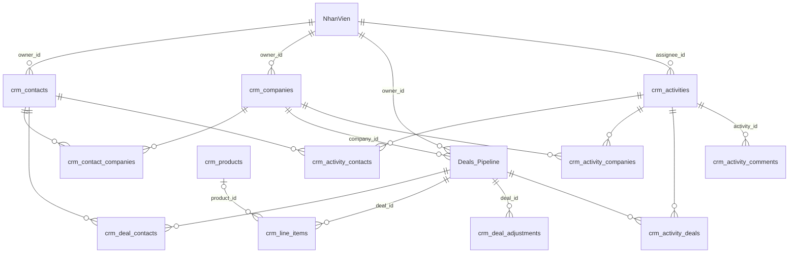

# CRM-00 — Mô hình dữ liệu CRM và chuyển đổi dữ liệu hiện có

> **Trạng thái:** 💡 Proposed · v1.3 · 01/10/2026 · chờ review
> **Tính năng sở hữu:** không có (spec nền của tầng màn)
> **Phục vụ:** G-03, CO-04, D-15, L-03, L-05, L-07, L-09, S-02, S-03 (xem Phụ lục A của `00-PLAN-viet-spec.md`)
> **Phụ thuộc:** `F03-S1` (liên kết bản ghi, bảng nối) · `F03-S2` (trường tính) · `F03-S3` (nhật ký) · `F03-S6` (Activities)
> **Nguồn:** prototype `crm-objects.js`, `crm-shared.js`, `crm-quan-he-hubspot.html` · `DOI-CHIEU-CHUC-NANG.md` §1, §9 · `ERPMini/features/features/F03-collections-data-layer.md` · khảo sát ERP erp.tuoitresoft.com ngày 23–24/09/2026

---

## 1. Mục đích và phạm vi

File này là nơi duy nhất định nghĩa **collection, trường, key và liên kết** của CRM. Mọi spec khác (CRM-01 đến CRM-10, F03-S1 đến F03-S6, F14-S1) trích key từ đây. Nếu một spec khác cần thêm hay đổi trường thì sửa ở đây trước.

**Trong phạm vi:**

- Định nghĩa 12 collection mới và phần sửa trên 2 collection có sẵn (`Deals_Pipeline`, `NhanVien`).
- Danh mục giá trị cho các trường lựa chọn.
- Quan hệ giữa các collection và hành vi khi xoá.
- Chuyển dữ liệu: Leads sang Contacts, hai trường văn bản trên Deals_Pipeline sang trường liên kết.
- Quy trình rà các workflow đang chạy trên các collection bị ảnh hưởng.
- Dữ liệu khởi tạo (danh mục, sản phẩm mẫu).

**Ngoài phạm vi (ở spec khác):**

- Cách engine lưu, truy vấn và kiểm tra bảng nối: `F03-S1`.
- Cách tính các trường tính (ngày hoạt động gần nhất…): `F03-S2`.
- Nhật ký thay đổi và sự kiện hệ thống trên timeline: `F03-S3`.
- Hành vi nghiệp vụ của Activities (nhắc hạn, lặp lại, ghim): `F03-S6`.
- Giao diện từng màn: `CRM-01` trở đi.
- Nhập dữ liệu từ HubSpot: chỉ làm nếu QĐ-07 được chốt là "có" (§10).

---

## 2. Quyết định đầu vào

| Mã | Nội dung | Trạng thái | Hệ quả trong file này |
|---|---|---|---|
| QĐ-01 | Owner của Contact, Company, Deal là **trường Liên kết tới bản ghi `NhanVien`** | Đã chốt 30/09 | Thêm trường `owner_id` (Liên kết → NhanVien) cho 3 đối tượng; thêm `NhanVien.tai_khoan` để biết "của tôi" (§5.6) |
| QĐ-02 | Collection **Leads gộp vào Contacts**; lead là Contact có `lifecycle_stage = Lead` | Đã chốt 30/09 | §7 chuyển dữ liệu; Leads chuyển sang chỉ đọc |
| QĐ-03 | Một Contact thuộc **nhiều Company**, trong đó tối đa **một Primary** | Đã chốt 30/09 | Bảng nối `crm_contact_companies` có `is_primary` (§5.3) |
| QĐ-09 | **Giữ key cũ** của các trường đang có trên Deals_Pipeline | Theo đề xuất mặc định của plan, **chưa có xác nhận riêng** | §5.4 giữ nguyên 17 key; trường mới đặt key chuẩn |
| QĐ-07 | Có nhập dữ liệu cũ từ HubSpot không | **Chưa chốt** | §10 viết sẵn, chỉ thực hiện khi chốt "có" |

**Lưu ý QĐ-01:** mọi bản ghi của ERP đã có một chủ sở hữu hệ thống là **tài khoản người dùng** (`ownerUserId` theo F03). Tài khoản này quyết định quyền: chủ sở hữu luôn đọc, sửa, xoá được bản ghi của mình. `owner_id` trong file này là **chủ sở hữu nghiệp vụ** (sale phụ trách), trỏ tới bản ghi nhân viên, không phải tài khoản. Quy tắc đồng bộ giữa hai khái niệm nằm ở §6.3.

---

## 3. Quy ước chung

### 3.1 Key trường

- Key là `snake_case` ASCII, có nghĩa, đặt tay. Ví dụ: `lifecycle_stage`, `owner_id`.
- Không dùng key do ERP tự sinh từ tên tiếng Việt. Ví dụ key hiện có `giai_o_n_pipeline` (sinh từ "Giai Đoạn Pipeline") khó đọc và dễ gõ sai trong biểu thức workflow.
- Trường Liên kết có hậu tố `_id`. Trường ngày giờ có hậu tố `_at`. Trường ngày có hậu tố `_date`. Trường hộp kiểm có tiền tố `is_`.
- Mọi collection và trường trong file này được tạo bằng **script khởi tạo gọi API**, không tạo tay trên giao diện, để đặt được key (xem câu hỏi Q1 ở §15).

### 3.2 Kiểu trường

Dùng 14 loại trường đang có trên ERP (trang Quản lý trường). Cột "Mã API" là mã thấy được khi gọi `/collections/:id`. Bảy mã có dấu `?` là tên prototype tự đặt, **BE cần xác nhận** trước khi viết script.

| Tên trên ERP | Mã API | Dùng trong file này cho |
|---|---|---|
| Văn bản | `TEXT` | tên, email, SĐT, domain… |
| Văn bản dài | `LONG_TEXT` | mô tả, nội dung hoạt động |
| Số | `NUMBER` | số lượng, số kỳ, phần trăm |
| Tiền tệ | `CURRENCY`? | giá, chỉ tiêu. Nếu ERP chưa có mã này, dùng `NUMBER` và định dạng ₫ ở FE |
| Ngày | `DATE` | ngày vào làm |
| Ngày giờ | `DATETIME` | thời điểm hoạt động, hạn task |
| Lựa chọn đơn | `SELECT` | lifecycle, lead status, nhãn liên kết… |
| Lựa chọn nhiều | `MULTI_SELECT`? | **không dùng** (vi phạm quy tắc không lưu mảng khi giá trị là thực thể; chỉ dùng cho nhãn thuần tuý nếu sau này cần) |
| Trạng thái | `STATUS`? | không dùng |
| Hộp kiểm | `CHECKBOX`? | `is_primary`, `is_done`, `is_active` |
| Người dùng | `USER`? | chỉ dùng cho `NhanVien.tai_khoan` |
| Tệp đính kèm | `FILE`? | `attachments` trên Contacts, Companies, Deals (card Tệp đính kèm, C-22) |
| Liên kết | `RELATION` | mọi quan hệ |
| Đường dẫn | `URL`? | không dùng |

ERP **không có** loại Email hay Số điện thoại riêng (khác bản thiết kế F03 gốc có `email`, `phone`). Email và SĐT dùng Văn bản; kiểm định dạng ở FE (CRM-02, CRM-03) và trong script nhập.

### 3.3 Giá trị lựa chọn

- Theo hiện trạng ERP, trường Lựa chọn đơn lưu **chính chuỗi hiển thị** (ví dụ `"5. Closed Won"`). BE cần xác nhận (Q2).
- Hệ quả: đổi tên một lựa chọn là đổi dữ liệu. Workflow, bộ lọc đã lưu và báo cáo so sánh theo chuỗi sẽ sai nếu đổi tên mà không rà. Mọi danh mục trong file này coi là **cố định sau khi go-live**; muốn đổi phải qua quy trình ở §9.
- Các chuỗi mà logic hệ thống dựa vào được liệt kê ở §5.4.3 và không được đổi tên.

### 3.4 Không lưu mảng

Theo quyết định cố định của dự án, mọi quan hệ nhiều–nhiều dùng **bảng nối** (một collection riêng, mỗi dòng là một cặp). Không dùng trường Liên kết nhiều giá trị, không dùng Lựa chọn nhiều để chứa danh sách thực thể. Danh sách người tham dự cuộc họp, người đã liên hệ trong cuộc gọi cũng đi qua bảng nối (§5.11).

Ngoại lệ duy nhất: trường **Tệp đính kèm** lưu danh sách id tệp, đúng như kiểu trường có sẵn của ERP. Tệp không phải bản ghi nghiệp vụ, không cần truy vấn ngược từ tệp về bản ghi, nên không tách bảng.

### 3.5 Tên collection

- Slug có tiền tố `crm_` để gom nhóm trong trang Dữ liệu. Slug theo quy tắc F03: `^[a-z][a-z0-9_]{1,40}$`, không đổi được sau khi có bản ghi.
- Tên hiển thị dùng tiếng Anh như HubSpot và như prototype (Contacts, Companies…), vì người dùng của khách đã quen các tên này.
- Deals giữ nguyên collection `Deals_Pipeline` đang chạy, không tạo mới.

### 3.6 Trường hệ thống

Mọi bản ghi đã có sẵn: id, ngày tạo, người tạo, ngày sửa, người sửa, chủ sở hữu hệ thống, ngày xoá mềm (F03 "Record"). File này không khai báo lại các trường đó. Trên giao diện, "Ngày tạo" là ngày tạo hệ thống; trong cấu hình view, bộ lọc và sắp xếp dùng key hệ thống `_createdAt` của F03 (Ngày sửa là `_updatedAt`).

---

## 4. Sơ đồ tổng quan



Tóm tắt bằng lời:

- Contact và Company nối với nhau qua bảng nối có Primary.
- Một Deal thuộc tối đa một Company (trường trên Deal) và có nhiều Contact (bảng nối có nhãn vai trò).
- Mỗi Deal có nhiều Line item. Line item có thể lấy từ thư viện Products hoặc là dòng tuỳ chỉnh.
- Chiết khấu, phí, thuế cấp Deal là các dòng riêng.
- Một hoạt động gắn được cùng lúc vào nhiều Contact, Company và Deal, nên hiện trên timeline của tất cả.

| Collection | Tên hiển thị | Mới / có sẵn | Loại |
|---|---|---|---|
| `crm_companies` | Companies | Mới | Đối tượng chính |
| `crm_contacts` | Contacts | Mới | Đối tượng chính |
| `crm_contact_companies` | Contact – Company | Mới | Bảng nối |
| `Deals_Pipeline` | Deals | Có sẵn, thêm trường | Đối tượng chính |
| `crm_deal_contacts` | Deal – Contact | Mới | Bảng nối |
| `NhanVien` | Nhân viên / Sales | Có sẵn, thêm trường | Danh mục người |
| `crm_products` | Products | Mới | Danh mục |
| `crm_line_items` | Line items | Mới | Dòng con của Deal |
| `crm_deal_adjustments` | Điều chỉnh Deal | Mới | Dòng con của Deal |
| `crm_activities` | Activities | Mới | Đối tượng chính |
| `crm_activity_contacts` / `_companies` / `_deals` | — | Mới | 3 bảng nối |
| `crm_activity_comments` | Bình luận hoạt động | Mới | Dòng con của Activity (F03-S6 §3.5) |

Tổng cộng 12 collection mới (tính riêng 3 bảng nối của Activities) và 2 collection sửa.

---

## 5. Đặc tả từng collection

Quy ước cột: **Bắt buộc** là cờ Bắt buộc của ERP. **Duy nhất** là cờ Duy nhất của ERP. Trường "tính" không nhập tay; cách tính ở spec ghi trong cột ghi chú.

### 5.1 `crm_companies` — Companies

Cột chính (hiển thị làm tên bản ghi, dùng cho Liên kết): `name`.

| Key | Tên hiển thị | Kiểu | Bắt buộc | Duy nhất | Danh mục / ghi chú |
|---|---|---|---|---|---|
| `name` | Tên công ty | Văn bản | ✓ | | Tối đa 255 ký tự |
| `domain` | Domain | Văn bản | | ✓ (khi có giá trị) | Lưu dạng `ten-mien.vn`, bỏ `http(s)://`, `www.` và dấu `/` cuối. Dùng để tránh tạo trùng công ty. Xem Q3 về cờ Duy nhất với giá trị rỗng |
| `industry` | Ngành | Lựa chọn đơn | | | Danh mục D-INDUSTRY (§5.12) |
| `phone` | Số điện thoại | Văn bản | | | |
| `owner_id` | Company owner | Liên kết → NhanVien | | | Chỉ chọn nhân viên đang làm việc (§6.2) |
| `city` | Thành phố | Văn bản | | | |
| `country` | Quốc gia/Khu vực | Văn bản | | | **CO-04**. Mặc định "Việt Nam" khi tạo từ giao diện |
| `lifecycle_stage` | Lifecycle stage | Lựa chọn đơn | | | D-LIFECYCLE |
| `lead_status` | Lead status | Lựa chọn đơn | | | D-LEADSTATUS. **CO-04** |
| `employees` | Số nhân sự | Số | | | ≥ 0 |
| `attachments` | Tệp đính kèm | Tệp đính kèm | | | Card Tệp đính kèm trên trang chi tiết (C-22, CRM-01 §5.7) |
| `last_activity_at` | Ngày hoạt động gần nhất | Ngày giờ (tính) | | | F03-S2. Thời điểm của hoạt động gần nhất đã xảy ra, gắn với company |
| `last_contacted_at` | Liên hệ gần nhất | Ngày giờ (tính) | | | F03-S2 §6.2: cuộc gọi, cuộc họp đã xảy ra, trừ cuộc họp Huỷ, Đổi lịch, Không đến |

Công ty mẫu trong prototype có "Mã số thuế", "Hạng khách hàng". Đó là **trường do người dùng tự tạo** (CRM-09), không nằm trong bộ trường gốc.

### 5.2 `crm_contacts` — Contacts

Cột chính: `last_name` + `first_name` (tên hiển thị). Vì ERP chỉ có một cột hiển thị cho Liên kết, script tạo thêm trường `full_name` do BE ghi lại mỗi khi họ hoặc tên đổi, và đặt làm cột hiển thị.

| Key | Tên hiển thị | Kiểu | Bắt buộc | Duy nhất | Danh mục / ghi chú |
|---|---|---|---|---|---|
| `email` | Email | Văn bản | | ✓ (khi có giá trị) | Lưu chữ thường, bỏ khoảng trắng hai đầu. Là khoá chống trùng khi nhập và khi chuyển Leads |
| `first_name` | Tên | Văn bản | | | |
| `last_name` | Họ và tên đệm | Văn bản | | | |
| `full_name` | Họ và tên | Văn bản (tính) | | | `last_name + " " + first_name`, bỏ khoảng trắng thừa. Nếu cả hai trống thì lấy `email`. BE ghi, không sửa tay |
| `job_title` | Chức danh | Văn bản | | | |
| `phone` | Số điện thoại | Văn bản | | | |
| `owner_id` | Contact owner | Liên kết → NhanVien | | | §6.2 |
| `lifecycle_stage` | Lifecycle stage | Lựa chọn đơn | | | D-LIFECYCLE. Mặc định `Lead` khi tạo |
| `lead_status` | Lead status | Lựa chọn đơn | | | D-LEADSTATUS |
| `city` | Thành phố | Văn bản | | | |
| `source` | Nguồn | Lựa chọn đơn | | | D-SOURCE |
| `attachments` | Tệp đính kèm | Tệp đính kèm | | | C-22, CRM-01 §5.7 |
| `legacy_lead_id` | Mã Lead cũ | Văn bản | | ✓ (khi có giá trị) | Id bản ghi Leads đã chuyển sang (§7). Chỉ đọc trên giao diện |
| `lead_created_at` | Ngày tạo lead gốc | Ngày giờ | | | Ngày tạo của bản ghi Leads đã chuyển sang (§7.3); trống với contact tạo mới. Chỉ đọc. Báo cáo contact tính theo trường này trước, trống thì theo Ngày tạo (CRM-07 §9) |
| `last_activity_at` | Ngày hoạt động gần nhất | Ngày giờ (tính) | | | F03-S2 |
| `last_contacted_at` | Liên hệ gần nhất | Ngày giờ (tính) | | | F03-S2 §6.2: như Companies, và contact phải ở vai trò Đã liên hệ hoặc Tham dự |

Ràng buộc không biểu diễn được bằng cờ ERP: một Contact phải có **ít nhất một trong ba** `email`, `first_name`, `last_name`. Kiểm ở form tạo (CRM-02) và trong script nhập. Q4 hỏi BE có chặn được ở API không.

Công ty của Contact **không phải trường trên Contact**, mà nằm trong bảng nối §5.3. Cột "Công ty chính" trên danh sách lấy từ dòng nối có `is_primary = true`.

### 5.3 `crm_contact_companies` — bảng nối Contact – Company

Cấu hình bảng nối theo F03-S1: bên trái `contact_id`, bên phải `company_id`, cặp duy nhất, Primary tính theo phía Contact.

| Key | Tên hiển thị | Kiểu | Bắt buộc | Ghi chú |
|---|---|---|---|---|
| `contact_id` | Contact | Liên kết → crm_contacts | ✓ | |
| `company_id` | Company | Liên kết → crm_companies | ✓ | |
| `label` | Nhãn liên kết | Lựa chọn đơn | | D-LABEL-CC. Có thể trống |
| `is_primary` | Công ty chính | Hộp kiểm | | Mỗi Contact tối đa một dòng `true`. Đặt dòng mới là Primary thì dòng cũ tự bỏ (F03-S1) |

Quy tắc:

- Khi một Contact được gắn Company **đầu tiên**, dòng đó tự là Primary.
- Khi gỡ dòng Primary mà Contact còn công ty khác, **không tự chọn** Primary mới. Cột "Công ty chính" để trống cho tới khi người dùng chọn. Lý do: hệ thống không có cơ sở để đoán công ty nào đúng.

### 5.4 `Deals_Pipeline` — Deals (có sẵn)

#### 5.4.1 Trường hiện có (giữ nguyên key theo QĐ-09)

Thứ tự bên dưới là thứ tự hiện tại trên ERP (khảo sát 23/09). Trường đầu tiên là cột chính. Script khởi tạo sắp lại vị trí trường theo CRM-04 §2.3, vì bảng Deals lấy thứ tự cột theo thứ tự trường.

| # | Key hiện tại | Tên | Kiểu | Xử lý trong giai đoạn 2 |
|---|---|---|---|---|
| 1 | `m_deal` | Mã Deal | Văn bản | Giữ. Là khoá nghiệp vụ, không đổi sau khi tạo (D-10). Deal mới do BE sinh mã `DEAL-{n}` (CRM-04 §5.2). Bật cờ Duy nhất sau khi kiểm dữ liệu cũ không có mã trùng hoặc rỗng (§8.4) |
| 2 | `t_n_deal` | Tên Deal | Văn bản | Giữ. Tên hiển thị trên record, đổi được |
| 3 | `lead_id` | Lead Id | Văn bản | **Ngừng dùng**. Chuyển sang dòng `crm_deal_contacts` (§8.2). Giữ chỉ đọc tới khi workflow không còn đọc |
| 4 | `g_i_d_ch_v_m_c_ti_u` | Gói Dịch Vụ Mục Tiêu | Lựa chọn đơn | Giữ. STARTER / PROFESSIONAL / ENTERPRISE BYOC |
| 5 | `th_i_h_n_thanh_to_n` | Thời Hạn Thanh Toán | Lựa chọn đơn | Giữ. 6 Months (6T) / 12 Months (12T) / Monthly |
| 6 | `giai_o_n_pipeline` | Giai Đoạn Pipeline | Lựa chọn đơn | Giữ. Danh mục D-STAGE (§5.12). Giá trị hệ thống dựa vào: §5.4.3 |
| 7 | `ph_thu_tr_tr_c` | Phí Thuê Trả Trước | Số | Giữ |
| 8 | `ph_kh_i_t_o_setup` | Phí Khởi Tạo (Setup) | Số | Giữ |
| 9 | `t_ng_cash_in_d_ki_n` | Tổng Cash-In Dự Kiến | Số | Giữ. **Đây là "Amount"** trên mọi màn và báo cáo. Có thể được ghi từ tổng line item (CRM-06, L-11) |
| 10 | `s_ti_n_gi_m_gi` | Số tiền giảm giá | Số | Giữ |
| 11 | `l_do_gi_m` | Lý do giảm | Văn bản dài | Giữ |
| 12 | `t_l_th_nh_c_ng` | Tỷ Lệ Thành Công (%) | Số | Giữ. 0–100. Dùng cho giá trị có trọng số (D-07) |
| 13 | `ng_y_d_ki_n_ch_t` | Ngày Dự Kiến Chốt | Ngày | Giữ. "Close date" |
| 14 | `sale_ph_tr_ch` | Sale phụ trách | Văn bản | **Ngừng dùng**. Thay bằng `owner_id` (§8.1). Trong thời gian chuyển tiếp BE ghi đồng bộ một chiều (§8.1) |
| 15 | `l_do_th_t_b_i` | Lý do thất bại | Lựa chọn đơn | Giữ. Danh mục D-LOSTREASON (§5.12) |
| 16 | `ng_y_c_p_nh_t_g_n_nh_t` | Ngày cập nhật gần nhất | Ngày giờ | Giữ |
| 17 | `test` | Test | Liên kết → NhanVien | Trường thử nghiệm. Đề xuất xoá sau khi xác nhận không workflow nào dùng (§9) |

#### 5.4.2 Trường thêm mới

| Key | Tên hiển thị | Kiểu | Bắt buộc | Ghi chú |
|---|---|---|---|---|
| `company_id` | Công ty | Liên kết → crm_companies | | Một Deal thuộc tối đa một Company (G-03) |
| `owner_id` | Sale phụ trách | Liên kết → NhanVien | | Thay `sale_ph_tr_ch`. §6.2 |
| `use_line_items_amount` | Dùng tổng line item làm Amount | Hộp kiểm | | Mặc định `true`. L-11. Chi tiết ở CRM-06 |
| `stage_changed_at` | Ngày đổi giai đoạn gần nhất | Ngày giờ | | BE ghi khi `giai_o_n_pipeline` đổi. Dùng để lọc, sắp xếp deal "đứng yên" lâu ở một giai đoạn. Báo cáo thời gian chốt dùng `closed_at`, không dùng trường này (CRM-07 §10) |
| `closed_at` | Ngày đóng | Ngày giờ | | BE ghi khi giai đoạn chuyển vào Won hoặc Lost; xoá khi chuyển ra. Dùng cho "Deals đã đóng" và "Thời gian chốt trung bình" |
| `last_activity_at` | Ngày hoạt động gần nhất | Ngày giờ (tính) | | F03-S2 |
| `last_contacted_at` | Liên hệ gần nhất | Ngày giờ (tính) | | F03-S2 §6.2: như Companies. Hiện ở card thuộc tính chính của Deal (CRM-04 §6.2) |
| `next_activity_at` | Hoạt động tiếp theo | Ngày giờ (tính) | | F03-S2. Lấy cái sớm hơn trong hai: hạn của task chưa xong sớm nhất (kể cả đã quá hạn), và giờ bắt đầu của cuộc họp sắp tới sớm nhất. "Cuộc họp sắp tới" là cuộc họp có giờ bắt đầu sau hiện tại và kết quả là "Đã lên lịch" hoặc trống; cuộc họp "Huỷ", "Đổi lịch", "Không đến", "Đã hoàn thành" không tính. Giá trị đổi theo thời gian nên F03-S2 phải tính lại theo lịch |
| `next_activity_id` | Hoạt động tiếp theo (bản ghi) | Liên kết → crm_activities (tính) | | F03-S2. Để cột "Hoạt động tiếp theo" hiện được tiêu đề (D-04) |
| `attachments` | Tệp đính kèm | Tệp đính kèm | | C-22, CRM-01 §5.7 |
| `line_items_total` | Tổng line item | Tiền tệ (tính) | | F03-S2 §6.4, handler tính trong giao dịch lưu line item. Công thức ở CRM-06 §6. Trống khi deal không có line item |
| `line_items_version` | Phiên bản line item | Số | | BE tăng mỗi lần lưu line item, chống ghi đè (CRM-06 §5.2). Không hiện trên giao diện |

Nhiều pipeline (D-15, P2) **chưa làm** trong giai đoạn này. Khi làm sẽ thêm trường `pipeline` và danh mục giai đoạn theo pipeline; ghi ở đây để không ai dùng key `pipeline` cho việc khác.

#### 5.4.3 Chuỗi giá trị mà logic hệ thống dựa vào

Không đổi tên các giá trị sau. Nếu buộc phải đổi, sửa đồng thời mọi nơi liệt kê.

| Giá trị | Trường | Nơi dựa vào |
|---|---|---|
| `5. Closed Won` | `giai_o_n_pipeline` | Chân cột board (D-07), `closed_at`, báo cáo R-09, KPI sale S-07/S-08 (doanh số thắng, tỷ lệ thắng) |
| `6. Closed Lost` | `giai_o_n_pipeline` | Như trên |
| `Lead` | `lifecycle_stage` | Giá trị mặc định khi tạo Contact; chuyển Leads (§7) |
| `Customer` | `lifecycle_stage` | Báo cáo CRM Data Overview (R-08) |

"Deal đang mở" trên mọi màn nghĩa là `giai_o_n_pipeline` khác hai giá trị Won/Lost ở trên.

### 5.5 `crm_deal_contacts` — bảng nối Deal – Contact

Cấu hình bảng nối: bên trái `deal_id`, bên phải `contact_id`, cặp duy nhất, không có Primary.

| Key | Tên hiển thị | Kiểu | Bắt buộc | Ghi chú |
|---|---|---|---|---|
| `deal_id` | Deal | Liên kết → Deals_Pipeline | ✓ | |
| `contact_id` | Contact | Liên kết → crm_contacts | ✓ | |
| `label` | Vai trò | Lựa chọn đơn | | D-LABEL-DC. Có thể trống |

### 5.6 `NhanVien` — Nhân viên / Sales (có sẵn)

`NhanVien` đang được dùng ở phần khác của ERP (ví dụ trường `test` của Deals_Pipeline trỏ tới đây). Danh sách trường hiện có **chưa được khảo sát**. Bảng dưới liệt kê những gì CRM cần. Cột "Hiện có?" phải điền sau khi khảo sát (§15, Q5). Trường nào đã có với ý nghĩa tương đương thì dùng trường đó, không tạo trùng.

| Key đề xuất | Tên hiển thị | Kiểu | Bắt buộc | Hiện có? | Ghi chú |
|---|---|---|---|---|---|
| (hiện có) | Họ và tên | Văn bản | ✓ | cần khảo sát | Cột hiển thị. Không được trùng tên giữa các nhân viên đang làm việc (S-10) |
| (hiện có) | Email | Văn bản | ✓ | cần khảo sát | Duy nhất |
| (hiện có) | Số điện thoại | Văn bản | | cần khảo sát | |
| `tai_khoan` | Tài khoản đăng nhập | Người dùng | | Mới | Duy nhất. Nối nhân viên với tài khoản ERP để lọc "của tôi" và nhận thông báo. Để trống nếu sale không dùng ERP |
| `sales_team` | Team | Lựa chọn đơn | | Mới | D-TEAM. Xem Q6: có dùng collection `PhongBan` thay cho danh mục này không |
| `sales_role` | Vai trò | Lựa chọn đơn | | Mới | D-ROLE |
| `monthly_quota` | Chỉ tiêu tháng | Tiền tệ | | Mới | ≥ 0. S-08 dùng để tính chỉ tiêu kỳ |
| `work_status` | Trạng thái | Lựa chọn đơn | ✓ | Mới | D-WORKSTATUS. Mặc định "Đang làm việc" |
| `is_sales` | Thuộc đội kinh doanh | Hộp kiểm | | Mới | Mặc định `false`. Danh sách Sales và ô chọn owner chỉ gồm nhân viên có cờ này (CRM-08 §3.1). Script đặt `true` cho nhân viên khớp `sale_ph_tr_ch` (§8.1) và nhân viên có Team hoặc Vai trò |
| (hiện có?) | Ngày vào làm | Ngày | | cần khảo sát | |

`NhanVien` không có tiền tố `crm_` vì là collection dùng chung, không riêng CRM.

### 5.7 `crm_products` — Products

| Key | Tên hiển thị | Kiểu | Bắt buộc | Duy nhất | Ghi chú |
|---|---|---|---|---|---|
| `name` | Tên sản phẩm | Văn bản | ✓ | | Cột hiển thị |
| `sku` | SKU | Văn bản | | ✓ (khi có giá trị) | |
| `unit_price` | Đơn giá | Tiền tệ | ✓ | | ≥ 0. Với hàng định kỳ là giá **một kỳ** |
| `cost_price` | Giá vốn / đơn vị | Tiền tệ | | | ≥ 0 |
| `description` | Mô tả | Văn bản dài | | | |
| `billing_frequency` | Tần suất thanh toán | Lựa chọn đơn | ✓ | | D-FREQ. Mặc định "Một lần" |
| `default_term` | Kỳ hạn mặc định (số kỳ) | Số | | | ≥ 1. Chỉ có nghĩa khi tần suất khác "Một lần" |
| `is_active` | Đang bán | Hộp kiểm | | | Mặc định `true`. Sản phẩm ngừng bán không hiện trong thư viện nhưng line item cũ vẫn giữ |

Giá trị mặc định cho các **trường tuỳ chỉnh của line item** (L-07) được lưu trên Products dưới dạng trường cùng key. Cách tạo cặp trường này ở F03-S4 và CRM-06.

### 5.8 `crm_line_items` — Line items

| Key | Tên hiển thị | Kiểu | Bắt buộc | Ghi chú |
|---|---|---|---|---|
| `deal_id` | Deal | Liên kết → Deals_Pipeline | ✓ | |
| `product_id` | Sản phẩm | Liên kết → crm_products | | Trống = dòng tuỳ chỉnh (L-04) |
| `name` | Tên | Văn bản | ✓ | Sao chép từ sản phẩm lúc thêm; sửa được |
| `quantity` | Số lượng | Số | ✓ | > 0. Cho phép số thập phân (Q7) |
| `unit_price` | Đơn giá | Tiền tệ | ✓ | ≥ 0. Sao chép từ sản phẩm lúc thêm; sửa được |
| `discount_type` | Kiểu chiết khấu | Lựa chọn đơn | | `₫` hoặc `%`. Mặc định `₫` |
| `discount_value` | Chiết khấu | Số | | ≥ 0. Nếu kiểu `%` thì ≤ 100 |
| `billing_frequency` | Tần suất thanh toán | Lựa chọn đơn | ✓ | D-FREQ |
| `term` | Kỳ hạn (số kỳ) | Số | | ≥ 1. Bắt buộc khi tần suất khác "Một lần" |
| `sku` | SKU | Văn bản | | Sao chép từ sản phẩm |
| `cost_price` | Giá vốn / đơn vị | Tiền tệ | | Sao chép từ sản phẩm |
| `description` | Mô tả | Văn bản dài | | |
| `sort_order` | Thứ tự | Số | ✓ | Thứ tự hiển thị trong Deal (L-08) |
| `line_total` | Thành tiền | Tiền tệ (tính) | | BE tính khi lưu theo công thức ở CRM-06. Không sửa tay |

Sao chép tên, giá, SKU từ sản phẩm là **có chủ đích**: đổi giá sản phẩm sau này không được làm thay đổi báo giá đã gửi cho khách.

### 5.9 `crm_deal_adjustments` — Điều chỉnh cấp Deal

Chiết khấu, phí, thuế áp lên cả Deal (L-09). Tách bảng riêng vì một Deal có thể có nhiều dòng.

| Key | Tên hiển thị | Kiểu | Bắt buộc | Ghi chú |
|---|---|---|---|---|
| `deal_id` | Deal | Liên kết → Deals_Pipeline | ✓ | |
| `kind` | Loại | Lựa chọn đơn | ✓ | `Chiết khấu` / `Phí` / `Thuế` |
| `name` | Tên | Văn bản | | Ví dụ "VAT 8%", "Phí vận chuyển" |
| `value_type` | Kiểu giá trị | Lựa chọn đơn | ✓ | `₫` hoặc `%` |
| `value` | Giá trị | Số | ✓ | ≥ 0 |
| `sort_order` | Thứ tự | Số | ✓ | |

Thứ tự áp dụng (chiết khấu → phí → thuế) nằm ở CRM-06.

### 5.10 `crm_activities` — Activities

Bảng này chứa hoạt động do **người** tạo: Ghi chú, Task, Cuộc gọi, Cuộc họp. Sự kiện hệ thống (tạo bản ghi, đổi giai đoạn…) **không** lưu ở đây mà lấy từ nhật ký F03-S3; timeline gộp hai nguồn (F03-S6).

Email, SMS, WhatsApp, LinkedIn nằm ngoài phạm vi (A-15), không có giá trị tương ứng trong `activity_type`.

| Key | Tên hiển thị | Kiểu | Bắt buộc | Dùng cho loại | Ghi chú |
|---|---|---|---|---|---|
| `activity_type` | Loại | Lựa chọn đơn | ✓ | tất cả | D-ACTTYPE. Không đổi được sau khi tạo |
| `title` | Tiêu đề | Văn bản | | Task (bắt buộc), Cuộc họp | Cột hiển thị. Với Ghi chú và Cuộc gọi, BE ghi tiêu đề tự sinh ("Ghi chú", "Cuộc gọi với …") để Liên kết có chữ hiển thị |
| `body_html` | Nội dung | Văn bản dài, `format: html` | | tất cả | HTML đã lọc, chỉ giữ thẻ `b strong i em u br p div ul ol li` (A-02). Lọc ở BE trên mọi đường ghi (F03-S6 §3.2). Bắt buộc với Ghi chú |
| `occurred_at` | Thời điểm | Ngày giờ | ✓ | tất cả | Ghi chú: lúc tạo. Cuộc gọi, Cuộc họp: giờ người dùng nhập. Task: lúc tạo |
| `due_at` | Hạn | Ngày giờ | | Task (bắt buộc) | |
| `task_kind` | Loại task | Lựa chọn đơn | | Task | D-TASKKIND |
| `priority` | Ưu tiên | Lựa chọn đơn | | Task | D-PRIORITY |
| `queue` | Hàng đợi | Lựa chọn đơn | | Task | Danh mục trống ban đầu (A-06 có trường này nhưng khách chưa có hàng đợi nào) |
| `assignee_id` | Người thực hiện | Liên kết → NhanVien | | Task (bắt buộc) | |
| `is_done` | Đã xong | Hộp kiểm | | Task | |
| `completed_at` | Ngày hoàn thành | Ngày giờ | | Task | BE ghi khi `is_done` chuyển sang `true`; xoá khi bỏ tick |
| `reminder` | Nhắc nhở | Lựa chọn đơn | | Task | D-REMINDER |
| `repeat_rule` | Lặp lại | Lựa chọn đơn | | Task | D-REPEAT. Trống là không lặp. Thay cho `is_recurring` (Hộp kiểm) của bản 1.0. Quy tắc sinh kỳ tiếp ở F03-S6 §7.2 |
| `reminder_sent_at` | Đã nhắc lúc | Ngày giờ | | Task | Job nhắc hạn ghi (F03-S6 §7.1). Không sửa tay |
| `repeat_source_id` | Lặp từ task | Liên kết → crm_activities | | Task | Task kỳ trước sinh ra task này (F03-S6 §7.2). Không sửa tay |
| `call_direction` | Hướng cuộc gọi | Lựa chọn đơn | | Cuộc gọi | `Gọi đi` / `Gọi đến` |
| `call_outcome` | Kết quả cuộc gọi | Lựa chọn đơn | | Cuộc gọi | D-CALLOUTCOME |
| `meeting_outcome` | Kết quả cuộc họp | Lựa chọn đơn | | Cuộc họp | D-MEETOUTCOME. Cuộc họp lên lịch trước (A-10) có giá trị `Đã lên lịch` |
| `duration_minutes` | Thời lượng (phút) | Số | | Cuộc họp | 15, 30, 45, 60, 90, 120 |

Ràng buộc trường theo loại hoạt động (trường nào bắt buộc, trường nào không được có) ở F03-S6 §3.3. "Đã liên hệ" của cuộc gọi và "Người tham dự" của cuộc họp là dòng `crm_activity_contacts` có `role` tương ứng, không phải trường riêng (F03-S6 §3.4).

Không có trường "ghim". Ghim là **theo từng bản ghi** (một hoạt động có thể ghim trên timeline của Deal nhưng không ghim trên Contact), nên cờ ghim nằm trên dòng bảng nối (§5.11).

### 5.10a `crm_activity_comments` — Bình luận hoạt động

Bình luận trên Ghi chú và Task (A-16). Chi tiết hành vi ở F03-S6 §3.5, §4.7.

| Key | Tên hiển thị | Kiểu | Bắt buộc | Ghi chú |
|---|---|---|---|---|
| `activity_id` | Hoạt động | Liên kết → crm_activities | ✓ | `onDelete: cascade` (R14) |
| `body_html` | Nội dung | Văn bản dài, `format: html` | ✓ | Tối đa 5.000 ký tự HTML sau khi lọc |

Người viết, thời điểm viết là trường hệ thống. Collection ẩn khỏi menu Dữ liệu (`hideInDataMenu`, §5.13).

### 5.11 Ba bảng nối của Activities

Một trường Liên kết của ERP chỉ trỏ được tới một collection, nên dùng ba bảng nối riêng thay vì một bảng có trường trỏ "một trong ba".

**`crm_activity_contacts`** — bên trái `activity_id`, bên phải `contact_id`, cặp duy nhất.

| Key | Kiểu | Bắt buộc | Ghi chú |
|---|---|---|---|
| `activity_id` | Liên kết → crm_activities | ✓ | |
| `contact_id` | Liên kết → crm_contacts | ✓ | |
| `role` | Lựa chọn đơn | ✓ | D-ACTROLE: `Liên quan` / `Tham dự` / `Đã liên hệ`. Giá trị mặc định `Liên quan`. "Tham dự" là người tham dự cuộc họp; "Đã liên hệ" là người trong cuộc gọi. Một contact vừa tham dự vừa liên quan thì chỉ ghi một dòng với vai trò cụ thể hơn (`Tham dự` hoặc `Đã liên hệ`) |
| `is_pinned` | Hộp kiểm | | Ghim trên timeline của contact này |

**`crm_activity_companies`** và **`crm_activity_deals`** — giống trên, bên phải là `company_id` / `deal_id`, không có `role` (luôn là "liên quan"), có `is_pinned`.

Quy tắc **gợi ý** liên kết khi tạo hoạt động (A-03). Máy chủ gợi ý, người dùng bỏ chọn được, máy chủ không tự gắn thêm lúc lưu (F03-S6 §4.1, CRM-05 §3.3):

- Tạo từ Contact: gắn Contact đó, Company Primary của nó, và các Deal **đang mở** của nó.
- Tạo từ Deal: gắn Deal đó, mọi Contact của Deal, và Company của Deal.
- Tạo từ Company: gắn Company đó.
- Người dùng bỏ chọn được từng bản ghi trước khi lưu.

### 5.12 Danh mục giá trị

| Mã danh mục | Giá trị (đúng thứ tự hiển thị) | Nguồn |
|---|---|---|
| D-STAGE | 1. MQL Qualified · 2. Discovery Call · 3. Demo Scheduled · 4. Proposal Sent · 5. Closed Won · 6. Closed Lost | Deals_Pipeline hiện có (khảo sát 23/09) |
| D-LOSTREASON | Giá cao · Chưa có ngân sách · Dùng đối thủ · Không liên lạc được · Tính năng chưa đáp ứng | Deals_Pipeline hiện có |
| D-LIFECYCLE | Subscriber · Lead · Marketing Qualified Lead · Sales Qualified Lead · Opportunity · Customer · Evangelist | HubSpot, giữ tiếng Anh như portal khách |
| D-LEADSTATUS | Mới · Đang mở · Đang xử lý · Có deal · Không phù hợp · Đã thử liên hệ · Đã kết nối · Chưa đúng thời điểm | Prototype |
| D-SOURCE | Website · Giới thiệu · Sự kiện · Quảng cáo · Nhập tay · Import | Prototype. Import do hệ thống gán khi nhập file |
| D-INDUSTRY | Y tế – Dược · Du lịch · Xây dựng · Bán lẻ – Thời trang · In ấn · Giáo dục · Logistics · Nội thất · Thực phẩm · Dịch vụ tài chính · Sản xuất · Làm đẹp · Công nghệ | Prototype. **Chờ khách chốt** |
| D-LABEL-DC | Người quyết định · Người ảnh hưởng · Người dùng chính · Kế toán / thanh toán | Prototype |
| D-LABEL-CC | (trống ban đầu) | Prototype chưa có nhãn nào cho cặp này. Đề xuất cho khách chọn: Nhân viên · Người quyết định · Cựu nhân viên · Đối tác tư vấn (CRM-02 Q1). Chưa chốt thì script tạo danh mục rỗng |
| D-TEAM | Sales HCM · Sales HN · Key Account | Prototype. **Chờ khách chốt** |
| D-ROLE | Sales Executive · Trưởng nhóm · Sales Manager · Account Manager | Prototype. **Chờ khách chốt** |
| D-WORKSTATUS | Đang làm việc · Tạm nghỉ · Đã nghỉ | S-02 |
| D-FREQ | Một lần · Hằng tháng · Hằng quý · Nửa năm · Hằng năm | L-05 |
| D-ACTTYPE | Ghi chú · Task · Cuộc gọi · Cuộc họp | A-05 → A-10 |
| D-ACTROLE | Liên quan · Tham dự · Đã liên hệ | §5.11 |
| D-TASKKIND | To-do · Gọi điện · Email | Prototype |
| D-PRIORITY | Không · Thấp · Trung bình · Cao | Prototype |
| D-REMINDER | Không nhắc · Vào lúc đến hạn · 30 phút trước · 1 giờ trước · 1 ngày trước | Prototype |
| D-CALLOUTCOME | Đã kết nối · Bận · Không nghe máy · Để lại tin nhắn thoại · Để lại tin nhắn trực tiếp · Sai số | Prototype |
| D-MEETOUTCOME | Đã lên lịch · Đã hoàn thành · Đổi lịch · Không đến · Huỷ | Prototype |
| D-REPEAT | Hằng ngày · Hằng tuần · 2 tuần một lần · Hằng tháng · Hằng quý · Nửa năm · Hằng năm | F03-S6 §3.3 |

### 5.13 Cấu hình metadata collection

Ngoài trường và danh mục, script khởi tạo ghi các cấu hình sau vào metadata collection. Nội dung chi tiết nằm ở spec tầng nền; bảng này để người chạy script biết phải đặt gì, ở đâu.

| Collection | Cấu hình | Giá trị | Định nghĩa |
|---|---|---|---|
| `NhanVien` | `identityUserField` | `"tai_khoan"` | F03-S1 §4.10 |
| Năm bảng nối (§5.3, §5.5, §5.11) | `junction_config` | Bên trái, bên phải, Primary theo mô tả ở từng mục | F03-S1 §3.1 |
| `crm_contacts`, `crm_companies`, `Deals_Pipeline` | `history_config` | Theo bảng "Cấu hình của CRM" | F03-S3 §3.1 |
| `crm_contacts`, `crm_companies`, `Deals_Pipeline` | `history_config.ownerField` | `"owner_id"` | F03-S3 §6.4 |
| `crm_activities` | `activity_config` | Theo mẫu ở F03-S6 §3.1 | F03-S6 §3.1 |
| `crm_activity_comments` | `hideInDataMenu` | `true` | F03-S6 §3.5 |
| `crm_contacts`, `crm_companies`, `Deals_Pipeline` | `rollup` trên các trường tính ngày | Theo F03-S2 §6.1–6.3 | F03-S2 §6 |
| `Deals_Pipeline` | `rollup` của `line_items_total` | `{ "kind": "handler", "handler": "crm.deal_line_items_total", "mode": "sync" }` | F03-S2 §6.4 |
| `Deals_Pipeline` | `display_config.extraFields.pinned` | `ph_thu_tr_tr_c`, `ph_kh_i_t_o_setup`, `s_ti_n_gi_m_gi` | F03-S4 §3.2, CRM-09 §9 |
| Mọi collection script tạo | `origin` của trường | `base` | F03-S4 §3.1 |
| `crm_contacts`, `crm_companies` | `mergeConfig` | `{ "mergeable": true }` | F03-S5 §4.1 |
| `Deals_Pipeline` | `mergeConfig` | `{ "mergeable": true, "lockedFields": ["m_deal"], "childRefs": ["ref:crm_line_items.deal_id", "ref:crm_deal_adjustments.deal_id"] }` | F03-S5 §4.1, §4.4 |

`Deals_Pipeline` là collection đang chạy, nên việc ghi `history_config` cho nó làm cùng đợt với chuyển `owner_id` (§8.1), sau khi trường `owner_id` đã có dữ liệu. Làm trước thì sẽ không ai được tự thêm vào người theo dõi.

---

## 6. Quan hệ, quyền sở hữu và hành vi khi xoá

### 6.1 Bảng quan hệ

Xoá trong ERP mặc định là **xoá mềm**: bản ghi vào thùng rác 30 ngày, khôi phục được (F03). Cột "Khi xoá" mô tả hành vi khi bản ghi phía trái bị xoá mềm. Cơ chế thực thi của bảng nối nằm ở F03-S1.

| # | Quan hệ | Bản số | Lưu ở | Khi xoá bên trái |
|---|---|---|---|---|
| R1 | NhanVien → Contact (owner) | 1:N | `crm_contacts.owner_id` | **Chặn** nếu còn bản ghi trỏ tới nhân viên này, kể cả Deal đã đóng. Nhân viên nghỉ việc thì đánh dấu `work_status = Đã nghỉ` (S-19) chứ không xoá; xoá chỉ dành cho bản ghi nhân viên tạo nhầm |
| R2 | NhanVien → Company (owner) | 1:N | `crm_companies.owner_id` | Như R1 |
| R3 | NhanVien → Deal (owner) | 1:N | `Deals_Pipeline.owner_id` | Như R1 |
| R4 | Contact ↔ Company | N:N | `crm_contact_companies` | Dòng nối bị xoá mềm theo. Bản ghi bên kia giữ nguyên |
| R5 | Company → Deal | 1:N | `Deals_Pipeline.company_id` | Deal giữ nguyên, trường `company_id` hiển thị "(Đã xoá) Tên công ty" theo F03. Khôi phục company thì liên kết trở lại bình thường |
| R6 | Deal ↔ Contact | N:N | `crm_deal_contacts` | Như R4 |
| R7 | Deal → Line item | 1:N | `crm_line_items.deal_id` | Line item bị xoá mềm theo; khôi phục Deal thì khôi phục theo |
| R8 | Product → Line item | 1:N | `crm_line_items.product_id` | Line item giữ nguyên (đã có bản sao tên, giá). Vẫn cho xoá sản phẩm, nhưng nên tắt `is_active` thay vì xoá |
| R9 | Deal → Điều chỉnh | 1:N | `crm_deal_adjustments.deal_id` | Như R7 |
| R10 | Activity ↔ Contact | N:N | `crm_activity_contacts` | Như R4. Xoá hoạt động thì gỡ khỏi mọi timeline |
| R11 | Activity ↔ Company | N:N | `crm_activity_companies` | Như R4 |
| R12 | Activity ↔ Deal | N:N | `crm_activity_deals` | Như R4 |
| R13 | NhanVien → Activity (người thực hiện) | 1:N | `crm_activities.assignee_id` | Như R1 |
| R14 | Activity → Bình luận | 1:N | `crm_activity_comments.activity_id` | Xoá theo, như R7 (F03-S6 §3.5) |

"Chặn" (R1–R3, R13) và "xoá theo" (R7, R9, R14) dùng cờ `onDelete` trên trường Liên kết, đặc tả ở F03-S1 §3.4.

### 6.2 Chọn owner

- Ô chọn owner (Contact owner, Company owner, Sale phụ trách) chỉ liệt kê nhân viên có `work_status = Đang làm việc` và `is_sales = true`. Ô Người thực hiện của task liệt kê mọi nhân viên đang làm việc, không cần `is_sales` (CRM-08 §3.2).
- Bản ghi đang thuộc một nhân viên `Tạm nghỉ` hoặc `Đã nghỉ` vẫn hiển thị tên đó, kèm nhãn trạng thái (CRM-08, S-19).
- Nhân viên mới tạo xuất hiện ngay trong mọi ô chọn owner (S-03), vì ô chọn đọc trực tiếp từ `NhanVien`.

### 6.3 "Của tôi" và quyền

"Contacts của tôi", "Deals của tôi" và các view tương tự lọc theo điều kiện "nhân viên trong `owner_id` có `tai_khoan` là người đang đăng nhập". Đây là lọc qua bản ghi liên kết, điều bộ lọc F03 chưa hỗ trợ; F03-S1 §4.10 thêm toán tử `linked_to_me` cho đúng trường hợp này:

```
?filter[owner_id][linked_to_me]=true
```

Metadata của collection `NhanVien` đặt `identityUserField = "tai_khoan"` (F03-S1 §4.10) để toán tử biết so với trường nào. View đã lưu giữ toán tử chứ không giữ id người, nên mỗi người mở view thấy bản ghi của mình.

Người dùng không có bản ghi NhanVien nào nối với tài khoản của mình sẽ thấy view "của tôi" rỗng. Giao diện hiện câu giải thích thay vì một bảng trống (CRM-01).

Về quyền: như §2 đã nói, ERP cho chủ sở hữu **hệ thống** toàn quyền trên bản ghi. Đề xuất: khi `owner_id` được đặt hoặc đổi, và nhân viên đó có `tai_khoan`, BE đặt chủ sở hữu hệ thống của bản ghi bằng tài khoản đó. Như vậy sale phụ trách luôn sửa được bản ghi của mình kể cả khi collection không cấp quyền ghi chung. Đề xuất này **cần BE và khách xác nhận** (Q8), vì nó thay đổi ai được sửa bản ghi.

Lưu ý giới hạn đã biết: view "của tôi" là **bộ lọc**, không phải chặn quyền. ERP chưa có quy tắc "chỉ xem bản ghi của mình" ở tầng quyền (ghi nhận ở `TTB/spec_ttb_sales_pipeline.md` §7). Nếu khách cần sale không xem được khách của nhau thì đó là việc riêng, không nằm trong spec này.

---

## 7. Chuyển Leads sang Contacts (QĐ-02)

### 7.1 Vì sao làm

HubSpot không có đối tượng Lead riêng: lead là Contact ở `lifecycle_stage = Lead`. Giữ song song Leads và Contacts thì một người có thể nằm ở hai nơi, hoạt động và deal bị chia đôi.

### 7.2 Khảo sát trước khi viết script

Chưa có danh sách trường của collection Leads trên workspace này. Người chạy chuyển đổi làm các bước sau và ghi kết quả vào một file khảo sát đính kèm spec:

1. Gọi `GET /collections/:id` của Leads để lấy danh sách trường (key, tên, kiểu, danh mục).
2. Đếm số bản ghi, số bản ghi có email, số email trùng nhau trong chính Leads.
3. Liệt kê workflow đang có trigger hoặc node đọc/ghi Leads (§9).
4. Liệt kê các giá trị thực tế của trường trạng thái lead (nếu có).

### 7.3 Ánh xạ trường

Điền bảng sau từ kết quả khảo sát. Cột "Quy tắc" là quy tắc mặc định; trường hợp khác ghi rõ vào file khảo sát.

| Ý nghĩa trường trong Leads | Đích trên Contacts | Quy tắc |
|---|---|---|
| Họ tên (một trường) | `last_name`, `first_name` | Tách tại khoảng trắng cuối cùng: phần sau là `first_name`, phần trước là `last_name`. "Nguyễn Văn An" → last "Nguyễn Văn", first "An" |
| Email | `email` | Chữ thường, bỏ khoảng trắng. Sai định dạng thì để trống và ghi vào báo cáo lỗi |
| Số điện thoại | `phone` | Giữ nguyên chuỗi |
| Chức vụ | `job_title` | |
| Tên công ty (văn bản) | dòng `crm_contact_companies` | Tìm Company theo §7.4; tạo dòng nối với `is_primary = true` |
| Nguồn | `source` | Ánh xạ giá trị sang D-SOURCE; không khớp thì để trống và ghi báo cáo |
| Trạng thái lead | `lead_status` và `lifecycle_stage` | Bảng ánh xạ riêng, lập sau khảo sát. Mặc định `lifecycle_stage = Lead` |
| Người phụ trách (văn bản) | `owner_id` | Ghép theo tên như §8.1 |
| Id bản ghi Leads | `legacy_lead_id` | Luôn ghi |
| Ngày tạo | `lead_created_at` | Không ghi đè ngày tạo hệ thống. Luôn tạo trường `lead_created_at` (§5.2) và ghi ngày tạo của bản ghi Leads vào đó; Leads không có ngày tạo thì để trống và ghi báo cáo. Báo cáo contact (CRM-07 §9) và sự kiện `created` (F03-S3) dùng trường này |
| Trường khác | trường tự tạo trên Contacts | Tạo trường mới cùng kiểu (CRM-09 cho phép). Trường không còn giá trị sử dụng thì bỏ, ghi lý do trong file khảo sát |

### 7.4 Tìm hoặc tạo Company từ tên công ty

Theo thứ tự, dừng ở bước đầu tiên khớp:

1. Nếu Leads có trường website/domain: chuẩn hoá như `crm_companies.domain` và tìm Company cùng domain.
2. So tên đã chuẩn hoá: bỏ khoảng trắng thừa, chữ thường, chuẩn Unicode NFC, bỏ các tiền tố "công ty", "cty", "tnhh", "cổ phần", "cp". Khớp đúng một Company thì dùng.
3. Khớp nhiều hơn một: không tự chọn; ghi vào báo cáo để người xử lý.
4. Không khớp: tạo Company mới với `name` là tên gốc (chưa chuẩn hoá).

Không dùng domain của email để suy ra công ty. Email Gmail, Yahoo… sẽ gom nhầm mọi người vào một "công ty".

### 7.5 Chống trùng khi đã có Contact

- Nếu `email` đã tồn tại trên Contacts: không tạo mới. Chỉ điền các trường **đang trống** của Contact có sẵn; ghi `legacy_lead_id` nếu đang trống.
- Nếu hai bản ghi Leads có cùng email: bản ghi tạo sớm hơn là gốc, bản ghi sau điền vào trường trống. Ghi cả hai id vào báo cáo.
- Lead không có email: luôn tạo mới (không có khoá tin cậy để ghép).
- Script luôn xuất file ánh xạ **mọi** Lead sang Contact (`lead_id → contact_id`), kể cả Lead bị ghép vào Contact có sẵn. `legacy_lead_id` chỉ giữ được một id nên không đủ cho §8.2; §8.2 dùng file ánh xạ này. File được lưu cùng báo cáo chuyển đổi.

### 7.6 Cách chạy

- Script có hai chế độ: **chạy thử** (chỉ đọc, xuất báo cáo CSV gồm: sẽ tạo mới, sẽ ghép, lỗi) và **chạy thật**.
- Chạy thật **idempotent** theo `legacy_lead_id`: chạy lại không tạo bản ghi trùng.
- Thứ tự: Companies trước, rồi Contacts, rồi dòng nối Contact – Company.
- Sau khi chạy thật: tắt quyền ghi trên Leads cho mọi vai trò (Leads thành chỉ đọc). **Không xoá** Leads trong ít nhất 60 ngày.
- Workflow nào đang trigger trên Leads phải được sửa trước khi tắt quyền ghi (§9), nếu không form hoặc workflow đang tạo Lead sẽ báo lỗi.

---

## 8. Chuyển trường trên Deals_Pipeline

### 8.1 `sale_ph_tr_ch` (văn bản) → `owner_id` (Liên kết)

1. Với mỗi Deal có `sale_ph_tr_ch` khác rỗng: tìm NhanVien có Họ và tên **trùng khớp** sau khi bỏ khoảng trắng thừa và chuẩn Unicode NFC. Giữ nguyên dấu; so khớp không phân biệt chữ hoa, chữ thường.
2. Khớp đúng một: ghi `owner_id`.
3. Không khớp hoặc khớp nhiều: để trống `owner_id`, ghi vào báo cáo kèm giá trị gốc để xử lý tay.

Trong thời gian chuyển tiếp (từ lúc chạy script tới khi mọi workflow đã đổi sang `owner_id`), **BE đồng bộ một chiều**: mỗi khi `owner_id` đổi, ghi Họ và tên của nhân viên vào `sale_ph_tr_ch`. Workflow cũ đọc `sale_ph_tr_ch` vẫn đúng. Không đồng bộ chiều ngược lại; giao diện mới không cho sửa `sale_ph_tr_ch`. Khi §9 xác nhận không còn workflow nào đọc trường cũ thì tắt đồng bộ và ẩn trường.

### 8.2 `lead_id` (văn bản) → `crm_deal_contacts`

Cần biết `lead_id` đang chứa gì: id bản ghi Leads, mã lead do người nhập, hay số điện thoại. Khảo sát ở §7.2 phải trả lời điểm này.

- Nếu là id bản ghi Leads: tra file ánh xạ ở §7.5 để lấy Contact, tạo dòng `crm_deal_contacts` với `label` trống.
- Nếu là mã khác: lập bảng ánh xạ riêng sau khảo sát.
- Không tìm được Contact: ghi báo cáo.

`lead_id` giữ chỉ đọc cho tới khi §9 xác nhận không còn workflow đọc.

### 8.3 Điền `company_id` cho Deal cũ

- Nếu Deal đã có ít nhất một Contact (sau §8.2) và Contact đó có Company Primary: gợi ý Company đó.
- Gợi ý được xuất ra báo cáo để **người duyệt trước khi ghi**, không ghi tự động. Prototype suy công ty từ "Tên Deal", cách này không đủ tin cậy cho dữ liệu thật.

### 8.4 Kiểm Mã Deal trước khi bật Duy nhất

- Script liệt kê deal có `m_deal` rỗng và các nhóm deal trùng `m_deal` (so sau khi bỏ khoảng trắng hai đầu, không phân biệt hoa thường).
- Không tự sửa. Báo cáo gửi người phụ trách dữ liệu để quyết định mã mới cho từng deal.
- Khi báo cáo rỗng mới bật cờ Duy nhất cho `m_deal` và khởi tạo bộ đếm Mã Deal (CRM-04 §5.2) bằng số lớn nhất đang có + 1. Mã cũ không theo dạng `DEAL-{n}` (ví dụ `HX-2025-07`) được giữ nguyên và không tính vào số lớn nhất.

### 8.5 Điền `closed_at` cho Deal đã đóng

- Deal đang ở `5. Closed Won` hoặc `6. Closed Lost` lúc chạy script: điền `closed_at` bằng `ng_y_c_p_nh_t_g_n_nh_t` nếu có giá trị; không có thì để trống và ghi vào báo cáo.
- Deal có `closed_at` trống không được tính trong các thẻ báo cáo và chỉ số dựa trên ngày đóng (CRM-07 §10, CRM-08 §6). Cách điền này cần khách xác nhận (CRM-07 Q3).
- `stage_changed_at` của deal cũ để trống; chỉ ghi từ lần đổi giai đoạn đầu tiên sau khi triển khai.

---

## 9. Rà workflow, view và báo cáo đang chạy

ERP đang có 10 workflow có thể kích hoạt từ trang chi tiết Deal (khảo sát 23/09); còn workflow trigger trên Leads thì chưa đếm. Trước khi chạy §7 và §8:

1. Xuất JSON từng workflow (ERP có "Xuất JSON").
2. Tìm trong JSON các chuỗi: id của collection Leads, `sale_ph_tr_ch`, `lead_id`, `test`, id collection `Deals_Pipeline`.
3. Điền bảng:

| Workflow | Trigger | Đọc trường | Ghi trường | Bị ảnh hưởng bởi | Việc phải sửa | Người sửa | Đã sửa |
|---|---|---|---|---|---|---|---|
| (điền) | | | | Leads gộp / owner / lead_id / test | | | ☐ |

4. Workflow ghi vào Leads: đổi đích sang `crm_contacts` và bổ sung `lifecycle_stage = Lead`.
5. Workflow đọc `sale_ph_tr_ch`: đổi sang đọc `owner_id` (nếu cần tên thì đọc qua liên kết).
6. Rà cả **view đã lưu và báo cáo** của Deals_Pipeline và Leads: view nào lọc, sắp xếp hay hiện cột `sale_ph_tr_ch` thì đổi điều kiện sang `owner_id` (điều kiện "Bằng Minh Trần" đổi thành owner là bản ghi nhân viên Minh Trần); view nào dùng `lead_id` thì bỏ điều kiện và ghi vào bảng để báo người tạo view. View trên Leads không chuyển sang Contacts tự động; ghi danh sách để người dùng tạo lại. Ghi các dòng này vào cùng bảng trên, cột Workflow đổi thành "View {tên}" hoặc "Báo cáo {tên}".
7. Chỉ khi bảng này đủ dấu "Đã sửa" mới được tắt quyền ghi Leads, tắt đồng bộ §8.1 và ẩn `lead_id`, `sale_ph_tr_ch`.

Quy trình đổi tên một giá trị danh mục sau go-live dùng lại đúng bảng này: tìm chuỗi cũ trong JSON workflow, bộ lọc đã lưu và cấu hình báo cáo, sửa hết rồi mới đổi.

---

## 10. Nhập dữ liệu từ HubSpot (chỉ khi QĐ-07 = có)

Khách đang dùng HubSpot. Nếu cần mang dữ liệu sang:

- Xuất từ HubSpot ba file CSV: Companies, Contacts, Deals, kèm cột associations.
- Thêm trường `hubspot_id` (Văn bản, Duy nhất) cho `crm_companies`, `crm_contacts`, `Deals_Pipeline` để nhập lại không tạo trùng.
- Thứ tự nhập: Companies → Contacts → dòng nối Contact – Company → Deals → dòng nối Deal – Contact và `company_id`.
- HubSpot owner ghép với NhanVien theo **email**.
- Giá trị lifecycle stage của HubSpot trùng tên D-LIFECYCLE nên ánh xạ một–một.
- Deal stage của HubSpot cần bảng ánh xạ sang 6 giai đoạn của Deals_Pipeline; lập khi có file thật.
- Hoạt động (notes, tasks, calls, meetings) của HubSpot **không** nhập trong giai đoạn này trừ khi khách yêu cầu riêng.

---

## 11. Dữ liệu khởi tạo

Script khởi tạo tạo đủ collection, trường, danh mục ở §5, rồi tạo sản phẩm mẫu dưới đây. Sản phẩm là **dữ liệu mẫu lấy từ prototype**, khách phải xác nhận danh sách thật trước go-live (câu hỏi còn treo từ doc giai đoạn 2).

| Tên | SKU | Đơn giá (₫) | Tần suất | Kỳ hạn mặc định |
|---|---|---|---|---|
| HarnexAI STARTER – 6 tháng | HX-ST-6 | 15.000.000 | Một lần | — |
| HarnexAI STARTER – 12 tháng | HX-ST-12 | 28.000.000 | Một lần | — |
| HarnexAI PROFESSIONAL – 12 tháng | HX-PRO-12 | 48.000.000 | Một lần | — |
| HarnexAI ENTERPRISE BYOC – 12 tháng | HX-ENT-12 | 180.000.000 | Một lần | — |
| Phí khởi tạo (Setup) | HX-SETUP | 3.000.000 | Một lần | — |
| User bổ sung / tháng | HX-USER | 250.000 | Hằng tháng | 12 |
| Đào tạo onsite (buổi) | HX-TRAIN | 5.000.000 | Một lần | — |

Script khởi tạo cũng phải idempotent: chạy lại không tạo collection hay trường trùng.

---

## 12. Tiêu chí nghiệm thu

Spec này không sở hữu tính năng nào trong sheet. Các tiêu chí dưới kiểm phần dữ liệu mà các tính năng khác dựa vào; mã AC ghi kèm ID tính năng được phục vụ.

**AC-CRM00-1 — Khởi tạo đủ cấu trúc**
Given workspace chưa có collection `crm_*`
When chạy script khởi tạo
Then có đủ 12 collection mới và các trường đúng key, kiểu, cờ Bắt buộc/Duy nhất như §5; Deals_Pipeline có thêm 12 trường ở §5.4.2; NhanVien có thêm các trường "Mới" ở §5.6.

**AC-CRM00-2 — Script khởi tạo chạy lại không trùng**
Given script khởi tạo đã chạy một lần
When chạy lại
Then không có collection, trường hay sản phẩm nào bị tạo trùng; script báo "đã tồn tại" cho từng mục.

**AC-CRM00-8 — Company có Quốc gia và Lead status (phục vụ CO-04)**
Given collection `crm_companies` đã khởi tạo
When tạo một Company từ API chỉ với `name`
Then bản ghi có hai trường `country` và `lead_status` (rỗng), đọc được qua API và lọc được.

**AC-S02-1 — NhanVien đủ trường cho Sales**
Given NhanVien đã được bổ sung trường
When mở một nhân viên
Then có đủ các trường "Mới" ở §5.6 (Tài khoản đăng nhập, Team, Vai trò, Chỉ tiêu tháng, Trạng thái, Thuộc đội kinh doanh `is_sales`) và các trường hiện có tương ứng (Họ tên, Email, SĐT, Ngày vào làm) đã được xác nhận qua khảo sát Q5.

**AC-S03-1 — Owner là liên kết tới nhân viên**
Given nhân viên "Lan Lê" có `work_status = Đang làm việc` và `is_sales = true`; nhân viên "Hà Phạm" (kế toán) có `is_sales = false`
When đặt Lan Lê làm owner của một Contact, một Company và một Deal
Then cả ba bản ghi lưu `owner_id` là id bản ghi NhanVien của Lan Lê (không phải chuỗi tên); ô chọn owner không có Hà Phạm.

**AC-S03-2 — Đổi tên nhân viên không làm vỡ owner**
Given Lan Lê đang là owner của 5 bản ghi
When đổi Họ và tên của Lan Lê thành "Lê Thị Lan"
Then cả 5 bản ghi hiển thị owner là "Lê Thị Lan" mà không cần cập nhật hàng loạt.

**AC-CRM00-3 — Primary duy nhất cho mỗi Contact**
Given Contact A đã có Company X là Primary
When thêm dòng nối A – Y với `is_primary = true`
Then dòng A – X tự chuyển `is_primary = false`; A chỉ còn một dòng Primary.

**AC-CRM00-4 — Chuyển Leads chạy thử không ghi dữ liệu**
Given Leads có 200 bản ghi
When chạy script chuyển ở chế độ chạy thử
Then không có bản ghi nào được tạo hay sửa; có file CSV liệt kê số sẽ tạo mới, sẽ ghép, lỗi.

**AC-CRM00-5 — Chuyển Leads chạy lại không trùng**
Given script chuyển Leads đã chạy thật một lần
When chạy thật lần hai
Then số Contact không đổi; không có hai Contact cùng `legacy_lead_id`.

**AC-CRM00-6 — Đồng bộ Sale phụ trách trong thời gian chuyển tiếp**
Given đồng bộ §8.1 đang bật
When đổi `owner_id` của một Deal sang Minh Trần
Then `sale_ph_tr_ch` của Deal đó bằng "Minh Trần" trong cùng lần lưu.

**AC-CRM00-7 — Nhân viên còn sở hữu bản ghi không xoá được**
Given nhân viên B còn là owner của 1 Deal đã đóng
When xoá B
Then ERP từ chối với thông báo "Không thể xoá: nhân viên còn sở hữu 1 bản ghi. Hãy chuyển giao, hoặc đánh dấu Đã nghỉ."

---

## 13. Test case

| Mã | Loại | Bước | Kỳ vọng |
|---|---|---|---|
| TC-CRM00-01 | Script | Chạy khởi tạo trên workspace trống | Đủ cấu trúc §5 |
| TC-CRM00-02 | Script | Chạy khởi tạo lần hai | Không trùng, báo "đã tồn tại" |
| TC-CRM00-03 | API | Tạo Contact với email `  An@Cty.VN ` | Lưu `an@cty.vn` |
| TC-CRM00-04 | API | Tạo 2 Contact cùng email | Lần hai trả 409 CONFLICT |
| TC-CRM00-05 | API | Tạo 2 Contact cùng để trống email | Cả hai tạo được (Duy nhất không áp cho rỗng; xem Q3) |
| TC-CRM00-06 | API | Tạo Contact không email, không họ, không tên | Bị từ chối nếu Q4 = BE chặn được; nếu không, chỉ form chặn |
| TC-CRM00-07 | API | Đổi `first_name` | `full_name` cập nhật theo |
| TC-CRM00-08 | API | Đặt Primary mới cho Contact đã có Primary | Dòng cũ tự bỏ Primary |
| TC-CRM00-09 | API | Gỡ dòng Primary, Contact còn 1 công ty khác | Không dòng nào là Primary |
| TC-CRM00-10 | API | Tạo line item `discount_type = %`, `discount_value = 120` | 422, "Chiết khấu phần trăm không được lớn hơn 100" |
| TC-CRM00-11 | API | Tạo line item tần suất "Hằng tháng", không có `term` | 422 |
| TC-CRM00-12 | API | Đổi giá sản phẩm sau khi đã có line item | `unit_price` của line item giữ giá cũ |
| TC-CRM00-13 | API | Xoá mềm Deal có 3 line item, 2 điều chỉnh | 5 dòng con xoá mềm theo; khôi phục Deal thì khôi phục cả 5 |
| TC-CRM00-14 | API | Xoá mềm Company là `company_id` của 2 Deal | 2 Deal còn nguyên, trường công ty hiện "(Đã xoá) …" |
| TC-CRM00-15 | API | Đổi `giai_o_n_pipeline` sang `5. Closed Won` | `closed_at` và `stage_changed_at` được ghi |
| TC-CRM00-16 | API | Đổi từ Closed Won về `4. Proposal Sent` | `closed_at` bị xoá, `stage_changed_at` cập nhật |
| TC-CRM00-17 | Script | Chuyển Leads có 2 bản ghi trùng email | 1 Contact; báo cáo ghi cả 2 id |
| TC-CRM00-18 | Script | Lead có tên công ty khớp 2 Company | Không tạo dòng nối; báo cáo ghi "khớp nhiều" |
| TC-CRM00-19 | Script | Lead email `abc@gmail.com`, không có tên công ty | Không tạo Company "gmail.com" |
| TC-CRM00-20 | Script | `sale_ph_tr_ch = "Minh  Trần"` (2 khoảng trắng) | Khớp "Minh Trần" |
| TC-CRM00-20b | Script | `sale_ph_tr_ch = "Minh Tran"` (không dấu) | Không khớp "Minh Trần"; ghi báo cáo |
| TC-CRM00-20c | Script | `sale_ph_tr_ch = "minh trần"` (chữ thường) | Khớp "Minh Trần" |
| TC-CRM00-21 | API | Xoá nhân viên còn sở hữu bản ghi | Bị chặn |
| TC-CRM00-22 | API | Tạo hoạt động với `body_html` chứa `<script>` và `` | Lưu chỉ còn phần chữ và thẻ cho phép |
| TC-CRM00-23 | Script | Deals_Pipeline có 2 deal cùng Mã Deal "DEAL-0005" và 1 deal Mã Deal rỗng | Báo cáo §8.4 ghi đủ 3 deal; cờ Duy nhất chưa bật |
| TC-CRM00-24 | Script | Mã Deal hiện có: DEAL-0120, HX-2025-07 | Bộ đếm khởi tạo ở 121 |
| TC-CRM00-25 | Script | Khởi tạo xong, đọc metadata `NhanVien` | `identityUserField = "tai_khoan"` |

---

## 14. Prototype giả lập gì

Prototype lưu mọi thứ trong `localStorage` (khoá `hx-crm-p2-v1`). Những điểm sau **không được chép sang bản thật**:

| Trong prototype | Bản thật |
|---|---|
| Owner là chuỗi tên (`owner = 'Minh Trần'`) | `owner_id` là Liên kết tới NhanVien (QĐ-01) |
| Mỗi Contact có đúng một `company` | Nhiều công ty qua bảng nối, một Primary (QĐ-03) |
| Liên kết Deal lưu trong object `dealLinks` ngoài bản ghi | `company_id` trên Deal và bảng nối `crm_deal_contacts` |
| Hoạt động lưu `contacts[]`, `companies[]`, `deals[]`, `attendees[]`, `contacted[]` là mảng | Ba bảng nối §5.11, người tham dự và người đã liên hệ là `role` |
| Sự kiện hệ thống (`db.events`) do FE tự ghi | Nhật ký phía BE (F03-S3); FE không tự ghi sự kiện |
| Ghim hoạt động lưu ở `localStorage` riêng | `is_pinned` trên dòng bảng nối |
| Line item có object `custom` chứa trường tuỳ chỉnh | Trường tuỳ chỉnh là trường thật của `crm_line_items` (F03-S4) |
| Điều chỉnh cấp Deal và cờ "dùng tổng làm Amount" lưu ở `db.liAdj`, `db.liUseAmount` | `crm_deal_adjustments` và `use_line_items_amount` |
| Công ty mẫu suy từ "Tên Deal" | Không suy; điền tay theo §8.3 |
| Key trường tự tạo có tiền tố `cf_`, sinh ở FE | Bộ trường gốc đặt key theo §3.1. Trường người dùng tạo sau có tiền tố `cf_` do máy chủ sinh, cờ `origin = custom` (F03-S4 §3.1, §4.1) |

---

## 15. Câu hỏi còn mở

| # | Câu hỏi | Hỏi ai | Chặn gì |
|---|---|---|---|
| Q1 | API tạo trường có cho **chỉ định key** không, hay luôn tự sinh từ tên? | BE | Toàn bộ §3.1. Nếu không cho, phải bổ sung API trước khi chạy script |
| Q2 | Trường Lựa chọn đơn lưu chuỗi hiển thị hay id lựa chọn? | BE | §3.3, §5.4.3 |
| Q3 | Cờ Duy nhất có bỏ qua giá trị rỗng không? (nhiều Contact không có email) | BE | `email`, `domain`, `sku`, `legacy_lead_id` |
| Q4 | Có cách chặn ở API ràng buộc "ít nhất một trong email / họ / tên" không? | BE | §5.2 |
| Q5 | Danh sách trường hiện có của NhanVien | BA khảo sát | §5.6 |
| Q6 | Team dùng danh mục riêng hay Liên kết tới collection `PhongBan` đang có? | Khách | `sales_team` |
| Q7 | Số lượng line item có cần số thập phân không (ví dụ 1,5 tháng)? | Khách | `quantity` |
| Q8 | Có đồng bộ chủ sở hữu hệ thống theo `owner_id` như §6.3 không? | BE + khách | Quyền sửa bản ghi của sale |
| Q9 | Cờ `onDelete` (F03-S1 §3.4) làm được trên bản ERP đang chạy không? | BE | R1–R3, R7, R9, R13, R14 |
| Q10 | Danh mục Ngành, Team, Vai trò, sản phẩm thật | Khách | §5.12, §11 |

---

## Liên kết

- Plan: `00-PLAN-viet-spec.md`
- Liên kết bản ghi và bảng nối: `ERPMini/features/features/F03-S1-lien-ket-ban-ghi.md`
- Khung màn: `CRM-01-khung-danh-sach-trang-chi-tiet.md`
- Lớp dữ liệu gốc: `ERPMini/features/features/F03-collections-data-layer.md`
- Sơ đồ quan hệ trong prototype: `../crm-quan-he-hubspot.html`
- Đối chiếu chức năng: `../DOI-CHIEU-CHUC-NANG.md`

## Version history

| Ngày | Nội dung | Tác giả |
|---|---|---|
| 2026-09-30 | v1.0 — bản đầu, theo QĐ-01/02/03 chốt 30/09 | TTS (qua Claude) |
| 2026-09-30 | v1.1 — bổ sung theo đợt 2: §9 rà thêm view đã lưu và báo cáo; `_createdAt` (§3.6); AC-CO04-1 đổi mã thành AC-CRM00-8; Deals thêm `last_contacted_at`; `m_deal` do BE sinh mã và bật Duy nhất sau khi kiểm (§8.4); vị trí trường Deals theo CRM-04 §2.3; D-LABEL-CC có giá trị đề xuất; §5.13 cấu hình metadata (`identityUserField`, `junction_config`, `history_config`); TC-CRM00-23..25 | TTS (qua Claude) |
| 2026-09-30 | v1.2 — bổ sung theo đợt 3: collection thứ 12 `crm_activity_comments` (R14); Activities thay `is_recurring` bằng `repeat_rule` (D-REPEAT), thêm `reminder_sent_at`, `repeat_source_id`, `body_html` định dạng HTML; Deals thêm `line_items_total`, `line_items_version`; §5.13 thêm `activity_config`, `rollup`, `display_config`, `origin` | TTS (qua Claude) |
| 2026-10-01 | v1.3 — bổ sung theo đợt 4: `NhanVien.is_sales` (§5.6) và ô chọn owner lọc theo cờ này (§6.2); §8.5 điền `closed_at` cho deal đã đóng; §5.13 thêm `mergeConfig`; Contacts luôn có `lead_created_at` (§5.2, §7.3); mô tả `stage_changed_at` không còn gắn với báo cáo thời gian chốt; AC-S02-1, AC-S03-1 nhắc `is_sales` | TTS (qua Claude) |
